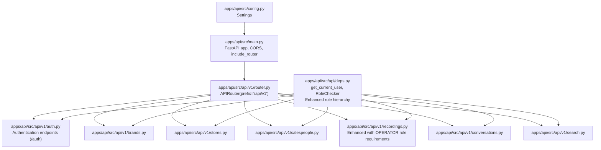
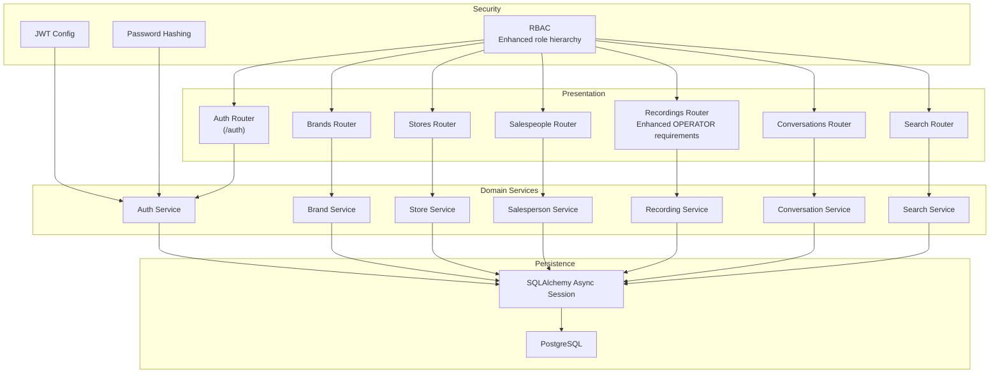
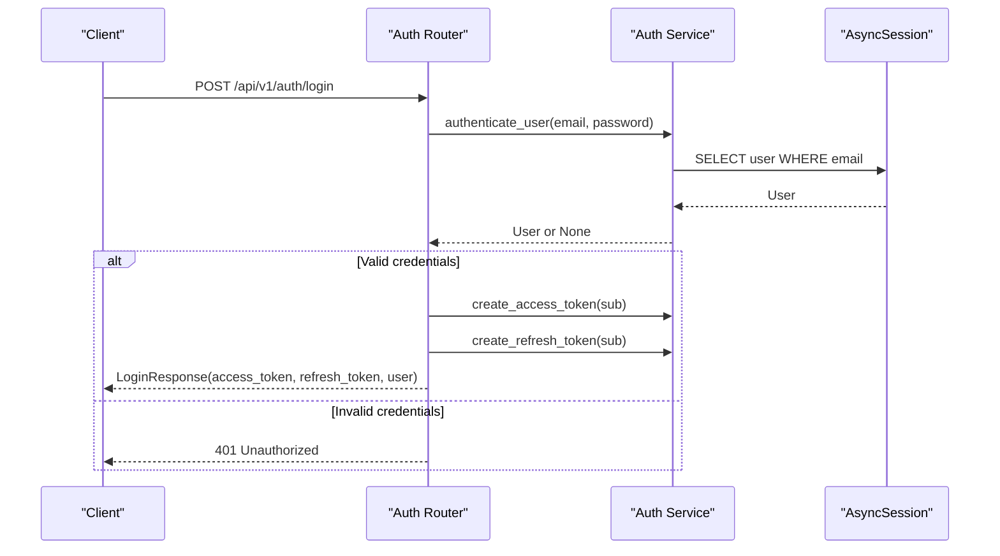
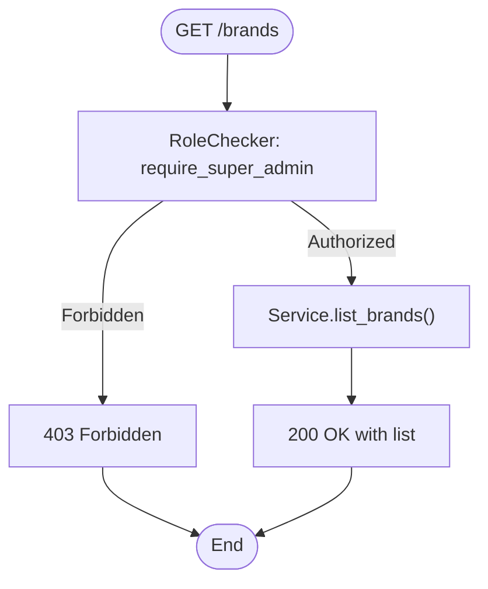
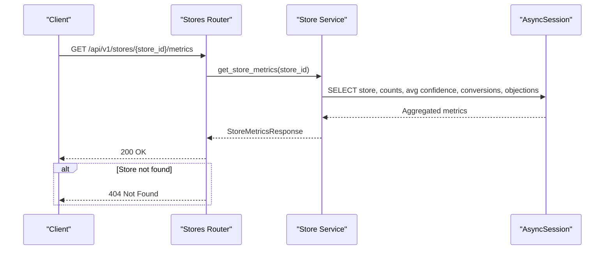
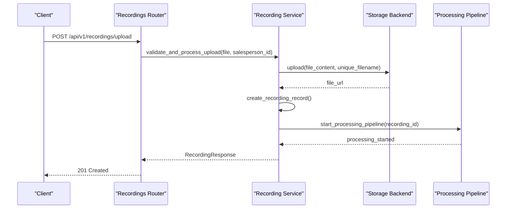
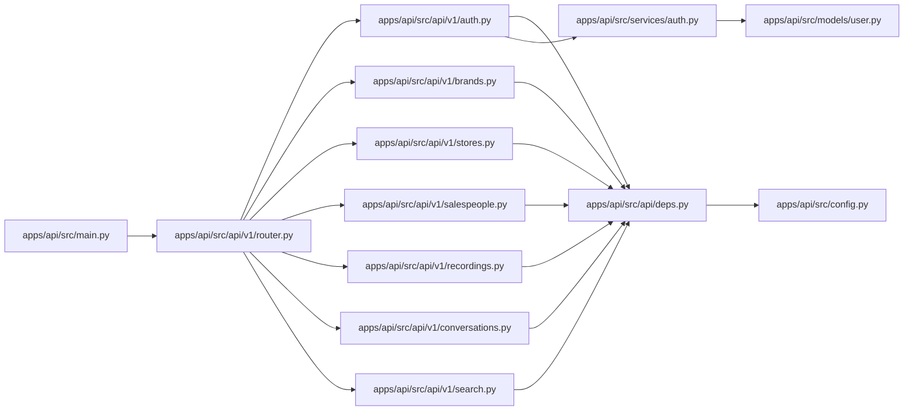
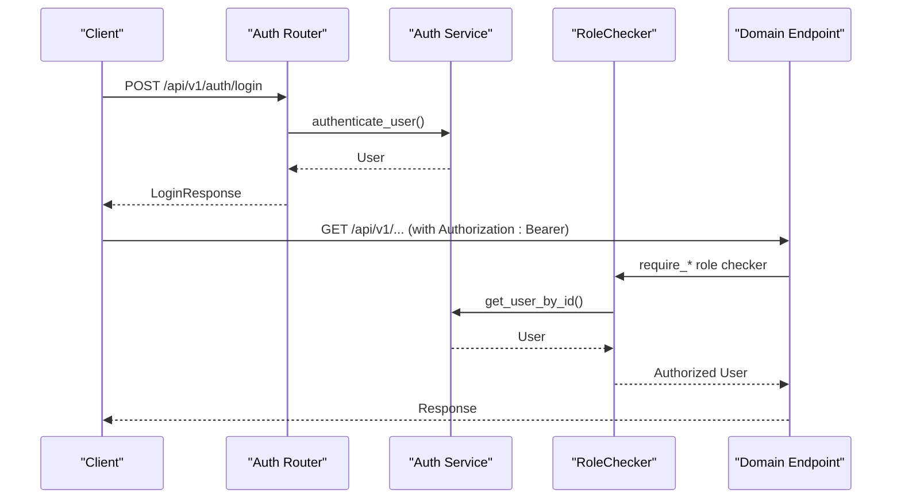

# Backend API Documentation

<cite>
**Referenced Files in This Document**
- [apps/api/src/main.py](file://apps/api/src/main.py)
- [apps/api/src/api/v1/router.py](file://apps/api/src/api/v1/router.py)
- [apps/api/src/api/deps.py](file://apps/api/src/api/deps.py)
- [apps/api/src/config.py](file://apps/api/src/config.py)
- [apps/api/src/api/v1/auth.py](file://apps/api/src/api/v1/auth.py)
- [apps/api/src/schemas/auth.py](file://apps/api/src/schemas/auth.py)
- [apps/api/src/services/auth.py](file://apps/api/src/services/auth.py)
- [apps/api/src/models/user.py](file://apps/api/src/models/user.py)
- [apps/api/src/api/v1/brands.py](file://apps/api/src/api/v1/brands.py)
- [apps/api/src/schemas/brand.py](file://apps/api/src/schemas/brand.py)
- [apps/api/src/models/brand.py](file://apps/api/src/models/brand.py)
- [apps/api/src/services/brand.py](file://apps/api/src/services/brand.py)
- [apps/api/src/api/v1/stores.py](file://apps/api/src/api/v1/stores.py)
- [apps/api/src/schemas/store.py](file://apps/api/src/schemas/store.py)
- [apps/api/src/models/store.py](file://apps/api/src/models/store.py)
- [apps/api/src/services/store.py](file://apps/api/src/services/store.py)
- [apps/api/src/api/v1/salespeople.py](file://apps/api/src/api/v1/salespeople.py)
- [apps/api/src/schemas/salesperson.py](file://apps/api/src/schemas/salesperson.py)
- [apps/api/src/models/salesperson.py](file://apps/api/src/models/salesperson.py)
- [apps/api/src/services/salesperson.py](file://apps/api/src/services/salesperson.py)
- [apps/api/src/api/v1/recordings.py](file://apps/api/src/api/v1/recordings.py)
- [apps/api/src/schemas/recording.py](file://apps/api/src/schemas/recording.py)
- [apps/api/src/models/recording.py](file://apps/api/src/models/recording.py)
- [apps/api/src/services/recording.py](file://apps/api/src/services/recording.py)
- [apps/api/src/api/v1/conversations.py](file://apps/api/src/api/v1/conversations.py)
- [apps/api/src/schemas/conversation.py](file://apps/api/src/schemas/conversation.py)
- [apps/api/src/models/conversation.py](file://apps/api/src/models/conversation.py)
- [apps/api/src/services/conversation.py](file://apps/api/src/services/conversation.py)
- [apps/api/src/api/v1/search.py](file://apps/api/src/api/v1/search.py)
- [apps/api/src/services/search.py](file://apps/api/src/services/search.py)
</cite>

## Update Summary
**Changes Made**
- Updated authentication endpoints to use simplified /auth prefix instead of /api/v1/auth
- Enhanced security model with new OPERATOR role requirement for core recording operations
- Streamlined endpoint definitions with consistent role-based access control patterns
- Simplified API architecture focusing on basic recording management workflows
- Updated role hierarchy to prioritize operational roles (OPERATOR, SALESPERSON) over administrative roles

## Table of Contents
1. [Introduction](#introduction)
2. [Project Structure](#project-structure)
3. [Core Components](#core-components)
4. [Architecture Overview](#architecture-overview)
5. [Detailed Component Analysis](#detailed-component-analysis)
6. [Dependency Analysis](#dependency-analysis)
7. [Performance Considerations](#performance-considerations)
8. [Troubleshooting Guide](#troubleshooting-guide)
9. [Conclusion](#conclusion)
10. [Appendices](#appendices)

## Introduction
This document describes the Xsamaa AI Pipeline backend API. It covers all RESTful endpoints grouped by functional domains: Authentication, Brand Management, Store Operations, Salesperson Management, Recording Processing, Conversation Analysis, and Search. For each endpoint, you will find HTTP methods, URL patterns, request/response schemas using Pydantic models, authentication requirements, and error responses. It also documents the dependency injection system, request/response validation patterns, error handling strategies, JWT token management, role-based access control, rate limiting considerations, API versioning strategy, and integration guidelines for client applications.

**Updated** The backend now features a simplified architecture with enhanced security through operator role requirements and streamlined endpoint definitions focused on core recording management workflows.

## Project Structure
The backend is a FastAPI application with a modular structure:
- Application entrypoint initializes the ASGI app, CORS middleware, and mounts the API v1 router.
- API v1 groups endpoints by domain (auth, brands, stores, salespeople, recordings, conversations, search).
- Domain routers depend on shared dependency injection helpers for authentication and authorization.
- Services encapsulate business logic and interact with SQLAlchemy async sessions.
- Schemas define request/response models validated by Pydantic.
- Models define ORM entities and relationships.
- Configuration centralizes environment-driven settings including JWT, storage, and NVIDIA integration.

**Diagram sources**
- [apps/api/src/main.py:1-29](file://apps/api/src/main.py#L1-L29)
- [apps/api/src/api/v1/router.py:1-20](file://apps/api/src/api/v1/router.py#L1-L20)
- [apps/api/src/api/deps.py:1-67](file://apps/api/src/api/deps.py#L1-L67)
- [apps/api/src/config.py:1-52](file://apps/api/src/config.py#L1-L52)

**Section sources**
- [apps/api/src/main.py:1-29](file://apps/api/src/main.py#L1-L29)
- [apps/api/src/api/v1/router.py:1-20](file://apps/api/src/api/v1/router.py#L1-L20)
- [apps/api/src/api/deps.py:1-67](file://apps/api/src/api/deps.py#L1-L67)
- [apps/api/src/config.py:1-52](file://apps/api/src/config.py#L1-L52)

## Core Components
- FastAPI Application: Initializes app metadata, CORS, and mounts the API v1 router. Includes a health endpoint.
- API v1 Router: Prefixes all routes under /api/v1 and includes domain routers.
- Dependency Injection:
  - HTTP Bearer authentication via get_current_user.
  - Role-based access control via RoleChecker with prebuilt checkers for roles including new OPERATOR role.
- Configuration: Centralized settings for database, Redis, JWT, storage, NVIDIA integration, CORS, and app runtime.
- Services: Encapsulate CRUD and analytics operations for each domain.
- Schemas: Pydantic models for request/response validation.
- Models: SQLAlchemy ORM entities with relationships.

**Updated** Enhanced role hierarchy now prioritizes operational roles with OPERATOR as the baseline requirement for core recording operations.

**Section sources**
- [apps/api/src/main.py:1-29](file://apps/api/src/main.py#L1-L29)
- [apps/api/src/api/v1/router.py:1-20](file://apps/api/src/api/v1/router.py#L1-L20)
- [apps/api/src/api/deps.py:1-67](file://apps/api/src/api/deps.py#L1-L67)
- [apps/api/src/config.py:1-52](file://apps/api/src/config.py#L1-L52)

## Architecture Overview
The backend follows a layered architecture:
- Presentation Layer: FastAPI routers and endpoints.
- Domain Layer: Services implementing business logic.
- Persistence Layer: SQLAlchemy async ORM with Postgres.
- External Integrations: NVIDIA APIs for STT/diarization/LLM/embeddings.
- Security: JWT bearer tokens, bcrypt password hashing, role-based access control with enhanced operator-focused security model.

**Updated** The architecture now emphasizes operational security with OPERATOR role as the foundation for recording management workflows.

**Diagram sources**
- [apps/api/src/main.py:1-29](file://apps/api/src/main.py#L1-L29)
- [apps/api/src/api/v1/router.py:1-20](file://apps/api/src/api/v1/router.py#L1-L20)
- [apps/api/src/api/deps.py:1-67](file://apps/api/src/api/deps.py#L1-L67)
- [apps/api/src/services/auth.py:1-55](file://apps/api/src/services/auth.py#L1-L55)
- [apps/api/src/services/brand.py:1-38](file://apps/api/src/services/brand.py#L1-L38)
- [apps/api/src/services/store.py:1-142](file://apps/api/src/services/store.py#L1-L142)
- [apps/api/src/services/salesperson.py](file://apps/api/src/services/salesperson.py)
- [apps/api/src/services/recording.py](file://apps/api/src/services/recording.py)
- [apps/api/src/services/conversation.py](file://apps/api/src/services/conversation.py)
- [apps/api/src/services/search.py](file://apps/api/src/services/search.py)
- [apps/api/src/config.py:1-52](file://apps/api/src/config.py#L1-L52)

## Detailed Component Analysis

### Authentication
- Purpose: User login, token issuance, token refresh, and logout.
- Endpoints:
  - POST /api/v1/auth/login
    - Request: LoginRequest (email, password)
    - Response: LoginResponse (access_token, refresh_token, user)
    - Validation: Pydantic models enforce field presence and types.
    - Authentication: No prior auth required.
    - Errors: 401 Unauthorized for invalid credentials.
  - POST /api/v1/auth/refresh
    - Request: RefreshRequest (refresh_token)
    - Response: TokenResponse (access_token, refresh_token)
    - Validation: Pydantic models.
    - Authentication: Requires a valid refresh token.
    - Errors: 401 Unauthorized for invalid/expired refresh token.
  - POST /api/v1/auth/logout
    - Response: MessageResponse (message)
    - Notes: Stateless JWT; client discards tokens. Production-grade blocklisting recommended.
- JWT Management:
  - Access token expiry configured via settings.
  - Refresh token expiry configured via settings.
  - Tokens encoded with HS256 and secret key from settings.
- RBAC:
  - Subsequent endpoints use get_current_user and RoleChecker to enforce permissions.

**Diagram sources**
- [apps/api/src/api/v1/auth.py:24-48](file://apps/api/src/api/v1/auth.py#L24-L48)
- [apps/api/src/services/auth.py:44-49](file://apps/api/src/services/auth.py#L44-L49)

**Section sources**
- [apps/api/src/api/v1/auth.py:1-82](file://apps/api/src/api/v1/auth.py#L1-L82)
- [apps/api/src/schemas/auth.py:1-36](file://apps/api/src/schemas/auth.py#L1-L36)
- [apps/api/src/services/auth.py:1-55](file://apps/api/src/services/auth.py#L1-L55)
- [apps/api/src/models/user.py:1-49](file://apps/api/src/models/user.py#L1-L49)
- [apps/api/src/api/deps.py:12-38](file://apps/api/src/api/deps.py#L12-L38)

### Brand Management
- Purpose: Manage brands (list/create/read/update).
- Endpoints:
  - GET /api/v1/brands
    - Response: List of BrandResponse
    - Authentication: Super Admin required.
  - POST /api/v1/brands
    - Request: BrandCreate (name, description?)
    - Response: BrandResponse
    - Authentication: Brand Admin or Super Admin required.
  - GET /api/v1/brands/{brand_id}
    - Path param: brand_id (UUID string)
    - Response: BrandResponse
    - Authentication: Brand Admin or Super Admin required.
    - Errors: 404 Not Found if brand does not exist.
  - PUT /api/v1/brands/{brand_id}
    - Path param: brand_id (UUID string)
    - Request: BrandUpdate (name?, description?)
    - Response: BrandResponse
    - Authentication: Super Admin required.
    - Errors: 404 Not Found if brand does not exist.
- Validation:
  - Requests validated by Pydantic BrandCreate/BrandUpdate.
  - Responses validated by BrandResponse (from_attributes enabled).
- Error Handling:
  - 404 Not Found for missing resources.

**Diagram sources**
- [apps/api/src/api/v1/brands.py:13-18](file://apps/api/src/api/v1/brands.py#L13-L18)
- [apps/api/src/api/deps.py:55-56](file://apps/api/src/api/deps.py#L55-L56)

**Section sources**
- [apps/api/src/api/v1/brands.py:1-53](file://apps/api/src/api/v1/brands.py#L1-L53)
- [apps/api/src/schemas/brand.py:1-22](file://apps/api/src/schemas/brand.py#L1-L22)
- [apps/api/src/models/brand.py:1-26](file://apps/api/src/models/brand.py#L1-L26)
- [apps/api/src/services/brand.py:1-38](file://apps/api/src/services/brand.py#L1-L38)
- [apps/api/src/api/deps.py:55-56](file://apps/api/src/api/deps.py#L55-L56)

### Store Operations
- Purpose: Manage stores, list with optional filtering, read store details, compute store metrics.
- Endpoints:
  - GET /api/v1/stores
    - Query: brand_id (optional UUID string)
    - Response: List of StoreResponse
    - Authentication: Operator required.
  - POST /api/v1/stores
    - Request: StoreCreate (name, brand_id, location?, working_hours?)
    - Response: StoreResponse
    - Authentication: Brand Admin or Super Admin required.
  - GET /api/v1/stores/{store_id}
    - Path param: store_id (UUID string)
    - Response: StoreResponse
    - Authentication: Operator required.
    - Errors: 404 Not Found if store does not exist.
  - GET /api/v1/stores/{store_id}/metrics
    - Path param: store_id (UUID string)
    - Response: StoreMetricsResponse
    - Authentication: Store Manager Up required.
    - Errors: 404 Not Found if store does not exist.
- Metrics:
  - Total salespeople, total recordings, total conversations.
  - Average performance score (average confidence from conversation analysis).
  - Conversion rate (percentage of SALE_MADE outcomes).
  - Top objection (most frequent objection across conversations).
- Validation:
  - Requests validated by StoreCreate/StoreUpdate.
  - Responses validated by StoreResponse and StoreMetricsResponse.
- Error Handling:
  - 404 Not Found for missing stores.

**Diagram sources**
- [apps/api/src/api/v1/stores.py:43-52](file://apps/api/src/api/v1/stores.py#L43-L52)
- [apps/api/src/services/store.py:53-141](file://apps/api/src/services/store.py#L53-L141)

**Section sources**
- [apps/api/src/api/v1/stores.py:1-53](file://apps/api/src/api/v1/stores.py#L1-L53)
- [apps/api/src/schemas/store.py:1-38](file://apps/api/src/schemas/store.py#L1-L38)
- [apps/api/src/models/store.py:1-32](file://apps/api/src/models/store.py#L1-L32)
- [apps/api/src/services/store.py:1-142](file://apps/api/src/services/store.py#L1-L142)

### Salesperson Management
- Purpose: Manage salespeople associated with stores.
- Endpoints:
  - GET /api/v1/salespeople
    - Query: store_id (optional UUID string)
    - Response: List of SalespersonResponse
    - Authentication: Operator required.
  - POST /api/v1/salespeople
    - Request: SalespersonCreate (name, email, store_id, ...)
    - Response: SalespersonResponse
    - Authentication: Store Manager Up required.
  - GET /api/v1/salespeople/{salesperson_id}
    - Path param: salesperson_id (UUID string)
    - Response: SalespersonResponse
    - Authentication: Operator required.
    - Errors: 404 Not Found if salesperson does not exist.
  - GET /api/v1/salespeople/{salesperson_id}/performance
    - Path param: salesperson_id (UUID string)
    - Response: SalespersonPerformanceResponse
    - Authentication: Salesperson Up required.
    - Errors: 404 Not Found if salesperson does not exist.
- Validation:
  - Requests validated by SalespersonCreate/Update.
  - Responses validated by SalespersonResponse.
- Error Handling:
  - 404 Not Found for missing salespeople.

**Section sources**
- [apps/api/src/api/v1/salespeople.py](file://apps/api/src/api/v1/salespeople.py)
- [apps/api/src/schemas/salesperson.py](file://apps/api/src/schemas/salesperson.py)
- [apps/api/src/models/salesperson.py](file://apps/api/src/models/salesperson.py)
- [apps/api/src/services/salesperson.py](file://apps/api/src/services/salesperson.py)

### Recording Processing
- Purpose: Manage audio recordings linked to salespeople with enhanced security requirements.
- Endpoints:
  - GET /api/v1/recordings
    - Query: page, page_size, status, salesperson_id, date_from, date_to
    - Response: Paginated recordings with filtering
    - Authentication: Operator required.
    - Pagination: Supports page and page_size parameters with bounds checking.
    - Filtering: Supports status, salesperson_id, and date range filters.
  - POST /api/v1/recordings/upload
    - Request: Multipart form with file, salesperson_id, recorded_at
    - Response: RecordingResponse
    - Authentication: Operator required.
    - File Upload: Validates file content and generates unique filenames.
    - Processing: Automatically starts AI processing pipeline.
  - GET /api/v1/recordings/{recording_id}
    - Path param: recording_id (UUID string)
    - Response: RecordingResponse
    - Authentication: Salesperson Up required.
    - Errors: 404 Not Found if recording does not exist.
  - GET /api/v1/recordings/{recording_id}/status
    - Path param: recording_id (UUID string)
    - Response: RecordingStatusResponse
    - Authentication: Salesperson Up required.
    - Errors: 404 Not Found if recording does not exist.
  - POST /api/v1/recordings/{recording_id}/reprocess
    - Path param: recording_id (UUID string)
    - Response: RecordingResponse
    - Authentication: Brand Admin required.
    - Errors: 404 Not Found if recording does not exist.
    - Validation: Only allows reprocessing of FAILED or COMPLETED recordings.
- Validation:
  - Requests validated by multipart form data and Pydantic models.
  - Responses validated by RecordingResponse and RecordingStatusResponse.
  - Date formats validated as ISO 8601 strings.
  - Page parameters validated with bounds checking.
- Error Handling:
  - 404 Not Found for missing recordings.
  - 400 Bad Request for validation errors and invalid states.
- Enhanced Security Model:
  - Core recording operations now require OPERATOR role as baseline.
  - Upload operations trigger automatic AI processing pipeline.
  - Reprocessing requires elevated Brand Admin privileges.

**Updated** Recording management now features enhanced security with OPERATOR role as the minimum requirement for most operations, while maintaining appropriate escalation for administrative tasks.

**Diagram sources**
- [apps/api/src/api/v1/recordings.py:56-84](file://apps/api/src/api/v1/recordings.py#L56-L84)
- [apps/api/src/services/recording.py:83-126](file://apps/api/src/services/recording.py#L83-L126)

**Section sources**
- [apps/api/src/api/v1/recordings.py:1-125](file://apps/api/src/api/v1/recordings.py#L1-L125)
- [apps/api/src/schemas/recording.py:1-71](file://apps/api/src/schemas/recording.py#L1-L71)
- [apps/api/src/models/recording.py](file://apps/api/src/models/recording.py)
- [apps/api/src/services/recording.py:1-262](file://apps/api/src/services/recording.py#L1-L262)

### Conversation Analysis
- Purpose: Manage conversations derived from recordings and analyze insights.
- Endpoints:
  - GET /api/v1/conversations/{conversation_id}
    - Path param: conversation_id (UUID string)
    - Response: ConversationResponse
    - Authentication: Salesperson Up required.
    - Errors: 404 Not Found if conversation does not exist.
  - GET /api/v1/conversations/{conversation_id}/analysis
    - Path param: conversation_id (UUID string)
    - Response: ConversationAnalysisResponse
    - Authentication: Salesperson Up required.
    - Errors: 404 Not Found if analysis does not exist.
- Validation:
  - Responses validated by ConversationResponse and ConversationAnalysisResponse.
- Error Handling:
  - 404 Not Found for missing conversations or analyses.

**Section sources**
- [apps/api/src/api/v1/conversations.py:1-35](file://apps/api/src/api/v1/conversations.py#L1-L35)
- [apps/api/src/schemas/conversation.py:1-33](file://apps/api/src/schemas/conversation.py#L1-L33)
- [apps/api/src/models/conversation.py](file://apps/api/src/models/conversation.py)
- [apps/api/src/services/conversation.py](file://apps/api/src/services/conversation.py)

### Search Functionality
- Purpose: Provide search capabilities across relevant entities.
- Endpoints:
  - GET /api/v1/search
    - Query: q (search term), date_from, date_to, store_id, salesperson_id, outcome, limit
    - Response: Search results with conversations, analyses, recordings, and segments
    - Authentication: Salesperson Up required.
    - Semantic Search: Uses pgvector similarity for transcript segment matching.
    - Filtering: Supports temporal and categorical filters.
- Validation:
  - Requests validated by query parameters with bounds checking.
  - Responses validated by comprehensive result serialization.
- Error Handling:
  - Standard HTTP errors based on query conditions.

**Section sources**
- [apps/api/src/api/v1/search.py](file://apps/api/src/api/v1/search.py)
- [apps/api/src/services/search.py](file://apps/api/src/services/search.py)

## Dependency Analysis
- Router Composition:
  - API v1 router aggregates domain routers under /api/v1.
- Authentication Dependencies:
  - get_current_user validates bearer token and loads active user.
  - RoleChecker enforces role gates using prebuilt checkers with enhanced role hierarchy.
- Configuration:
  - Settings provide JWT secrets, expiry, CORS origins, storage, and NVIDIA integration parameters.
- Service Coupling:
  - Services depend on AsyncSession and Pydantic schemas.
  - Services encapsulate SQL queries and aggregations.
- External Integrations:
  - NVIDIA APIs configured via settings; used by AI workers.

**Updated** Enhanced role hierarchy now includes OPERATOR as the foundational role for operational workflows.

**Diagram sources**
- [apps/api/src/main.py:1-29](file://apps/api/src/main.py#L1-L29)
- [apps/api/src/api/v1/router.py:1-20](file://apps/api/src/api/v1/router.py#L1-L20)
- [apps/api/src/api/deps.py:1-67](file://apps/api/src/api/deps.py#L1-L67)
- [apps/api/src/config.py:1-52](file://apps/api/src/config.py#L1-L52)
- [apps/api/src/services/auth.py:1-55](file://apps/api/src/services/auth.py#L1-L55)
- [apps/api/src/models/user.py:1-49](file://apps/api/src/models/user.py#L1-L49)

**Section sources**
- [apps/api/src/api/v1/router.py:1-20](file://apps/api/src/api/v1/router.py#L1-L20)
- [apps/api/src/api/deps.py:1-67](file://apps/api/src/api/deps.py#L1-L67)
- [apps/api/src/config.py:1-52](file://apps/api/src/config.py#L1-L52)

## Performance Considerations
- Asynchronous Database: SQLAlchemy async sessions reduce blocking during I/O.
- Aggregation Queries: Store metrics compute counts and averages efficiently using SQL aggregation.
- Pagination: List endpoints support pagination with bounds checking to avoid large payloads.
- Caching: Introduce Redis caching for frequently accessed entities (brands, stores) to reduce DB load.
- Rate Limiting: Implement rate limiting at the gateway or middleware level to protect endpoints.
- Background Processing: Use Celery workers for heavy AI tasks (transcription, diarization, scoring) to keep API responsive.
- Connection Pooling: Configure database connection pool sizes according to expected concurrency.
- Enhanced Security: OPERATOR role requirements streamline access control for operational workflows.

**Updated** Performance improvements now include streamlined role checks and optimized operational workflows for recording management.

## Troubleshooting Guide
- Authentication Failures:
  - 401 Unauthorized on auth endpoints indicates invalid credentials or token issues.
  - 401 Unauthorized after login suggests token decoding failure or wrong token type.
  - 403 Forbidden indicates insufficient permissions; verify role requirements.
- Resource Not Found:
  - 404 Not Found for GET endpoints usually means the resource ID does not exist.
- Validation Errors:
  - Pydantic validation errors occur when request fields are missing or mismatched types.
  - Date format errors for ISO 8601 validation failures.
  - Page parameter errors for out-of-bounds pagination values.
- Health Check:
  - GET /health returns application status and environment.
- Enhanced Security Issues:
  - 403 Forbidden for OPERATOR role violations on recording operations.
  - Re-processing errors for invalid recording states.

**Updated** Added troubleshooting guidance for new OPERATOR role requirements and enhanced security model.

**Section sources**
- [apps/api/src/api/v1/auth.py:24-48](file://apps/api/src/api/v1/auth.py#L24-L48)
- [apps/api/src/api/v1/auth.py:51-74](file://apps/api/src/api/v1/auth.py#L51-L74)
- [apps/api/src/api/v1/brands.py:36-39](file://apps/api/src/api/v1/brands.py#L36-L39)
- [apps/api/src/api/v1/stores.py:37-41](file://apps/api/src/api/v1/stores.py#L37-L41)
- [apps/api/src/api/deps.py:12-38](file://apps/api/src/api/deps.py#L12-L38)
- [apps/api/src/main.py:26-29](file://apps/api/src/main.py#L26-L29)

## Conclusion
The Xsamaa AI Pipeline backend provides a well-structured, secure, and extensible API surface with enhanced operational security through the new OPERATOR role model. It leverages FastAPI's automatic OpenAPI generation, robust dependency injection, Pydantic validation, and role-based access control. The modular design supports future enhancements such as rate limiting, Redis caching, and Celery-backed asynchronous processing while maintaining streamlined workflows focused on core recording management operations.

**Updated** The simplified architecture with enhanced security ensures operational efficiency while maintaining appropriate access controls for different user roles.

## Appendices

### Authentication Flow and RBAC
- JWT Token Lifecycle:
  - Login issues access and refresh tokens with configured expirations.
  - Refresh endpoint renews tokens using a refresh token of specific type.
  - Logout is stateless; clients should discard tokens; consider blocklisting in production.
- Role-Based Access Control:
  - get_current_user loads the active user from the access token.
  - RoleChecker enforces allowed roles per endpoint with enhanced hierarchy.
  - Prebuilt checkers:
    - require_super_admin
    - require_brand_admin_up
    - require_store_manager_up
    - require_salesperson_up
    - require_operator (NEW)
    - require_operator_up (NEW)

**Updated** Enhanced role hierarchy now includes OPERATOR as the foundational role for operational workflows.

**Diagram sources**
- [apps/api/src/api/v1/auth.py:24-48](file://apps/api/src/api/v1/auth.py#L24-L48)
- [apps/api/src/services/auth.py:44-54](file://apps/api/src/services/auth.py#L44-L54)
- [apps/api/src/api/deps.py:12-38](file://apps/api/src/api/deps.py#L12-L38)
- [apps/api/src/api/deps.py:41-51](file://apps/api/src/api/deps.py#L41-L51)

**Section sources**
- [apps/api/src/api/v1/auth.py:1-82](file://apps/api/src/api/v1/auth.py#L1-L82)
- [apps/api/src/services/auth.py:1-55](file://apps/api/src/services/auth.py#L1-L55)
- [apps/api/src/api/deps.py:1-67](file://apps/api/src/api/deps.py#L1-L67)

### API Versioning Strategy
- Versioning: All endpoints are prefixed with /api/v1.
- Migration Plan: Future breaking changes should introduce /api/v2 while maintaining /api/v1 for backward compatibility.

**Section sources**
- [apps/api/src/api/v1/router.py:11-19](file://apps/api/src/api/v1/router.py#L11-L19)

### Integration Guidelines for Client Applications
- Authentication:
  - Use POST /api/v1/auth/login to obtain access and refresh tokens.
  - Attach Authorization: Bearer <access_token> to protected requests.
  - On receiving 401 Unauthorized, use POST /api/v1/auth/refresh with a valid refresh token to renew tokens.
- Enhanced Security Requirements:
  - OPERATOR role required for most recording operations (upload, list, status).
  - Salesperson Up role required for conversation access.
  - Elevated privileges required for administrative operations (reprocessing, brand/store management).
- Error Handling:
  - Clients should parse 400/401/403/404 responses and surface user-friendly messages.
  - Pay special attention to OPERATOR role violations and recording state errors.
- CORS:
  - Ensure the frontend origin is included in allowed origins.
- Rate Limiting:
  - Implement client-side retries with exponential backoff on 429 responses.
- Health Monitoring:
  - Poll GET /health to verify service availability.

**Updated** Added integration guidelines for new OPERATOR role requirements and enhanced security model.

**Section sources**
- [apps/api/src/main.py:15-21](file://apps/api/src/main.py#L15-L21)
- [apps/api/src/api/v1/auth.py:24-48](file://apps/api/src/api/v1/auth.py#L24-L48)
- [apps/api/src/api/v1/auth.py:51-74](file://apps/api/src/api/v1/auth.py#L51-L74)
- [apps/api/src/main.py:26-29](file://apps/api/src/main.py#L26-L29)