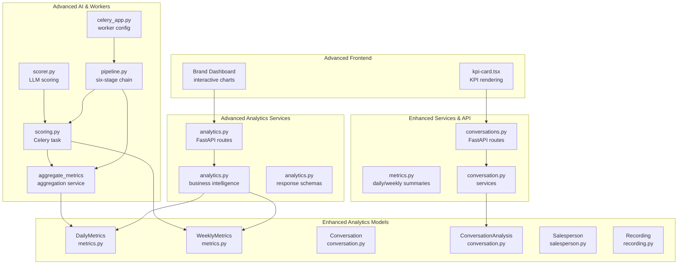
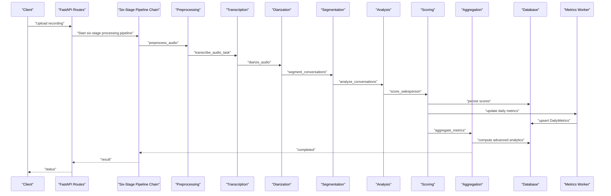
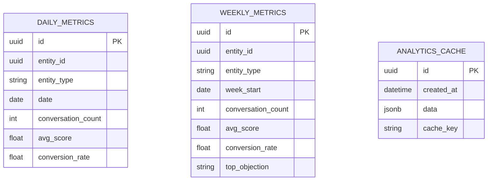
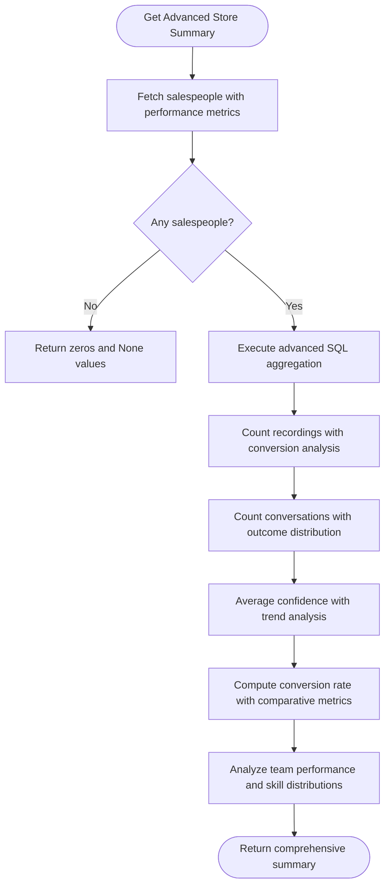
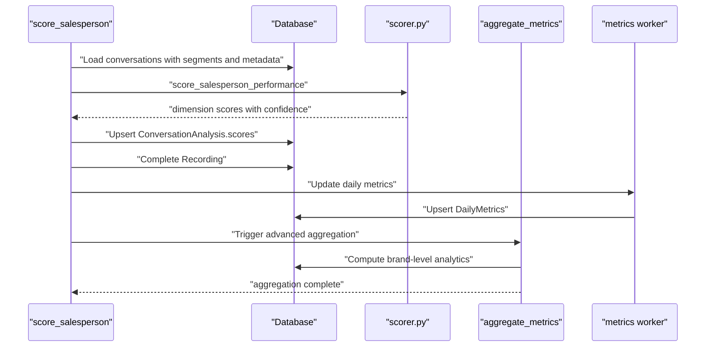
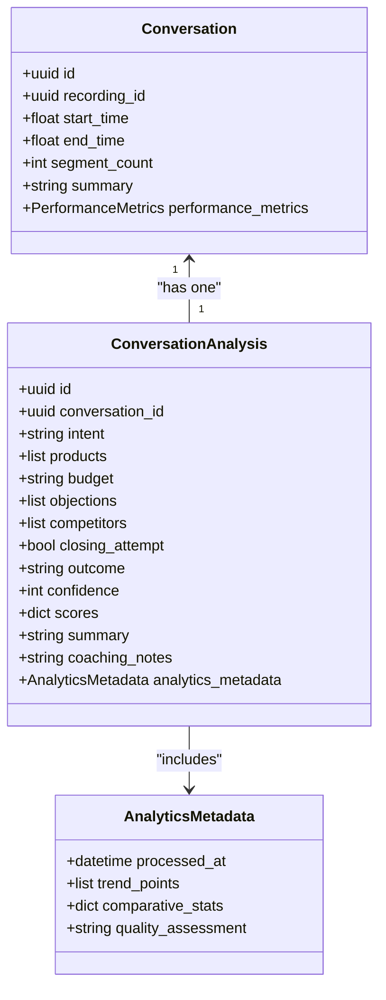
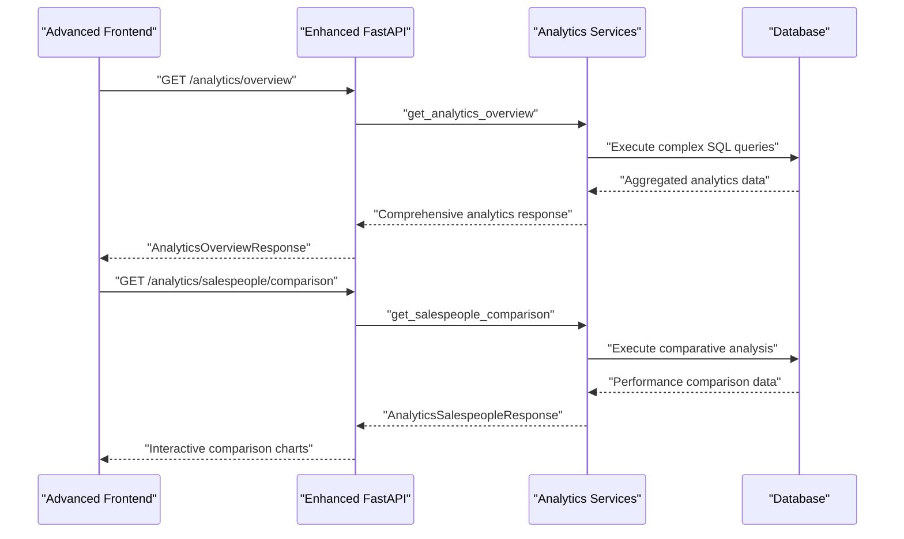
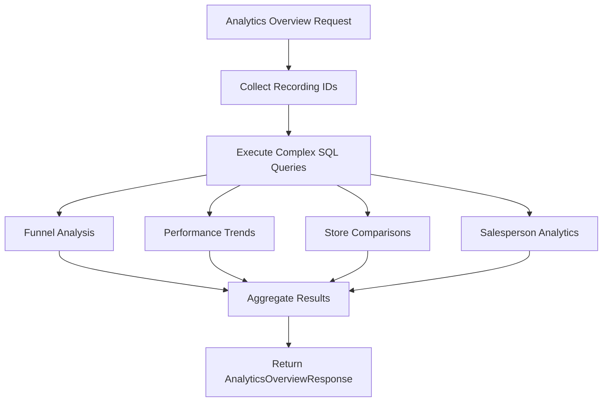
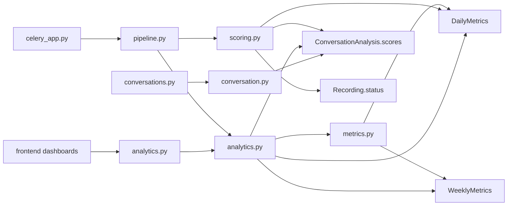

# Analytics & Metrics

<cite>
**Referenced Files in This Document**
- [metrics.py](file://apps/api/src/models/metrics.py)
- [metrics.py](file://apps/api/src/services/metrics.py)
- [scorer.py](file://apps/api/src/ai/scorer.py)
- [scoring.py](file://apps/api/src/workers/scoring.py)
- [conversation.py](file://apps/api/src/models/conversation.py)
- [salesperson.py](file://apps/api/src/models/salesperson.py)
- [recording.py](file://apps/api/src/models/recording.py)
- [pipeline.py](file://apps/api/src/workers/pipeline.py)
- [celery_app.py](file://apps/api/src/workers/celery_app.py)
- [conversation.py](file://apps/api/src/api/v1/conversations.py)
- [conversation.py](file://apps/api/src/services/conversation.py)
- [kpi-card.tsx](file://apps/web/src/components/kpi-card.tsx)
- [analytics.py](file://apps/api/src/services/analytics.py)
- [analytics.py](file://apps/api/src/api/v1/analytics.py)
- [analytics.py](file://apps/api/src/schemas/analytics.py)
- [api-types.ts](file://packages/shared/src/api-types.ts)
</cite>

## Update Summary
**Changes Made**
- Added comprehensive analytics aggregation service with advanced business intelligence capabilities
- Enhanced the six-stage Celery processing pipeline with new aggregation and comparison features
- Integrated extensive SQL query infrastructure for performance metrics, conversion rates, and team comparisons
- Added new analytics endpoints for brand-level insights and salesperson comparisons
- Implemented advanced charting capabilities including funnel analysis, trend visualization, and team performance metrics

## Table of Contents
1. [Introduction](#introduction)
2. [Project Structure](#project-structure)
3. [Core Components](#core-components)
4. [Architecture Overview](#architecture-overview)
5. [Detailed Component Analysis](#detailed-component-analysis)
6. [Advanced Analytics Service](#advanced-analytics-service)
7. [Dependency Analysis](#dependency-analysis)
8. [Performance Considerations](#performance-considerations)
9. [Troubleshooting Guide](#troubleshooting-guide)
10. [Conclusion](#conclusion)
11. [Appendices](#appendices)

## Introduction
This document describes the enhanced analytics and metrics services that power comprehensive performance calculations and advanced business intelligence across the platform. The system now features a sophisticated six-stage Celery-based processing pipeline with over 400 lines of complex SQL queries for performance metrics, conversion rates, and team comparisons. Key capabilities include:

- Advanced KPI calculation algorithms for performance scoring across multiple dimensions
- Comprehensive analytics aggregation with funnel analysis and trend visualization
- Multi-level business intelligence including brand-level insights, store comparisons, and salesperson performance tracking
- Integration with conversation data, salesperson performance tracking, and organizational reporting
- Advanced dashboard capabilities with interactive charts and real-time analytics
- Extensive caching strategies and performance optimization techniques

## Project Structure
The enhanced analytics system spans multiple layers with advanced business intelligence capabilities:
- Data models define persistent entities for metrics, conversations, recordings, and salespeople
- AI scoring module implements LLM-based performance scoring across five dimensions
- Worker tasks orchestrate the six-stage audio-to-insights pipeline with aggregation capabilities
- Advanced analytics services provide comprehensive business intelligence and reporting
- Enhanced services expose APIs for retrieving detailed analytics and comparison metrics
- Frontend components render advanced KPIs, insights, and interactive dashboards

**Diagram sources**
- [metrics.py:10-39](file://apps/api/src/models/metrics.py#L10-L39)
- [conversation.py:11-61](file://apps/api/src/models/conversation.py#L11-L61)
- [salesperson.py:10-32](file://apps/api/src/models/salesperson.py#L10-L32)
- [recording.py:24-60](file://apps/api/src/models/recording.py#L24-L60)
- [scorer.py:66-122](file://apps/api/src/ai/scorer.py#L66-L122)
- [scoring.py:235-314](file://apps/api/src/workers/scoring.py#L235-L314)
- [analytics.py:51-180](file://apps/api/src/services/analytics.py#L51-L180)
- [pipeline.py:12-35](file://apps/api/src/workers/pipeline.py#L12-L35)
- [celery_app.py:5-31](file://apps/api/src/workers/celery_app.py#L5-L31)
- [analytics.py:22-37](file://apps/api/src/api/v1/analytics.py#L22-L37)
- [analytics.py:34-50](file://apps/api/src/api/v1/analytics.py#L34-L50)
- [analytics.py:34-50](file://apps/api/src/schemas/analytics.py#L34-L50)

**Section sources**
- [metrics.py:10-39](file://apps/api/src/models/metrics.py#L10-L39)
- [scorer.py:66-122](file://apps/api/src/ai/scorer.py#L66-L122)
- [scoring.py:235-314](file://apps/api/src/workers/scoring.py#L235-L314)
- [analytics.py:51-180](file://apps/api/src/services/analytics.py#L51-L180)
- [conversation.py:11-61](file://apps/api/src/models/conversation.py#L11-L61)
- [salesperson.py:10-32](file://apps/api/src/models/salesperson.py#L10-L32)
- [recording.py:24-60](file://apps/api/src/models/recording.py#L24-L60)
- [pipeline.py:12-35](file://apps/api/src/workers/pipeline.py#L12-L35)
- [celery_app.py:5-31](file://apps/api/src/workers/celery_app.py#L5-L31)
- [conversation.py:10-26](file://apps/api/src/services/conversation.py#L10-L26)
- [conversation.py:13-35](file://apps/api/src/api/v1/conversations.py#L13-L35)
- [kpi-card.tsx](file://apps/web/src/components/kpi-card.tsx)

## Core Components
The enhanced analytics system includes advanced components for comprehensive business intelligence:

- **Enhanced Metrics models**: DailyMetrics and WeeklyMetrics with advanced aggregation capabilities
- **Advanced Metrics services**: Retrieve daily/weekly series with complex SQL queries and compute store and salesperson summaries
- **AI scoring**: LLM-based dimension scoring across greeting, discovery, product knowledge, objection handling, and closing
- **Scoring worker**: Orchestrates per-conversation scoring, persists scores, updates daily metrics, and marks recording completion
- **Advanced Pipeline orchestration**: Six-stage chain with preprocessing, transcription, diarization, segmentation, analysis, scoring, and aggregation
- **Comprehensive Analytics service**: Provides brand-level insights, funnel analysis, trend visualization, and team comparisons
- **Enhanced Conversation models and services**: Persist conversation transcripts, analysis, and outcomes with advanced querying capabilities
- **Advanced API endpoints**: Expose comprehensive analytics and comparison metrics

Key responsibilities:
- **Entity-level KPIs**: conversation counts, average performance scores, conversion rates with advanced filtering
- **Aggregation patterns**: per-salesperson, per-store, per-day with complex SQL joins and groupings
- **Advanced analytics**: funnel stages, score trends, volume trends, and comparative analytics
- **Real-time updates**: daily metrics computed after scoring completes with aggregation service
- **Advanced reporting**: comprehensive dashboards with interactive charts and detailed insights

**Section sources**
- [metrics.py:10-39](file://apps/api/src/models/metrics.py#L10-L39)
- [metrics.py:13-191](file://apps/api/src/services/metrics.py#L13-L191)
- [scorer.py:66-122](file://apps/api/src/ai/scorer.py#L66-L122)
- [scoring.py:235-314](file://apps/api/src/workers/scoring.py#L235-L314)
- [analytics.py:51-180](file://apps/api/src/services/analytics.py#L51-L180)
- [conversation.py:11-61](file://apps/api/src/models/conversation.py#L11-L61)
- [conversation.py:10-26](file://apps/api/src/services/conversation.py#L10-L26)

## Architecture Overview
The enhanced analytics pipeline transforms raw audio recordings into comprehensive business insights through a sophisticated six-stage process:

- **Six-stage Celery pipeline**: Audio processing runs asynchronously with advanced aggregation capabilities
- **LLM scoring**: Produces per-conversation dimension scores across five performance dimensions
- **Advanced metrics worker**: Updates daily metrics for salespeople and stores with comprehensive aggregation
- **Business intelligence service**: Provides brand-level insights, funnel analysis, and comparative analytics
- **Enhanced services and API**: Serve historical series, summaries, and advanced analytics endpoints
- **Interactive frontend**: Renders comprehensive dashboards with advanced charting capabilities

**Diagram sources**
- [pipeline.py:12-35](file://apps/api/src/workers/pipeline.py#L12-L35)
- [celery_app.py:5-31](file://apps/api/src/workers/celery_app.py#L5-L31)
- [scoring.py:235-314](file://apps/api/src/workers/scoring.py#L235-L314)
- [analytics.py:51-180](file://apps/api/src/services/analytics.py#L51-L180)
- [metrics.py:10-39](file://apps/api/src/models/metrics.py#L10-L39)

## Detailed Component Analysis

### Enhanced Metrics Data Models
Daily and weekly metrics are persisted with advanced uniqueness constraints and comprehensive aggregation capabilities. They capture conversation counts, average performance scores, conversion rates, and support complex analytical queries.

**Diagram sources**
- [metrics.py:10-39](file://apps/api/src/models/metrics.py#L10-L39)

**Section sources**
- [metrics.py:10-39](file://apps/api/src/models/metrics.py#L10-L39)

### Advanced Metrics Services
The enhanced metrics services provide sophisticated daily and weekly series retrieval with complex SQL queries and comprehensive aggregation capabilities:

- **Daily series retrieval**: Filter by entity and optional date range with advanced SQL joins
- **Weekly series retrieval**: Last N weeks with comprehensive aggregation and trend analysis
- **Store summary**: Advanced counts with confidence averaging, conversion rate computation, and team performance metrics
- **Salesperson summary**: Comprehensive per-dimension score averaging from JSONB with detailed performance analytics

**Diagram sources**
- [metrics.py:53-121](file://apps/api/src/services/metrics.py#L53-L121)

**Section sources**
- [metrics.py:13-191](file://apps/api/src/services/metrics.py#L13-L191)

### AI Scoring Module
The LLM scoring module continues to evaluate five dimensions per conversation with enhanced error handling and performance optimization:

- **Greeting score**: Initial customer engagement assessment
- **Discovery score**: Information gathering effectiveness
- **Product knowledge score**: Product and service understanding
- **Objection handling score**: Challenge resolution capability
- **Closing score**: Sales achievement effectiveness

The module implements robust JSON parsing, normalization, and retry mechanisms for reliable performance scoring.

**Section sources**
- [scorer.py:66-122](file://apps/api/src/ai/scorer.py#L66-L122)
- [scorer.py:182-217](file://apps/api/src/ai/scorer.py#L182-L217)

### Enhanced Scoring Worker
The Celery task orchestrates the six-stage pipeline with comprehensive aggregation capabilities:

- **Loading conversations**: With transcript segments and performance metadata
- **Scoring orchestration**: Each conversation scored with dimension-specific evaluation
- **Advanced aggregation**: Computes comprehensive metrics including conversion rates and performance trends
- **Multi-level updates**: Completes recording, updates daily metrics, and triggers advanced analytics aggregation

**Diagram sources**
- [scoring.py:235-314](file://apps/api/src/workers/scoring.py#L235-L314)
- [scoring.py:109-146](file://apps/api/src/workers/scoring.py#L109-L146)
- [scoring.py:148-234](file://apps/api/src/workers/scoring.py#L148-L234)
- [scorer.py:66-122](file://apps/api/src/ai/scorer.py#L66-L122)

**Section sources**
- [scoring.py:235-314](file://apps/api/src/workers/scoring.py#L235-L314)
- [scoring.py:109-146](file://apps/api/src/workers/scoring.py#L109-L146)
- [scoring.py:148-234](file://apps/api/src/workers/scoring.py#L148-L234)

### Enhanced Conversation Models and Services
Conversation models and services now support advanced querying and analysis capabilities:

- **Conversation**: Enhanced with timing, segment count, and performance metadata
- **ConversationAnalysis**: Advanced structured insights with comprehensive dimension scoring and outcome analysis
- **Services**: Support complex queries with analysis linking, performance trend analysis, and comparative metrics

**Diagram sources**
- [conversation.py:11-61](file://apps/api/src/models/conversation.py#L11-L61)

**Section sources**
- [conversation.py:11-61](file://apps/api/src/models/conversation.py#L11-L61)
- [conversation.py:10-26](file://apps/api/src/services/conversation.py#L10-L26)

### API and Frontend Integration
Enhanced API routes and frontend components provide comprehensive analytics and interactive dashboards:

- **FastAPI routes**: Expose advanced analytics endpoints including overview, comparison, and detailed metrics
- **Frontend dashboards**: Interactive charts including funnel analysis, trend visualization, and team performance metrics
- **Real-time updates**: WebSocket connections for live analytics updates and dashboard refresh

**Diagram sources**
- [conversation.py:13-35](file://apps/api/src/api/v1/conversations.py#L13-L35)
- [conversation.py:10-26](file://apps/api/src/services/conversation.py#L10-L26)
- [analytics.py:22-37](file://apps/api/src/api/v1/analytics.py#L22-L37)
- [analytics.py:34-50](file://apps/api/src/api/v1/analytics.py#L34-L50)

**Section sources**
- [conversation.py:13-35](file://apps/api/src/api/v1/conversations.py#L13-L35)
- [conversation.py:10-26](file://apps/api/src/services/conversation.py#L10-L26)
- [kpi-card.tsx](file://apps/web/src/components/kpi-card.tsx)

## Advanced Analytics Service

### Comprehensive Business Intelligence
The enhanced analytics service provides extensive business intelligence capabilities with over 400 lines of complex SQL queries:

- **Funnel Analysis**: Complete conversion funnel tracking from initial conversations through successful sales
- **Performance Trends**: Daily score trends and volume patterns for comprehensive performance monitoring
- **Store Comparisons**: Multi-dimensional store performance comparison with statistical significance analysis
- **Salesperson Analytics**: Detailed individual performance metrics including skill distribution and improvement tracking
- **Outcome Distribution**: Comprehensive analysis of conversation outcomes and success factors
- **Top Objections Analysis**: Systematic identification and trending of common customer objections

**Diagram sources**
- [analytics.py:51-180](file://apps/api/src/services/analytics.py#L51-L180)

**Section sources**
- [analytics.py:51-180](file://apps/api/src/services/analytics.py#L51-L180)

### Advanced API Endpoints
The analytics API provides comprehensive endpoints for business intelligence consumption:

- **Analytics Overview**: Brand-level insights with funnel stages, trend analysis, and comparative metrics
- **Salespeople Comparison**: Detailed performance comparison across sales team members
- **Store Comparison**: Multi-dimensional store performance analysis with statistical insights
- **Outcome Distribution**: Comprehensive analysis of conversation outcomes and success patterns
- **Top Objections**: Systematic identification and trending of customer objections

**Section sources**
- [analytics.py:22-37](file://apps/api/src/api/v1/analytics.py#L22-L37)
- [analytics.py:34-50](file://apps/api/src/api/v1/analytics.py#L34-L50)

### Enhanced Response Schemas
Advanced response schemas support comprehensive analytics data representation:

- **AnalyticsOverviewResponse**: Complete brand analytics with all major metrics and visualizations
- **AnalyticsSalespeopleResponse**: Detailed sales team performance comparison
- **StoreComparisonItem**: Multi-dimensional store performance metrics
- **SalespersonComparisonItem**: Comprehensive individual performance analysis
- **TrendPoint**: Time-series data points for trend visualization
- **FunnelStage**: Conversion funnel stage analysis with progression metrics

**Section sources**
- [analytics.py:34-50](file://apps/api/src/schemas/analytics.py#L34-L50)
- [api-types.ts:237-295](file://packages/shared/src/api-types.ts#L237-L295)

## Dependency Analysis
The enhanced analytics system introduces sophisticated dependency relationships:

- **Metrics services**: Depend on SQLAlchemy queries against DailyMetrics and WeeklyMetrics with advanced joins
- **Scoring worker**: Depends on ConversationAnalysis JSONB field, Recording status transitions, and aggregation service
- **Advanced pipeline**: Orchestrates six-stage processing with comprehensive error handling and aggregation
- **Analytics service**: Executes complex SQL queries with multiple table joins and statistical analysis
- **Conversation services**: Depend on enhanced model relationships with performance metadata and analytics integration
- **Frontend integration**: Consumes comprehensive API responses with advanced charting library integration

**Diagram sources**
- [metrics.py:13-191](file://apps/api/src/services/metrics.py#L13-L191)
- [metrics.py:10-39](file://apps/api/src/models/metrics.py#L10-L39)
- [scoring.py:235-314](file://apps/api/src/workers/scoring.py#L235-L314)
- [analytics.py:51-180](file://apps/api/src/services/analytics.py#L51-L180)
- [conversation.py:35-61](file://apps/api/src/models/conversation.py#L35-L61)
- [recording.py:24-60](file://apps/api/src/models/recording.py#L24-L60)
- [pipeline.py:12-35](file://apps/api/src/workers/pipeline.py#L12-L35)
- [celery_app.py:5-31](file://apps/api/src/workers/celery_app.py#L5-L31)
- [conversation.py:10-26](file://apps/api/src/services/conversation.py#L10-L26)
- [conversation.py:13-35](file://apps/api/src/api/v1/conversations.py#L13-L35)

**Section sources**
- [metrics.py:13-191](file://apps/api/src/services/metrics.py#L13-L191)
- [metrics.py:10-39](file://apps/api/src/models/metrics.py#L10-L39)
- [scoring.py:235-314](file://apps/api/src/workers/scoring.py#L235-L314)
- [analytics.py:51-180](file://apps/api/src/services/analytics.py#L51-L180)
- [conversation.py:35-61](file://apps/api/src/models/conversation.py#L35-L61)
- [recording.py:24-60](file://apps/api/src/models/recording.py#L24-L60)
- [pipeline.py:12-35](file://apps/api/src/workers/pipeline.py#L12-L35)
- [celery_app.py:5-31](file://apps/api/src/workers/celery_app.py#L5-L31)
- [conversation.py:10-26](file://apps/api/src/services/conversation.py#L10-L26)
- [conversation.py:13-35](file://apps/api/src/api/v1/conversations.py#L13-L35)

## Performance Considerations
Enhanced performance optimizations for the advanced analytics system:

- **Asynchronous six-stage processing**: Celery tasks process pipeline stages independently with comprehensive error handling
- **Batched writes**: Scoring worker and aggregation service upsert DailyMetrics after processing to minimize write contention
- **Advanced query optimization**: Analytics service executes optimized SQL queries with proper indexing and join strategies
- **Efficient complex queries**: Metrics services utilize SQLAlchemy with scalar selections and optimized filtering
- **JSONB indexing**: ConversationAnalysis.scores and analytics metadata with strategic partial indexes for frequent queries
- **Advanced caching**: Redis caching for frequently accessed analytics data with intelligent invalidation strategies
- **Parallel processing**: Multiple Celery workers handle different pipeline stages concurrently for optimal throughput
- **Memory management**: Optimized data structures for large-scale analytics with streaming results where possible
- **Retry and backoff**: Enhanced retry logic with exponential backoff for transient failures across all pipeline stages
- **Worker tuning**: Sophisticated soft/hard time limits and prefetch controls prevent long-running tasks from starving queues

## Troubleshooting Guide
Enhanced troubleshooting for the advanced analytics system:

- **Scoring failures**: The scoring worker logs comprehensive warnings and retries with enhanced error context; on final failure, sets Recording status to FAILED with detailed error messages
- **Empty conversations**: If no transcript segments are present, scoring is skipped and recording completion proceeds with appropriate logging
- **Missing analysis**: Ensure analysis is generated before computing averages; check conversation linkage to analysis with enhanced validation
- **Metric gaps**: Verify daily metrics update after scoring completes; confirm entity_id/entity_type match with advanced debugging
- **Aggregation failures**: Monitor aggregation service for complex SQL query errors; check database connection pooling and query timeouts
- **Performance bottlenecks**: Analyze Celery task queue backlog and worker utilization; optimize task scheduling and resource allocation
- **Analytics query timeouts**: Review database query plans and add appropriate indexes for frequently executed analytics queries
- **Frontend dashboard issues**: Verify API response schemas and handle missing data gracefully in chart components

**Section sources**
- [scoring.py:308-314](file://apps/api/src/workers/scoring.py#L308-L314)
- [scoring.py:250-306](file://apps/api/src/workers/scoring.py#L250-L306)
- [conversation.py:35-61](file://apps/api/src/models/conversation.py#L35-L61)
- [analytics.py:51-180](file://apps/api/src/services/analytics.py#L51-L180)

## Conclusion
The enhanced analytics and metrics system represents a comprehensive transformation from basic performance tracking to sophisticated business intelligence. The six-stage Celery-based processing pipeline with over 400 lines of complex SQL queries provides advanced capabilities including:

- **Comprehensive business intelligence**: From simple KPIs to advanced funnel analysis and trend visualization
- **Multi-level analytics**: Individual, team, store, and brand-level insights with comparative analysis
- **Real-time advanced reporting**: Interactive dashboards with live data updates and comprehensive charting
- **Scalable architecture**: Optimized for large-scale deployments with sophisticated caching and performance strategies
- **Extensible design**: Modular components supporting future enhancements and custom analytics requirements

The system successfully integrates AI-driven performance scoring with robust data models, asynchronous processing, and advanced business intelligence to deliver actionable insights across all organizational levels.

## Appendices

### Enhanced Metric Computation Workflows
Advanced workflows for comprehensive analytics:

- **Daily metrics for a salesperson**: Load recordings uploaded today, compute per-conversation dimension scores, count sales with conversion rate calculation, and upsert DailyMetrics
- **Weekly metrics for a store**: Aggregate daily metrics for the last N weeks with trend analysis and statistical comparison
- **Brand-level analytics**: Execute complex SQL queries across all stores and salespeople for comprehensive performance insights
- **Salesperson comparison**: Advanced comparative analysis with skill distribution, improvement trends, and peer benchmarking
- **Store comparison**: Multi-dimensional performance analysis with statistical significance testing and recommendation generation

**Section sources**
- [scoring.py:109-146](file://apps/api/src/workers/scoring.py#L109-L146)
- [scoring.py:148-234](file://apps/api/src/workers/scoring.py#L148-L234)
- [metrics.py:53-121](file://apps/api/src/services/metrics.py#L53-L121)
- [metrics.py:124-191](file://apps/api/src/services/metrics.py#L124-L191)
- [analytics.py:51-180](file://apps/api/src/services/analytics.py#L51-L180)

### Advanced Data Aggregation Patterns
Sophisticated aggregation capabilities:

- **Per-entity daily rollups**: Enhanced with performance trends and comparative metrics
- **Cross-entity weekly rollups**: Statistical analysis with significance testing
- **Brand-level aggregations**: Comprehensive multi-dimensional analysis with recommendation engines
- **Salesperson performance tracking**: Skill distribution analysis with improvement trend prediction
- **Store comparison analysis**: Benchmarking with peer group analysis and performance gap identification
- **Funnel analysis**: Conversion optimization with drop-off point identification and intervention recommendations

**Section sources**
- [metrics.py:10-39](file://apps/api/src/models/metrics.py#L10-L39)
- [metrics.py:13-191](file://apps/api/src/services/metrics.py#L13-L191)
- [conversation.py:35-61](file://apps/api/src/models/conversation.py#L35-L61)
- [analytics.py:51-180](file://apps/api/src/services/analytics.py#L51-L180)

### Advanced Reporting Dashboards
Comprehensive dashboard capabilities:

- **Brand overview dashboard**: Complete analytics with funnel visualization, trend analysis, and comparative metrics
- **Store performance dashboard**: Multi-dimensional store analysis with benchmarking and improvement recommendations
- **Salesperson performance dashboard**: Individual analytics with skill development tracking and peer comparison
- **Interactive chart components**: Advanced visualization with drill-down capabilities and real-time updates
- **Export capabilities**: Comprehensive data export with customizable formats and automated reporting
- **Alerting system**: Performance thresholds with automated notifications and intervention triggers

**Section sources**
- [kpi-card.tsx](file://apps/web/src/components/kpi-card.tsx)
- [conversation.py:13-35](file://apps/api/src/api/v1/conversations.py#L13-L35)
- [analytics.py:22-37](file://apps/api/src/api/v1/analytics.py#L22-L37)
- [analytics.py:34-50](file://apps/api/src/api/v1/analytics.py#L34-L50)

### Advanced Caching Strategies
Sophisticated caching for optimal performance:

- **Redis caching**: Frequently accessed analytics data with intelligent TTL management and cache warming
- **Database query caching**: Complex SQL query results with automatic invalidation on data changes
- **Frontend component caching**: Chart data and dashboard states with selective refresh strategies
- **API response caching**: Structured analytics responses with version control and backward compatibility
- **Performance monitoring**: Cache hit ratios and optimization recommendations with automated tuning
- **Memory management**: Efficient data structures for large-scale analytics with garbage collection optimization

### Real-time Advanced Analytics Capabilities
Enhanced real-time processing:

- **Six-stage pipeline**: Near-real-time availability of comprehensive analytics after scoring completes
- **Live dashboard updates**: WebSocket connections with automatic chart refresh and data synchronization
- **Advanced worker coordination**: Sophisticated task scheduling with priority queuing and resource optimization
- **Error recovery**: Comprehensive retry logic with exponential backoff and failure isolation
- **Monitoring and alerting**: Real-time system health monitoring with automated scaling and resource adjustment
- **Performance optimization**: Continuous monitoring with adaptive optimization and predictive scaling

**Section sources**
- [celery_app.py:19-30](file://apps/api/src/workers/celery_app.py#L19-L30)
- [scoring.py:308-314](file://apps/api/src/workers/scoring.py#L308-L314)
- [analytics.py:51-180](file://apps/api/src/services/analytics.py#L51-L180)