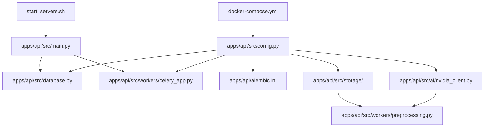
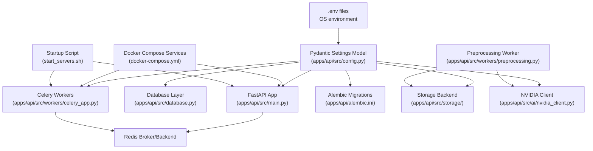
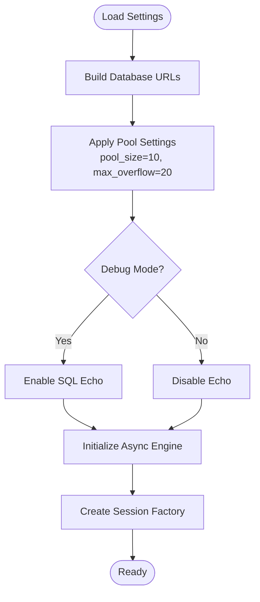
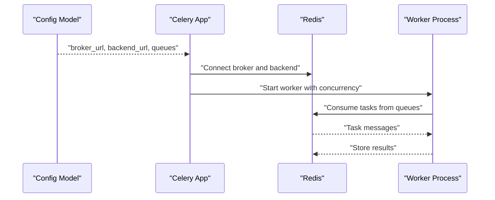
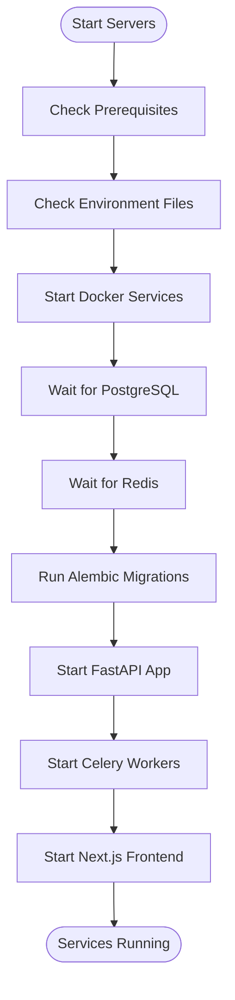
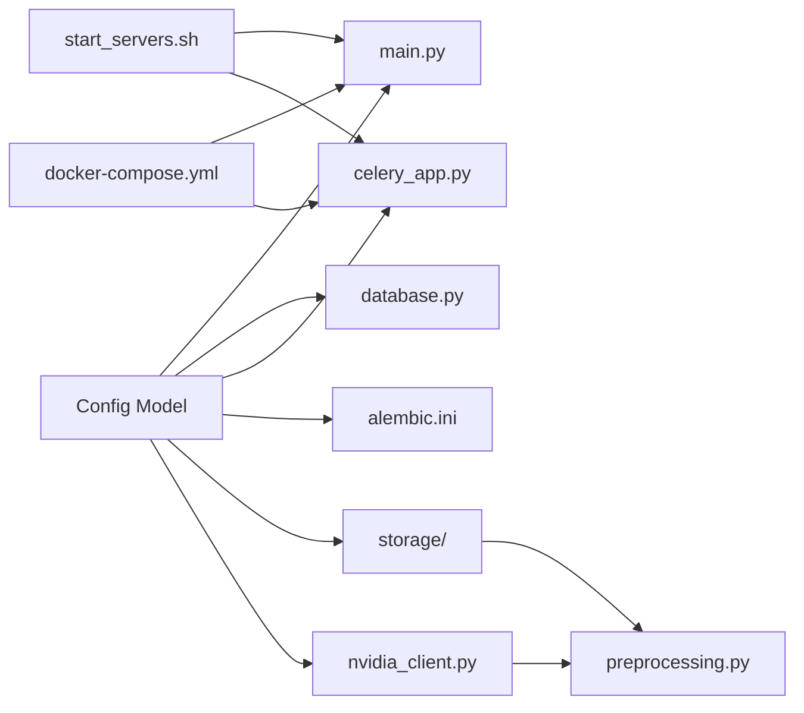

# Configuration & Environment Management

<cite>
**Referenced Files in This Document**
- [apps/api/src/config.py](file://apps/api/src/config.py)
- [apps/api/src/main.py](file://apps/api/src/main.py)
- [apps/api/src/database.py](file://apps/api/src/database.py)
- [apps/api/src/workers/celery_app.py](file://apps/api/src/workers/celery_app.py)
- [apps/api/src/workers/preprocessing.py](file://apps/api/src/workers/preprocessing.py)
- [apps/api/src/storage/base.py](file://apps/api/src/storage/base.py)
- [apps/api/src/storage/local.py](file://apps/api/src/storage/local.py)
- [apps/api/src/ai/nvidia_client.py](file://apps/api/src/ai/nvidia_client.py)
- [docker-compose.yml](file://docker-compose.yml)
- [start_servers.sh](file://start_servers.sh)
- [apps/api/alembic.ini](file://apps/api/alembic.ini)
</cite>

## Update Summary
**Changes Made**
- Enhanced configuration hierarchy documentation with multi-layered Pydantic settings validation
- Expanded database configuration coverage with connection pooling and async/asyncpg integration
- Added comprehensive Redis/Celery integration details including task processing and worker configuration
- Documented NVIDIA API client implementation with retry logic and error handling
- Enhanced storage backend configuration with factory pattern and local/cloud backend support
- Updated JWT configuration documentation with security best practices
- Added detailed CORS configuration and middleware integration
- Expanded Docker Compose orchestration with health checks and service dependencies
- Enhanced startup script documentation with automated service initialization
- Added troubleshooting section for common configuration issues

## Table of Contents
1. [Introduction](#introduction)
2. [Project Structure](#project-structure)
3. [Core Components](#core-components)
4. [Architecture Overview](#architecture-overview)
5. [Detailed Component Analysis](#detailed-component-analysis)
6. [Dependency Analysis](#dependency-analysis)
7. [Performance Considerations](#performance-considerations)
8. [Troubleshooting Guide](#troubleshooting-guide)
9. [Conclusion](#conclusion)

## Introduction
This document explains the configuration and environment management strategy for the Xsamaa AI Pipeline. The configuration system is built around Pydantic Settings with comprehensive validation, supporting both development and production environments with secure secret handling and strict validation patterns.

The system integrates seamlessly with Docker Compose orchestration, startup automation, and the complete AI processing pipeline. It provides centralized configuration management for database connections, Redis/Celery workers, NVIDIA API credentials, JWT token management, storage backends, and CORS policies.

**Section sources**
- [apps/api/src/config.py](file://apps/api/src/config.py)
- [apps/api/src/main.py](file://apps/api/src/main.py)

## Project Structure
The configuration system spans multiple layers with clear separation of concerns:

- **Root orchestration** via Docker Compose defines services and shared environment variables
- **Application-level configuration** centralized in the FastAPI service under apps/api/src/config.py
- **Database migrations** and worker configuration integrate with the same settings
- **AI processing pipeline** with dedicated NVIDIA API client and retry logic
- **Startup scripts** coordinate service readiness and automated initialization
- **Storage abstraction** with factory pattern for backend selection

**Diagram sources**
- [docker-compose.yml](file://docker-compose.yml)
- [start_servers.sh](file://start_servers.sh)
- [apps/api/src/config.py](file://apps/api/src/config.py)
- [apps/api/src/main.py](file://apps/api/src/main.py)
- [apps/api/src/database.py](file://apps/api/src/database.py)
- [apps/api/src/workers/celery_app.py](file://apps/api/src/workers/celery_app.py)
- [apps/api/src/workers/preprocessing.py](file://apps/api/src/workers/preprocessing.py)
- [apps/api/alembic.ini](file://apps/api/alembic.ini)
- [apps/api/src/storage/base.py](file://apps/api/src/storage/base.py)
- [apps/api/src/ai/nvidia_client.py](file://apps/api/src/ai/nvidia_client.py)

**Section sources**
- [docker-compose.yml](file://docker-compose.yml)
- [start_servers.sh](file://start_servers.sh)
- [apps/api/src/config.py](file://apps/api/src/config.py)

## Core Components
The configuration system is implemented as a Pydantic Settings model that loads environment variables from multiple sources and validates them at runtime. It centralizes:

- **Database configuration**: Connection URLs for async and sync operations, pool settings, and echo logging
- **Redis-backed Celery workers**: Broker/backend configuration, queue management, and worker settings
- **NVIDIA API credentials**: STT, diarization, and analysis service configuration with retry logic
- **JWT security settings**: Signing algorithms, secrets, and token expiration policies
- **Storage backend configuration**: Local and cloud storage backends with factory pattern
- **Application settings**: Environment, debug mode, host/port configuration
- **CORS configuration**: Cross-origin resource sharing policies with dynamic origin parsing
- **AI processing pipeline settings**: Model configurations and timeout parameters

Key responsibilities:
- Load environment variables from .env files and OS environment
- Validate required variables and enforce type safety
- Provide defaults for non-sensitive settings
- Expose configuration to application modules (database, workers, main app)
- Support development vs production overrides
- Enable environment-specific feature flags

**Section sources**
- [apps/api/src/config.py](file://apps/api/src/config.py)

## Architecture Overview
The configuration architecture integrates environment-driven settings with service orchestration and worker initialization. The system supports both development and production environments with comprehensive validation and security controls.

**Diagram sources**
- [apps/api/src/config.py](file://apps/api/src/config.py)
- [apps/api/src/main.py](file://apps/api/src/main.py)
- [apps/api/src/database.py](file://apps/api/src/database.py)
- [apps/api/src/workers/celery_app.py](file://apps/api/src/workers/celery_app.py)
- [apps/api/src/workers/preprocessing.py](file://apps/api/src/workers/preprocessing.py)
- [apps/api/alembic.ini](file://apps/api/alembic.ini)
- [docker-compose.yml](file://docker-compose.yml)
- [start_servers.sh](file://start_servers.sh)
- [apps/api/src/storage/base.py](file://apps/api/src/storage/base.py)
- [apps/api/src/ai/nvidia_client.py](file://apps/api/src/ai/nvidia_client.py)

## Detailed Component Analysis

### Configuration Hierarchy and Settings Model
The configuration hierarchy follows a layered approach with comprehensive validation:

**Root environment files (.env)** supply base values with development defaults
**OS environment variables** override .env during runtime for production deployment
**Pydantic Settings model** enforces validation and type safety with explicit error handling
**Application modules** consume validated settings for database, workers, and API configuration

Settings covered:
- **Database**: Connection URLs for async and sync operations, pool configuration, echo logging
- **Redis**: Broker URL, result backend URL, queue names, worker concurrency settings
- **NVIDIA**: API key and endpoint configuration for STT, diarization, and analysis services
- **JWT**: Signing algorithm, secret, expiration policies for access and refresh tokens
- **Storage**: Backend type selection (local/cloud), directory paths, and cloud credentials
- **Application**: Environment, debug mode, host/port configuration, CORS origins
- **AI Pipeline**: Model configurations, timeout settings, and processing parameters

Validation patterns:
- Required fields enforced with explicit error messages on missing values
- Type coercion ensures numeric and boolean values are handled consistently
- Sensitive fields are marked appropriately for logging and exposure policies
- CORS origins parsed into list format for middleware configuration

**Section sources**
- [apps/api/src/config.py](file://apps/api/src/config.py)

### Database Configuration
The database configuration is derived from the settings model and consumed by the database module. It includes:

**Connection Management**:
- Asynchronous connection URL for FastAPI operations using asyncpg driver
- Synchronous connection URL for Alembic migrations and background tasks
- Connection pooling with configurable pool size (10) and overflow (20)
- Optional echo flag for SQL statement logging in development

**Database Module Integration**:
- SQLAlchemy async engine creation with validation
- Session factory configuration with automatic commit/rollback
- Base declarative model for ORM operations
- Dependency injection for request-scoped database sessions

**Diagram sources**
- [apps/api/src/config.py](file://apps/api/src/config.py)
- [apps/api/src/database.py](file://apps/api/src/database.py)

**Section sources**
- [apps/api/src/config.py](file://apps/api/src/config.py)
- [apps/api/src/database.py](file://apps/api/src/database.py)

### Redis and Celery Configuration
Celery workers use Redis as both broker and result backend with comprehensive task processing capabilities:

**Redis Configuration**:
- Broker URL for task ingestion and distribution
- Backend URL for result storage and retrieval
- Queue names for task routing and priority management
- Connection pooling and health monitoring

**Celery Worker Configuration**:
- Task serializer configuration (JSON)
- Time limit settings (soft/hard limits for 1-2 hour processing)
- Prefetch multiplier for optimal resource utilization
- Task acknowledgment settings for reliability
- Worker concurrency configuration (default 2, configurable)

**Task Pipeline Integration**:
- Preprocessing, transcription, diarization, segmentation, analysis, and scoring tasks
- Error handling and retry mechanisms
- Progress tracking and status updates
- Resource management for audio processing workloads

**Diagram sources**
- [apps/api/src/config.py](file://apps/api/src/config.py)
- [apps/api/src/workers/celery_app.py](file://apps/api/src/workers/celery_app.py)

**Section sources**
- [apps/api/src/config.py](file://apps/api/src/config.py)
- [apps/api/src/workers/celery_app.py](file://apps/api/src/workers/celery_app.py)

### NVIDIA API Client Implementation
The NVIDIA API client provides comprehensive integration with NVIDIA NIM services with robust error handling and retry logic:

**API Configuration**:
- NVIDIA API key for authentication with external services
- Base URL for NVIDIA NIM service endpoints
- Model configurations for STT, diarization, LLM analysis, and embeddings
- Timeout settings for API requests (5-minute default per call)

**Client Features**:
- HTTP client with retry logic for transient failures
- Comprehensive error handling with specific exception types
- Rate limiting detection and exponential backoff
- Authentication error handling and API key validation
- Support for both JSON and multipart form data requests

**Processing Pipeline Integration**:
- Speech-to-text with word-level timestamps
- Speaker diarization for conversation segmentation
- AI analysis for intent detection and performance scoring
- Embedding generation for semantic search capabilities

**Section sources**
- [apps/api/src/config.py](file://apps/api/src/config.py)
- [apps/api/src/ai/nvidia_client.py](file://apps/api/src/ai/nvidia_client.py)

### Storage Backend Configuration
The storage backend is selected and configured via settings with support for both local and cloud storage:

**Local Storage Implementation**:
- File-based storage with configurable upload directory
- Synchronous and asynchronous methods for different contexts
- Direct file system access for development and testing
- Simple path management and file operations

**Storage Interface Design**:
- Abstract base class defining common storage operations
- Async methods for FastAPI request handling
- Sync methods for Celery worker processing
- Signed URL generation for temporary access

**Factory Pattern Implementation**:
- Centralized backend selection based on configuration
- Extensible design for future cloud storage implementations
- Consistent interface across different storage backends

**Section sources**
- [apps/api/src/config.py](file://apps/api/src/config.py)
- [apps/api/src/storage/base.py](file://apps/api/src/storage/base.py)
- [apps/api/src/storage/local.py](file://apps/api/src/storage/local.py)

### JWT Configuration and Security
JWT configuration provides secure token-based authentication with comprehensive security controls:

**Security Settings**:
- HS256 signing algorithm for symmetric key cryptography
- Configurable secret key for token signing
- Access token expiration (15 minutes) and refresh token expiration (7 days)
- Secure token generation and validation

**Integration Patterns**:
- Middleware integration for request authentication
- Token validation and user identity extraction
- Refresh token management for seamless user experience
- Security headers and CORS policy enforcement

**Section sources**
- [apps/api/src/config.py](file://apps/api/src/config.py)
- [apps/api/src/main.py](file://apps/api/src/main.py)

### CORS Configuration and Middleware
CORS configuration provides flexible cross-origin resource sharing policies:

**Configuration Options**:
- Dynamic origin list parsing from comma-separated string
- Configurable allow methods and headers
- Credential support for authenticated requests
- Flexible origin matching for development and production

**Middleware Integration**:
- FastAPI CORSMiddleware integration
- Runtime origin validation and matching
- Security-conscious default configuration
- Development-friendly relaxed settings

**Section sources**
- [apps/api/src/config.py](file://apps/api/src/config.py)
- [apps/api/src/main.py](file://apps/api/src/main.py)

### Alembic Migration Configuration
Alembic reads the database URL from the settings model to connect to the target database for schema migrations:

**Migration Integration**:
- Database URL configuration for migration environment
- Version location management for migration scripts
- Logging configuration for migration operations
- Environment-specific migration settings

**Deployment Automation**:
- Startup script integration for automated migrations
- Development and production migration workflows
- Rollback and upgrade management
- Database state validation

**Section sources**
- [apps/api/src/config.py](file://apps/api/src/config.py)
- [apps/api/alembic.ini](file://apps/api/alembic.ini)

### Docker Compose Orchestration and Inter-Service Communication
Docker Compose defines services and shared environment variables with comprehensive service orchestration:

**Infrastructure Services**:
- PostgreSQL 16 with pgvector extension for vector database operations
- Redis 7 for message broker and caching
- Health check configurations for service monitoring
- Volume management for persistent data storage

**Service Communication**:
- API service with port mapping and volume mounts
- Redis service for Celery broker/backend communication
- Database service for persistence and data integrity
- Worker service(s) for AI processing pipeline tasks

**Network Configuration**:
- Service DNS resolution for internal communication
- Network isolation and security boundaries
- Port forwarding and external access control
- Load balancing and service discovery

**Section sources**
- [docker-compose.yml](file://docker-compose.yml)

### Startup Script: Dependency Checking and Automated Initialization
The startup script coordinates service readiness with comprehensive dependency management:

**Prerequisite Validation**:
- Docker, Node.js, and Python environment checks
- API dependencies verification and installation guidance
- ffmpeg dependency validation for audio processing
- Environment file management and symlinking

**Service Coordination**:
- Docker service startup and health monitoring
- Database migration execution with error handling
- Application server startup with logging
- Worker process initialization and supervision

**Development Workflow**:
- Multi-process management with PID tracking
- Graceful shutdown and cleanup procedures
- Log file management and rotation
- User-friendly status reporting and progress indication

**Diagram sources**
- [start_servers.sh](file://start_servers.sh)
- [apps/api/alembic.ini](file://apps/api/alembic.ini)
- [apps/api/src/main.py](file://apps/api/src/main.py)
- [apps/api/src/workers/celery_app.py](file://apps/api/src/workers/celery_app.py)

**Section sources**
- [start_servers.sh](file://start_servers.sh)

### Development vs Production Configuration Differences
Environment-specific differences are carefully managed through configuration validation:

**Development Configuration**:
- Debug mode enabled with SQL echo for development visibility
- Local storage backend with configurable upload directory
- Development database with default credentials
- CORS origins set for local development
- JWT secrets with development-friendly configuration

**Production Configuration**:
- Debug mode disabled for security and performance
- Cloud storage backend (S3/R2) with proper credentials
- Managed database and Redis services
- Production-ready CORS configuration
- Strong JWT secrets and security headers
- Optimized worker concurrency and resource allocation

**Configuration Management**:
- Environment variable overrides for service-specific settings
- Validation ensures required production variables are present
- Feature flags enable/disable capabilities per environment
- Security policies enforced through configuration validation

**Section sources**
- [apps/api/src/config.py](file://apps/api/src/config.py)

### Security Considerations for Sensitive Data
Comprehensive security measures protect sensitive configuration data:

**Secret Management**:
- Secrets loaded from environment variables only
- Sensitive fields excluded from logs and error traces
- Validation prevents empty or malformed secrets
- Development vs production secret policies

**Authentication and Authorization**:
- JWT configuration with strong secret keys
- Token expiration policies for access and refresh tokens
- CORS policy enforcement for cross-origin requests
- API endpoint security and rate limiting

**Infrastructure Security**:
- Database encryption at rest and in transit
- Redis password protection and TLS configuration
- Container security and privilege management
- Network isolation and firewall configuration

**Best Practices**:
- Regular secret rotation and management
- Principle of least privilege for service accounts
- Audit logging and monitoring configuration
- Backup and disaster recovery procedures

**Section sources**
- [apps/api/src/config.py](file://apps/api/src/config.py)

### Deployment-Specific Configurations and Scaling
Production deployment requires comprehensive configuration management:

**Cloud Platform Integration**:
- Platform-managed secrets and environment variable injection
- Managed database and Redis services (RDS, ElastiCache, etc.)
- Container orchestration with Kubernetes or platform-specific services
- Load balancing and auto-scaling configurations

**Scaling Strategies**:
- Horizontal scaling of API replicas behind load balancers
- Dedicated worker nodes for heavy AI processing tasks
- Separate Redis instances for high-throughput environments
- Database connection pooling and optimization

**Monitoring and Observability**:
- Health checks and readiness probes for all services
- Metrics collection and alerting systems
- Distributed tracing for microservice communication
- Log aggregation and analysis platforms

**Section sources**
- [docker-compose.yml](file://docker-compose.yml)
- [apps/api/src/config.py](file://apps/api/src/config.py)

### Environment-Specific Feature Flags
Feature flags enable capability management across different environments:

**Development Features**:
- Verbose logging and additional analytics
- Experimental AI features and model testing
- Additional debugging tools and monitoring
- Local-only features for development workflow

**Production Features**:
- Performance optimizations and resource management
- Security enhancements and compliance features
- Production-ready monitoring and alerting
- Scalability and reliability improvements

**Configuration Management**:
- Environment-specific flag values
- Validation ensures consistent feature behavior
- Gradual rollout and A/B testing capabilities
- Feature toggle management and auditing

**Section sources**
- [apps/api/src/config.py](file://apps/api/src/config.py)

## Dependency Analysis
The configuration model acts as the single source of truth for all downstream components with comprehensive dependency management:

**Primary Dependencies**:
- Application main module consumes validated settings for middleware and routing
- Database module depends on database settings for connection management
- Celery app depends on Redis and worker settings for task processing
- Alembic depends on database settings for migration execution
- Startup script orchestrates prerequisite checks and service initialization
- Storage backend depends on configuration for backend selection and initialization
- NVIDIA client depends on API settings for external service integration

**Integration Points**:
- Settings model provides unified configuration interface
- Environment variables drive service-specific behavior
- Validation ensures configuration consistency across services
- Factory patterns enable backend selection and service instantiation

**Diagram sources**
- [apps/api/src/config.py](file://apps/api/src/config.py)
- [apps/api/src/main.py](file://apps/api/src/main.py)
- [apps/api/src/database.py](file://apps/api/src/database.py)
- [apps/api/src/workers/celery_app.py](file://apps/api/src/workers/celery_app.py)
- [apps/api/alembic.ini](file://apps/api/alembic.ini)
- [start_servers.sh](file://start_servers.sh)
- [docker-compose.yml](file://docker-compose.yml)
- [apps/api/src/storage/base.py](file://apps/api/src/storage/base.py)
- [apps/api/src/ai/nvidia_client.py](file://apps/api/src/ai/nvidia_client.py)
- [apps/api/src/workers/preprocessing.py](file://apps/api/src/workers/preprocessing.py)

**Section sources**
- [apps/api/src/config.py](file://apps/api/src/config.py)
- [apps/api/src/main.py](file://apps/api/src/main.py)
- [apps/api/src/database.py](file://apps/api/src/database.py)
- [apps/api/src/workers/celery_app.py](file://apps/api/src/workers/celery_app.py)
- [apps/api/alembic.ini](file://apps/api/alembic.ini)
- [start_servers.sh](file://start_servers.sh)
- [docker-compose.yml](file://docker-compose.yml)
- [apps/api/src/storage/base.py](file://apps/api/src/storage/base.py)
- [apps/api/src/ai/nvidia_client.py](file://apps/api/src/ai/nvidia_client.py)
- [apps/api/src/workers/preprocessing.py](file://apps/api/src/workers/preprocessing.py)

## Performance Considerations
Optimized configuration for various deployment scenarios:

**Database Optimization**:
- Tune database pool sizes and timeouts per environment
- Connection pooling configuration for high-concurrency applications
- Query optimization and indexing strategies
- Connection lifetime and health check configuration

**Worker Performance**:
- Adjust Celery concurrency and prefetch counts for workload characteristics
- Task serialization optimization for large audio files
- Memory management for AI processing pipelines
- Resource allocation for GPU-accelerated operations

**Infrastructure Scaling**:
- Redis clustering and persistence for high availability
- Database connection pooling and load balancing
- CDN integration for static assets and media files
- Monitoring and alerting for performance metrics

**AI Pipeline Optimization**:
- Model selection based on processing requirements
- Batch processing for multiple recordings
- Resource scheduling and priority management
- Error handling and retry strategies

## Troubleshooting Guide
Comprehensive troubleshooting for common configuration and deployment issues:

**Environment Setup Issues**:
- Missing environment variables cause validation errors at startup
- Incorrect database URL leads to connection failures
- Redis connectivity problems prevent task processing
- NVIDIA API key authentication failures

**Service Communication Problems**:
- Docker service startup failures and health check issues
- Database migration failures indicating schema mismatches
- CORS configuration errors blocking frontend access
- JWT configuration issues causing authentication failures

**Performance and Scaling Issues**:
- Slow audio processing pipeline performance
- Database connection pool exhaustion
- Redis memory pressure and eviction policies
- Worker task queue backlog and processing delays

**Production Deployment Issues**:
- SSL certificate and HTTPS configuration problems
- Load balancer and reverse proxy configuration
- Database backup and restore procedures
- Monitoring and alerting system setup

**Diagnostic Commands**:
- Health check endpoints for service verification
- Log file analysis for error patterns
- Database connection testing and query performance
- Worker task processing and completion verification

**Section sources**
- [apps/api/src/config.py](file://apps/api/src/config.py)
- [apps/api/src/database.py](file://apps/api/src/database.py)
- [apps/api/src/workers/celery_app.py](file://apps/api/src/workers/celery_app.py)
- [apps/api/alembic.ini](file://apps/api/alembic.ini)
- [start_servers.sh](file://start_servers.sh)

## Conclusion
The Xsamaa AI Pipeline employs a robust, environment-driven configuration system centered on Pydantic settings with comprehensive validation and security controls. The system supports seamless development and production deployments through careful environment management, secure secret handling, and strict validation patterns.

The integration with Docker Compose orchestration and automated startup scripts provides a reliable foundation for both development and production operations. The comprehensive configuration system enables centralized management of database connections, Redis/Celery workers, NVIDIA API integrations, JWT authentication, storage backends, and CORS policies.

Adhering to the outlined configuration practices ensures consistent behavior across environments, improved security through proper secret management, and scalable performance through optimized resource allocation. The modular architecture enables easy maintenance, future extensibility, and reliable operation in production environments.

The configuration system's emphasis on validation, security, and environment-specific management makes it suitable for enterprise-scale deployments while maintaining developer productivity and operational simplicity.