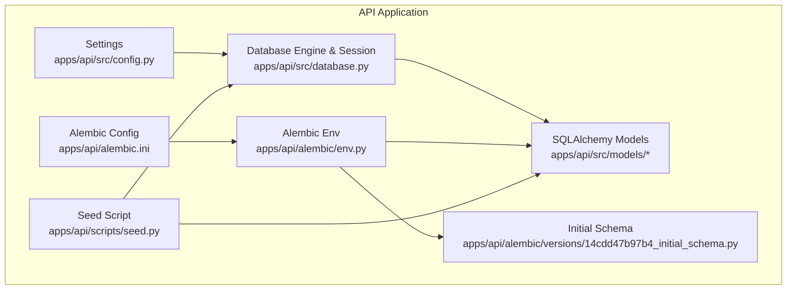
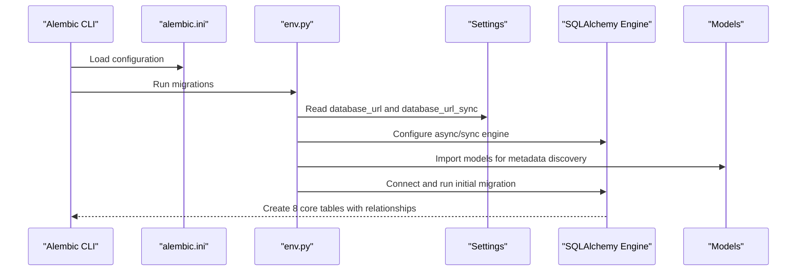
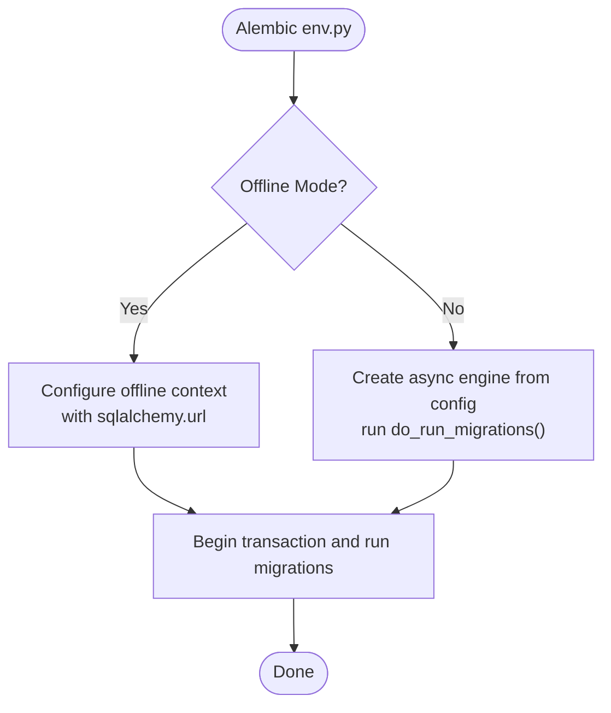
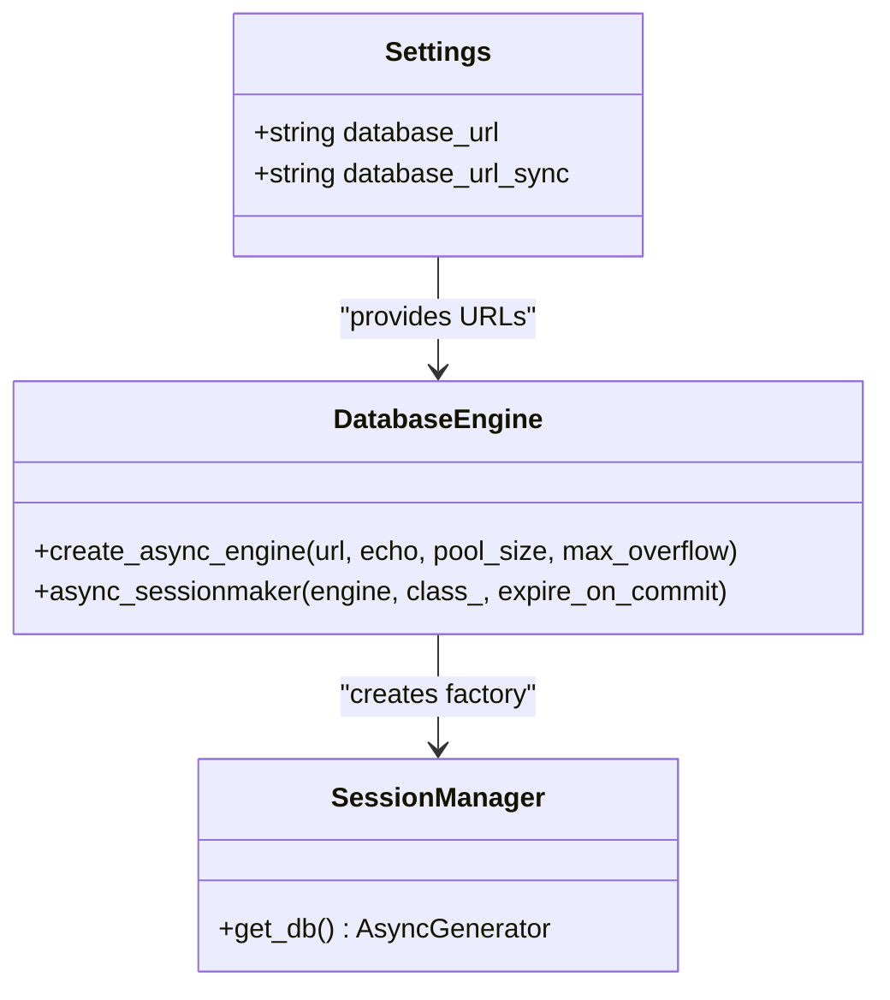
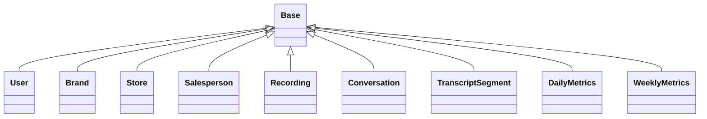
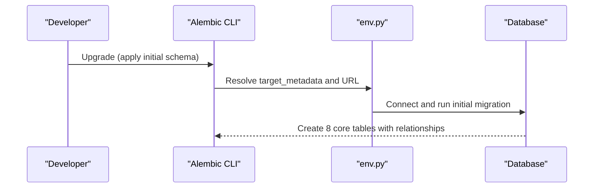
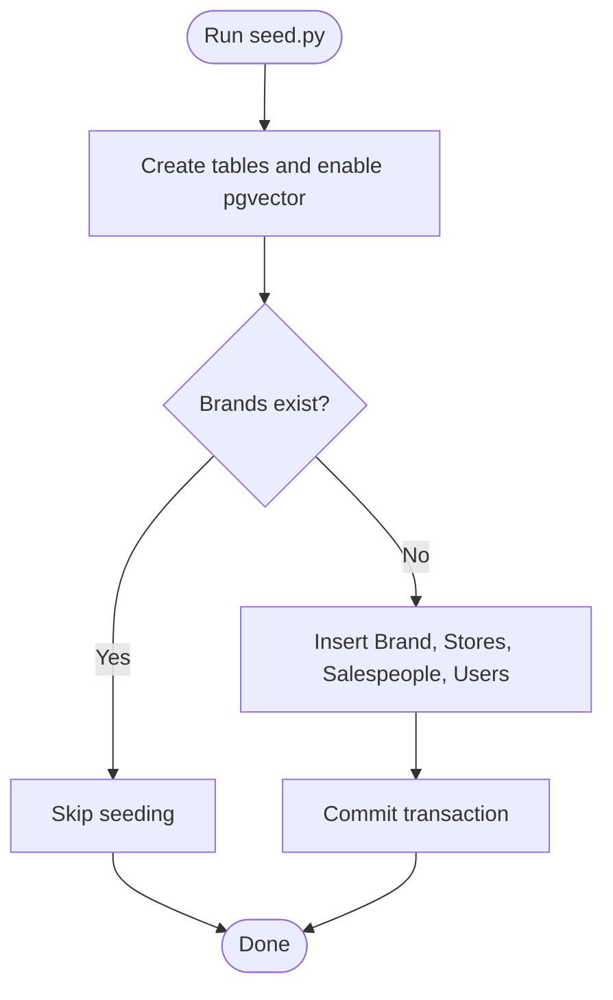
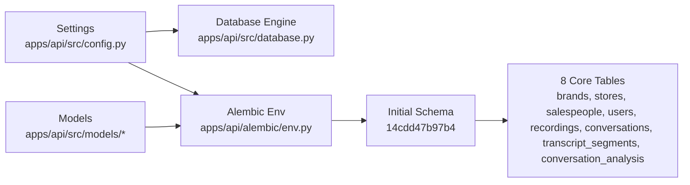

# Database Operations and Migrations

<cite>
**Referenced Files in This Document**
- [apps/api/src/config.py](file://apps/api/src/config.py)
- [apps/api/src/database.py](file://apps/api/src/database.py)
- [apps/api/alembic/env.py](file://apps/api/alembic/env.py)
- [apps/api/alembic.ini](file://apps/api/alembic.ini)
- [apps/api/alembic/versions/14cdd47b97b4_initial_schema.py](file://apps/api/alembic/versions/14cdd47b97b4_initial_schema.py)
- [apps/api/scripts/seed.py](file://apps/api/scripts/seed.py)
- [apps/api/src/models/__init__.py](file://apps/api/src/models/__init__.py)
- [apps/api/src/models/user.py](file://apps/api/src/models/user.py)
- [apps/api/src/models/brand.py](file://apps/api/src/models/brand.py)
- [apps/api/src/models/store.py](file://apps/api/src/models/store.py)
- [apps/api/src/models/salesperson.py](file://apps/api/src/models/salesperson.py)
- [apps/api/src/models/recording.py](file://apps/api/src/models/recording.py)
- [apps/api/src/models/conversation.py](file://apps/api/src/models/conversation.py)
- [apps/api/src/models/transcript.py](file://apps/api/src/models/transcript.py)
- [apps/api/src/models/metrics.py](file://apps/api/src/models/metrics.py)
</cite>

## Update Summary
**Changes Made**
- Updated initial schema documentation to reflect the new comprehensive database structure
- Added detailed coverage of all 8 core tables in the initial migration
- Enhanced model relationships documentation with specific foreign key constraints
- Expanded metrics table documentation including daily and weekly analytics
- Updated seed data documentation with realistic test data structure
- Enhanced troubleshooting section with vector embedding considerations

## Table of Contents
1. [Introduction](#introduction)
2. [Project Structure](#project-structure)
3. [Core Components](#core-components)
4. [Architecture Overview](#architecture-overview)
5. [Detailed Component Analysis](#detailed-component-analysis)
6. [Initial Database Schema](#initial-database-schema)
7. [Dependency Analysis](#dependency-analysis)
8. [Performance Considerations](#performance-considerations)
9. [Troubleshooting Guide](#troubleshooting-guide)
10. [Conclusion](#conclusion)
11. [Appendices](#appendices)

## Introduction
This document explains database operations and migration management in the Xsamaa AI Pipeline API service. It covers Alembic configuration, database connection settings, migration repository structure, and version control strategies. The system now includes a comprehensive initial schema supporting operations management with brands, stores, salespeople, users, recordings, conversations, transcript segments, and conversation analysis tables. It documents the migration workflow from schema changes to database updates, dependency management, rollback procedures, and the relationship between SQLAlchemy models and Alembic revisions. Guidance is included for automatic migration generation, manual customization, database initialization, seed data loading, environment-specific configuration, best practices for schema evolution and production deployments, and troubleshooting common migration issues.

## Project Structure
The database and migrations are centered under the API application with a comprehensive initial schema:
- Alembic configuration and runtime environment live under apps/api/alembic/.
- Application settings and database engine/session are defined under apps/api/src/.
- SQLAlchemy models are defined under apps/api/src/models/ with 8 core entities.
- Seed script for initializing and seeding the database is under apps/api/scripts/.

**Diagram sources**
- [apps/api/src/config.py:1-52](file://apps/api/src/config.py#L1-L52)
- [apps/api/src/database.py:1-34](file://apps/api/src/database.py#L1-L34)
- [apps/api/alembic.ini:1-151](file://apps/api/alembic.ini#L1-L151)
- [apps/api/alembic/env.py:1-73](file://apps/api/alembic/env.py#L1-L73)
- [apps/api/alembic/versions/14cdd47b97b4_initial_schema.py:1-178](file://apps/api/alembic/versions/14cdd47b97b4_initial_schema.py#L1-L178)
- [apps/api/scripts/seed.py:1-132](file://apps/api/scripts/seed.py#L1-L132)

**Section sources**
- [apps/api/src/config.py:1-52](file://apps/api/src/config.py#L1-L52)
- [apps/api/src/database.py:1-34](file://apps/api/src/database.py#L1-L34)
- [apps/api/alembic.ini:1-151](file://apps/api/alembic.ini#L1-L151)
- [apps/api/alembic/env.py:1-73](file://apps/api/alembic/env.py#L1-L73)
- [apps/api/alembic/versions/14cdd47b97b4_initial_schema.py:1-178](file://apps/api/alembic/versions/14cdd47b97b4_initial_schema.py#L1-L178)
- [apps/api/scripts/seed.py:1-132](file://apps/api/scripts/seed.py#L1-L132)

## Core Components
- Settings and database URLs:
  - Asynchronous and synchronous database URLs are defined in settings and consumed by the engine and Alembic respectively.
- Database engine and session:
  - An asynchronous SQLAlchemy engine and async session factory are configured with connection pooling parameters.
  - A scoped async generator provides sessions with automatic commit/rollback semantics.
- Alembic configuration:
  - Alembic reads script_location and logging from alembic.ini.
  - env.py sets the SQLAlchemy URL dynamically from settings and imports all models to ensure detection.
- Initial schema migration:
  - The first migration establishes 8 core tables with proper foreign key relationships and indexes.
- Models:
  - SQLAlchemy declarative base is used across models; relationships and indexes are defined consistently.
- Seed script:
  - Creates tables, enables the pgvector extension, and seeds initial data if the brands table is empty.

**Section sources**
- [apps/api/src/config.py:11-14](file://apps/api/src/config.py#L11-L14)
- [apps/api/src/database.py:8-19](file://apps/api/src/database.py#L8-L19)
- [apps/api/src/database.py:26-34](file://apps/api/src/database.py#L26-L34)
- [apps/api/alembic.ini:8](file://apps/api/alembic.ini#L8)
- [apps/api/alembic/env.py:27](file://apps/api/alembic/env.py#L27)
- [apps/api/alembic/env.py:29](file://apps/api/alembic/env.py#L29)
- [apps/api/alembic/versions/14cdd47b97b4_initial_schema.py:22-157](file://apps/api/alembic/versions/14cdd47b97b4_initial_schema.py#L22-L157)
- [apps/api/scripts/seed.py:21-27](file://apps/api/scripts/seed.py#L21-L27)
- [apps/api/scripts/seed.py:28-107](file://apps/api/scripts/seed.py#L28-L107)

## Architecture Overview
The migration architecture integrates application settings, SQLAlchemy models, and Alembic runtime. The flow supports offline and online modes, with dynamic URL resolution and model discovery. The initial schema establishes a complete operations foundation with proper entity relationships and indexing strategy.

**Diagram sources**
- [apps/api/alembic.ini:8](file://apps/api/alembic.ini#L8)
- [apps/api/alembic/env.py:29](file://apps/api/alembic/env.py#L29)
- [apps/api/alembic/env.py:53-62](file://apps/api/alembic/env.py#L53-L62)
- [apps/api/src/config.py:11-14](file://apps/api/src/config.py#L11-L14)
- [apps/api/src/models/__init__.py:1-24](file://apps/api/src/models/__init__.py#L1-L24)

## Detailed Component Analysis

### Alembic Configuration and Environment
- Configuration file:
  - script_location points to the alembic directory.
  - prepend_sys_path allows importing application modules.
  - Logging is configured via loggers and handlers.
- Environment runtime:
  - Imports all models to ensure Alembic detects them.
  - Sets the SQLAlchemy URL from settings.database_url_sync for offline mode and settings.database_url for online mode.
  - Supports offline and online migration execution paths.

**Diagram sources**
- [apps/api/alembic/env.py:32-49](file://apps/api/alembic/env.py#L32-L49)
- [apps/api/alembic/env.py:52-67](file://apps/api/alembic/env.py#L52-L67)

**Section sources**
- [apps/api/alembic.ini:8](file://apps/api/alembic.ini#L8)
- [apps/api/alembic.ini:21](file://apps/api/alembic.ini#L21)
- [apps/api/alembic.ini:118-151](file://apps/api/alembic.ini#L118-L151)
- [apps/api/alembic/env.py:12-21](file://apps/api/alembic/env.py#L12-L21)
- [apps/api/alembic/env.py:27-30](file://apps/api/alembic/env.py#L27-L30)
- [apps/api/alembic/env.py:65-73](file://apps/api/alembic/env.py#L65-L73)

### Database Connection Settings and Engine
- Settings:
  - database_url: asynchronous PostgreSQL URL used by the application and Alembic online mode.
  - database_url_sync: synchronous PostgreSQL URL used by Alembic offline mode.
- Engine and session:
  - Asynchronous engine configured with pool_size and max_overflow.
  - Async session factory with expire_on_commit disabled.
  - get_db provides a context manager that commits on success and rolls back on exceptions.

**Diagram sources**
- [apps/api/src/config.py:11-14](file://apps/api/src/config.py#L11-L14)
- [apps/api/src/database.py:8-19](file://apps/api/src/database.py#L8-L19)
- [apps/api/src/database.py:26-34](file://apps/api/src/database.py#L26-L34)

**Section sources**
- [apps/api/src/config.py:11-14](file://apps/api/src/config.py#L11-L14)
- [apps/api/src/database.py:8-19](file://apps/api/src/database.py#L8-L19)
- [apps/api/src/database.py:26-34](file://apps/api/src/database.py#L26-L34)

### SQLAlchemy Models and Metadata Discovery
- Base class:
  - Declarative base used across models.
- Model imports:
  - env.py imports all models to ensure Alembic's target_metadata includes them.
- Model coverage:
  - Users, Brands, Stores, Salespeople, Recordings, Conversations, Transcript segments, and Metrics are defined with relationships and indexes.

**Diagram sources**
- [apps/api/src/database.py:22-23](file://apps/api/src/database.py#L22-L23)
- [apps/api/alembic/env.py:12-21](file://apps/api/alembic/env.py#L12-L21)
- [apps/api/src/models/user.py:19-48](file://apps/api/src/models/user.py#L19-L48)
- [apps/api/src/models/brand.py:10-26](file://apps/api/src/models/brand.py#L10-L26)
- [apps/api/src/models/store.py:11-32](file://apps/api/src/models/store.py#L11-L32)
- [apps/api/src/models/salesperson.py:10-32](file://apps/api/src/models/salesperson.py#L10-L32)
- [apps/api/src/models/recording.py:24-60](file://apps/api/src/models/recording.py#L24-L60)
- [apps/api/src/models/conversation.py:11-61](file://apps/api/src/models/conversation.py#L11-L61)
- [apps/api/src/models/transcript.py:10-27](file://apps/api/src/models/transcript.py#L10-L27)
- [apps/api/src/models/metrics.py:10-39](file://apps/api/src/models/metrics.py#L10-L39)

**Section sources**
- [apps/api/src/database.py:22-23](file://apps/api/src/database.py#L22-L23)
- [apps/api/alembic/env.py:12-21](file://apps/api/alembic/env.py#L12-L21)
- [apps/api/src/models/__init__.py:1-24](file://apps/api/src/models/__init__.py#L1-L24)

### Migration Workflow: From Schema Changes to Database Updates
- Detecting models:
  - env.py imports models to populate target_metadata for Alembic.
- Running migrations:
  - Offline mode uses the configured sqlalchemy.url.
  - Online mode creates an async engine from settings and runs migrations synchronously inside an async context.
- Version locations:
  - The versions directory contains the initial schema migration.

**Diagram sources**
- [apps/api/alembic/env.py:27-30](file://apps/api/alembic/env.py#L27-L30)
- [apps/api/alembic/env.py:52-67](file://apps/api/alembic/env.py#L52-L67)

**Section sources**
- [apps/api/alembic/env.py:27-30](file://apps/api/alembic/env.py#L27-L30)
- [apps/api/alembic/env.py:52-67](file://apps/api/alembic/env.py#L52-L67)
- [apps/api/alembic.ini:8](file://apps/api/alembic.ini#L8)

### Automatic vs Manual Migration Generation
- Autogenerate:
  - Alembic can compare the target_metadata with the database to produce revision scripts.
- Manual customization:
  - Revision scripts can be edited after generation to refine operations, add constraints, or handle complex data transformations.
- Post-write hooks:
  - Optional formatters or linters can be integrated via post_write_hooks.

**Section sources**
- [apps/api/alembic.ini:10-16](file://apps/api/alembic.ini#L10-L16)
- [apps/api/alembic.ini:93-115](file://apps/api/alembic.ini#L93-L115)

### Rollback Procedures
- Downgrade:
  - Alembic downgrade commands move to previous revisions, removing tables in reverse dependency order.
- Safety:
  - Use explicit revision identifiers and test rollbacks in staging environments.
- Data safety:
  - Prefer reversible operations and backup before production rollbacks.

### Database Initialization and Seed Data Loading
- Initialization:
  - The seed script creates tables and enables the pgvector extension.
- Seeding:
  - Seeds a Brand, two Stores, three Salespeople, and multiple Users with hashed passwords.
- Conditional seeding:
  - Skips seeding if brands already exist.

**Diagram sources**
- [apps/api/scripts/seed.py:21-27](file://apps/api/scripts/seed.py#L21-L27)
- [apps/api/scripts/seed.py:28-107](file://apps/api/scripts/seed.py#L28-L107)

**Section sources**
- [apps/api/scripts/seed.py:21-27](file://apps/api/scripts/seed.py#L21-L27)
- [apps/api/scripts/seed.py:28-107](file://apps/api/scripts/seed.py#L28-L107)

### Environment-Specific Configuration Management
- Settings:
  - database_url and database_url_sync define the connection strings for async and sync contexts.
  - Additional environment controls include app_env, app_debug, and CORS origins.
- Environment files:
  - Settings load from .env via pydantic-settings.

**Section sources**
- [apps/api/src/config.py:11-14](file://apps/api/src/config.py#L11-L14)
- [apps/api/src/config.py:38-48](file://apps/api/src/config.py#L38-L48)

## Initial Database Schema

### Core Entity Tables
The initial migration establishes eight fundamental tables forming the operations system foundation:

#### Brands Table
- Purpose: Central organizational entity for retail chains
- Primary Keys: UUID id
- Key Fields: name (255 chars), description (1000 chars), timestamps
- Relationships: One-to-many with stores, users
- Indexes: Primary key index

#### Stores Table
- Purpose: Physical locations within brands
- Primary Keys: UUID id
- Foreign Keys: brand_id → brands.id
- Key Fields: name (255 chars), location (500 chars), working_hours (JSONB)
- Relationships: Many-to-one with brand, one-to-many with salespeople/users
- Indexes: brand_id foreign key index, primary key index

#### Salespeople Table
- Purpose: Individual sales team members
- Primary Keys: UUID id
- Foreign Keys: store_id → stores.id
- Key Fields: name (255 chars), email (255 chars), role (100 chars), shift (50 chars)
- Relationships: Many-to-one with store, one-to-many with recordings
- Indexes: store_id foreign key index, primary key index

#### Users Table
- Purpose: System users with role-based access control
- Primary Keys: UUID id
- Foreign Keys: brand_id → brands.id, store_id → stores.id
- Key Fields: email (unique), password_hash (255 chars), full_name (255 chars), role (enum)
- Relationships: Many-to-one with brand/store
- Indexes: email unique index, brand_id/store_id foreign key indexes

#### Recordings Table
- Purpose: Audio/video recordings of customer interactions
- Primary Keys: UUID id
- Foreign Keys: salesperson_id → salespeople.id
- Key Fields: file_url (text), file_size, duration_seconds, format (10 chars)
- Status Enum: UPLOADED, PREPROCESSING, TRANSCRIBING, DIARIZING, SEGMENTING, ANALYZING, SCORING, COMPLETED, FAILED
- Relationships: Many-to-one with salesperson, one-to-many with transcript_segments/conversations
- Indexes: salesperson_id foreign key index, primary key index

#### Conversations Table
- Purpose: Segmented conversations extracted from recordings
- Primary Keys: UUID id
- Foreign Keys: recording_id → recordings.id
- Key Fields: start_time, end_time, segment_count
- Relationships: Many-to-one with recording, one-to-one with conversation_analysis
- Indexes: recording_id foreign key index, primary key index

#### Transcript Segments Table
- Purpose: Individual speaker segments with vector embeddings
- Primary Keys: UUID id
- Foreign Keys: recording_id → recordings.id
- Key Fields: speaker_label (20 chars), timestamps, text (text), embedding (Vector 768)
- Relationships: Many-to-one with recording
- Indexes: recording_id foreign key index, primary key index

#### Conversation Analysis Table
- Purpose: AI-powered insights and analytics for conversations
- Primary Keys: UUID id (unique constraint on conversation_id)
- Foreign Keys: conversation_id → conversations.id
- Key Fields: intent (text), products/objections/competitors (JSONB arrays), budget (100 chars)
- Additional Fields: closing_attempt (boolean), outcome (50 chars), confidence (integer)
- Relationships: One-to-one with conversation
- Indexes: unique conversation_id index, primary key index

### Metrics Tables
Two specialized analytics tables for operational insights:

#### Daily Metrics Table
- Purpose: Daily operational metrics aggregation
- Primary Keys: UUID id
- Unique Constraints: (entity_id, entity_type, date)
- Key Fields: entity_id, entity_type (20 chars), date, conversation_count, avg_score, conversion_rate
- Indexes: entity_id index

#### Weekly Metrics Table
- Purpose: Weekly operational metrics aggregation
- Primary Keys: UUID id
- Unique Constraints: (entity_id, entity_type, week_start)
- Key Fields: entity_id, entity_type (20 chars), week_start, conversation_count, avg_score, conversion_rate, top_objection (500 chars)
- Indexes: entity_id index

**Section sources**
- [apps/api/alembic/versions/14cdd47b97b4_initial_schema.py:25-156](file://apps/api/alembic/versions/14cdd47b97b4_initial_schema.py#L25-L156)
- [apps/api/src/models/brand.py:10-26](file://apps/api/src/models/brand.py#L10-L26)
- [apps/api/src/models/store.py:11-32](file://apps/api/src/models/store.py#L11-L32)
- [apps/api/src/models/salesperson.py:10-32](file://apps/api/src/models/salesperson.py#L10-L32)
- [apps/api/src/models/user.py:20-49](file://apps/api/src/models/user.py#L20-L49)
- [apps/api/src/models/recording.py:24-60](file://apps/api/src/models/recording.py#L24-L60)
- [apps/api/src/models/conversation.py:11-61](file://apps/api/src/models/conversation.py#L11-L61)
- [apps/api/src/models/transcript.py:10-27](file://apps/api/src/models/transcript.py#L10-L27)
- [apps/api/src/models/metrics.py:10-39](file://apps/api/src/models/metrics.py#L10-L39)

## Dependency Analysis
The following diagram shows how Alembic depends on settings and models, and how the application database layer depends on settings.

**Diagram sources**
- [apps/api/src/config.py:11-14](file://apps/api/src/config.py#L11-L14)
- [apps/api/src/database.py:8-19](file://apps/api/src/database.py#L8-L19)
- [apps/api/alembic/env.py:12-21](file://apps/api/alembic/env.py#L12-L21)
- [apps/api/alembic/env.py:27-30](file://apps/api/alembic/env.py#L27-L30)
- [apps/api/alembic/versions/14cdd47b97b4_initial_schema.py:22-157](file://apps/api/alembic/versions/14cdd47b97b4_initial_schema.py#L22-L157)

**Section sources**
- [apps/api/src/config.py:11-14](file://apps/api/src/config.py#L11-L14)
- [apps/api/src/database.py:8-19](file://apps/api/src/database.py#L8-L19)
- [apps/api/alembic/env.py:12-21](file://apps/api/alembic/env.py#L12-L21)
- [apps/api/alembic/env.py:27-30](file://apps/api/alembic/env.py#L27-L30)

## Performance Considerations
- Connection pooling:
  - Tune pool_size and max_overflow according to workload.
- Asynchronous operations:
  - Use async sessions for I/O-bound workloads.
- Indexes and constraints:
  - Appropriate indexes on foreign keys and frequently queried columns.
- Migration performance:
  - Initial schema creation is optimized for sequential table creation.
- Vector embeddings:
  - Proper indexing and dimension management for pgvector embeddings.

## Troubleshooting Guide
- Migration fails due to missing pgvector:
  - Ensure the seed script runs to enable the extension before creating dependent tables.
- Database locking during migrations:
  - Avoid concurrent migrations; coordinate with CI/CD pipelines.
  - Use downtime windows for destructive changes.
- Rollback issues:
  - Verify the presence of a downgrade script; if missing, recreate a reversible migration.
- Environment mismatch:
  - Confirm database_url and database_url_sync match the target environment.
- Alembic cannot detect models:
  - Ensure all model modules are imported in env.py.
- Vector embedding errors:
  - Verify pgvector extension is enabled and compatible with PostgreSQL version.
- Foreign key constraint violations:
  - Ensure parent records are created before child records in seed data.
- Role enum validation:
  - Verify UserRole enum values match the database enum definition.

**Section sources**
- [apps/api/scripts/seed.py:25-27](file://apps/api/scripts/seed.py#L25-L27)
- [apps/api/alembic/env.py:12-21](file://apps/api/alembic/env.py#L12-L21)
- [apps/api/alembic/versions/14cdd47b97b4_initial_schema.py:133](file://apps/api/alembic/versions/14cdd47b97b4_initial_schema.py#L133)

## Conclusion
The Xsamaa AI Pipeline leverages Alembic with dynamic URL resolution and explicit model imports to manage database migrations. The initial schema establishes a comprehensive operations foundation with 8 core tables supporting brands, stores, salespeople, users, recordings, conversations, transcript segments, and conversation analysis. The asynchronous SQLAlchemy engine and session factory integrate cleanly with the application, while the seed script provides a safe initialization routine with realistic test data. Following the recommended practices ensures robust schema evolution and reliable production deployments.

## Appendices

### Typical Migration Patterns
- Adding a column with a default:
  - Use alter_column with server_default.
- Creating a new table with foreign keys:
  - Define the table and relationships; add indexes as needed.
- Renaming a column:
  - Use op.alter_column with existing_name/new_name; consider data preservation steps.
- Dropping a table:
  - Ensure referential integrity is handled; cascade deletes if appropriate.

### Database Maintenance Operations
- Vacuum/analyze:
  - Regular maintenance improves query performance.
- Backup and restore:
  - Use logical backups for development and point-in-time recovery for production.
- Monitoring:
  - Track slow queries and long-running transactions.
- Vector extension management:
  - Monitor pgvector extension health and optimize embedding queries.
- Index optimization:
  - Regularly analyze query patterns and adjust indexes accordingly.

### Seed Data Structure
The seed script provides comprehensive test data including:
- Single brand with description
- Two stores with working hours JSON
- Three salespeople with roles and shifts
- Five users with different role types and credentials
- Realistic test credentials for all user types

**Section sources**
- [apps/api/scripts/seed.py:40-127](file://apps/api/scripts/seed.py#L40-L127)