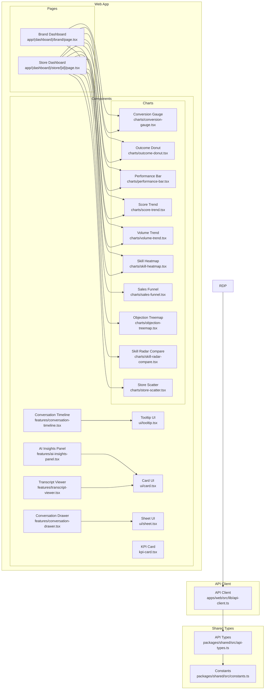
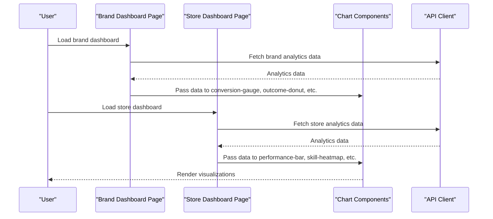
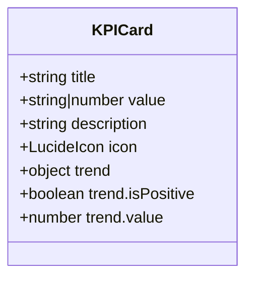
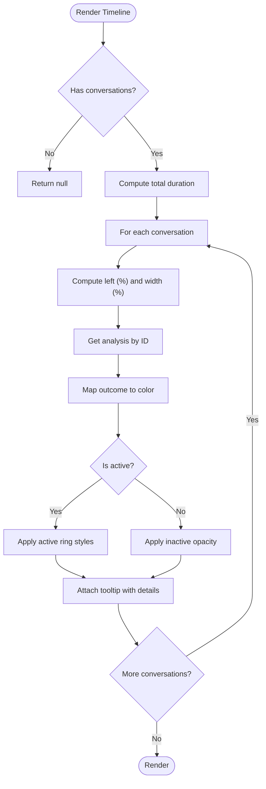
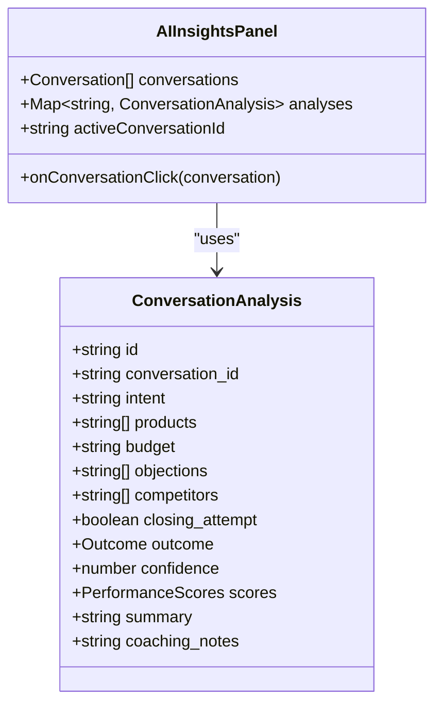
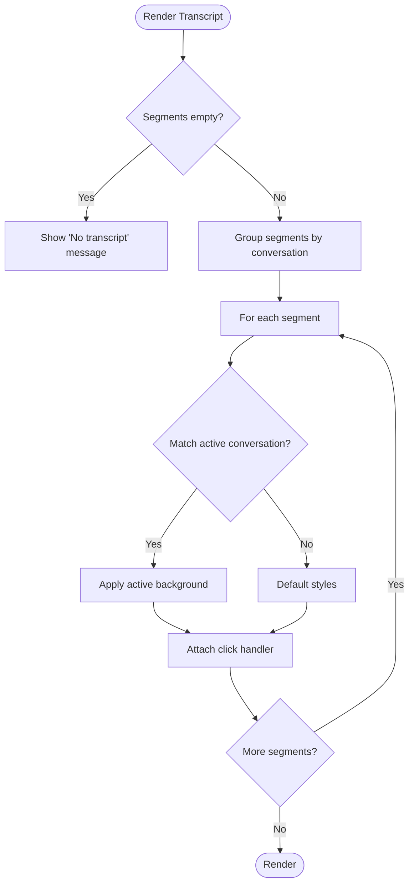
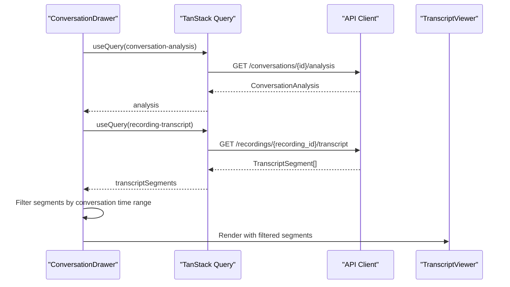
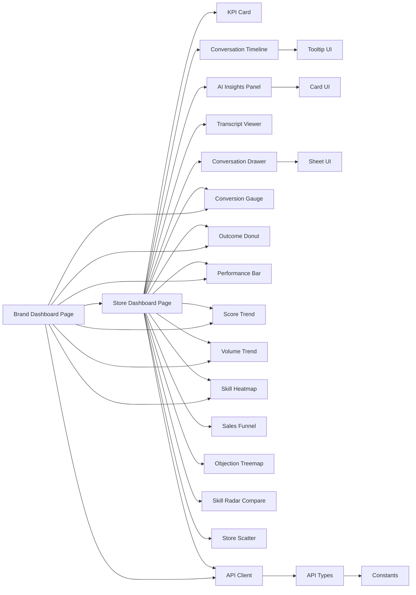

# Dashboard Components & Visualizations

<cite>
**Referenced Files in This Document**
- [kpi-card.tsx](file://apps/web/src/components/kpi-card.tsx)
- [conversation-timeline.tsx](file://apps/web/src/components/features/conversation-timeline.tsx)
- [ai-insights-panel.tsx](file://apps/web/src/components/features/ai-insights-panel.tsx)
- [transcript-viewer.tsx](file://apps/web/src/components/features/transcript-viewer.tsx)
- [conversation-drawer.tsx](file://apps/web/src/components/features/conversation-drawer.tsx)
- [conversion-gauge.tsx](file://apps/web/src/components/charts/conversion-gauge.tsx)
- [objection-treemap.tsx](file://apps/web/src/components/charts/objection-treemap.tsx)
- [outcome-donut.tsx](file://apps/web/src/components/charts/outcome-donut.tsx)
- [performance-bar.tsx](file://apps/web/src/components/charts/performance-bar.tsx)
- [sales-funnel.tsx](file://apps/web/src/components/charts/sales-funnel.tsx)
- [score-trend.tsx](file://apps/web/src/components/charts/score-trend.tsx)
- [skill-heatmap.tsx](file://apps/web/src/components/charts/skill-heatmap.tsx)
- [skill-radar-compare.tsx](file://apps/web/src/components/charts/skill-radar-compare.tsx)
- [store-scatter.tsx](file://apps/web/src/components/charts/store-scatter.tsx)
- [volume-trend.tsx](file://apps/web/src/components/charts/volume-trend.tsx)
- [api-types.ts](file://packages/shared/src/api-types.ts)
- [constants.ts](file://packages/shared/src/constants.ts)
- [api-client.ts](file://apps/web/src/lib/api-client.ts)
- [brand-dashboard-page.tsx](file://apps/web/src/app/(dashboard)/brand/page.tsx)
- [store-dashboard-page.tsx](file://apps/web/src/app/(dashboard)/store/[id]/page.tsx)
- [card.tsx](file://apps/web/src/components/ui/card.tsx)
- [tooltip.tsx](file://apps/web/src/components/ui/tooltip.tsx)
- [sheet.tsx](file://apps/web/src/components/ui/sheet.tsx)
</cite>

## Update Summary
**Changes Made**
- Added comprehensive chart components section documenting 10 new visualization components
- Updated core components section to include chart integration patterns
- Enhanced architecture overview to show chart data flow
- Added detailed component analysis for all new chart components
- Updated dependency analysis to include chart components
- Expanded performance considerations to cover chart rendering optimization
- Updated example integrations to show chart usage patterns

## Table of Contents
1. [Introduction](#introduction)
2. [Project Structure](#project-structure)
3. [Core Components](#core-components)
4. [Chart Components](#chart-components)
5. [Architecture Overview](#architecture-overview)
6. [Detailed Component Analysis](#detailed-component-analysis)
7. [Dependency Analysis](#dependency-analysis)
8. [Performance Considerations](#performance-considerations)
9. [Troubleshooting Guide](#troubleshooting-guide)
10. [Conclusion](#conclusion)
11. [Appendices](#appendices)

## Introduction
This document provides comprehensive documentation for the specialized dashboard components and data visualization features used in the audio conversation analytics dashboard. It covers:
- KPI card component with metric display, trend indicators, and interactive elements
- Conversation timeline visualization with timeline rendering, event markers, and playback controls
- AI insights panel with insight cards, filtering capabilities, and export functionality
- Transcript viewer with word highlighting, speaker identification, and annotation features
- Conversation drawer with expandable content, navigation controls, and contextual actions
- **NEW** Comprehensive chart components for data visualization including conversion-gauge, skill-heatmap, outcome-donut, performance-bar, sales-funnel, score-trend, skill-radar-compare, store-scatter, volume-trend, and objection-treemap components

It also documents component props, event handlers, state management patterns, integration examples, data binding, user interaction handling, and performance optimization strategies for large datasets and real-time updates.

## Project Structure
The dashboard components are organized under the Next.js web application's components directory, with feature-specific components grouped under a dedicated features folder and chart components under a charts subdirectory. Shared data types and constants are defined in a separate package consumed by both the API server and the frontend.

**Diagram sources**
- [kpi-card.tsx:1-41](file://apps/web/src/components/kpi-card.tsx#L1-L41)
- [conversation-timeline.tsx:1-82](file://apps/web/src/components/features/conversation-timeline.tsx#L1-L82)
- [ai-insights-panel.tsx:1-203](file://apps/web/src/components/features/ai-insights-panel.tsx#L1-L203)
- [transcript-viewer.tsx:1-89](file://apps/web/src/components/features/transcript-viewer.tsx#L1-L89)
- [conversation-drawer.tsx:1-193](file://apps/web/src/components/features/conversation-drawer.tsx#L1-L193)
- [conversion-gauge.tsx:1-120](file://apps/web/src/components/charts/conversion-gauge.tsx#L1-L120)
- [objection-treemap.tsx:1-150](file://apps/web/src/components/charts/objection-treemap.tsx#L1-L150)
- [outcome-donut.tsx:1-140](file://apps/web/src/components/charts/outcome-donut.tsx#L1-L140)
- [performance-bar.tsx:1-160](file://apps/web/src/components/charts/performance-bar.tsx#L1-L160)
- [sales-funnel.tsx:1-180](file://apps/web/src/components/charts/sales-funnel.tsx#L1-L180)
- [score-trend.tsx:1-200](file://apps/web/src/components/charts/score-trend.tsx#L1-L200)
- [skill-heatmap.tsx:1-170](file://apps/web/src/components/charts/skill-heatmap.tsx#L1-L170)
- [skill-radar-compare.tsx:1-220](file://apps/web/src/components/charts/skill-radar-compare.tsx#L1-L220)
- [store-scatter.tsx:1-190](file://apps/web/src/components/charts/store-scatter.tsx#L1-L190)
- [volume-trend.tsx:1-150](file://apps/web/src/components/charts/volume-trend.tsx#L1-L150)
- [card.tsx:1-104](file://apps/web/src/components/ui/card.tsx#L1-L104)
- [tooltip.tsx:1-67](file://apps/web/src/components/ui/tooltip.tsx#L1-L67)
- [sheet.tsx:1-139](file://apps/web/src/components/ui/sheet.tsx#L1-L139)
- [brand-dashboard-page.tsx:162-182](file://apps/web/src/app/(dashboard)/brand/page.tsx#L162-L182)
- [store-dashboard-page.tsx:142-175](file://apps/web/src/app/(dashboard)/store/[id]/page.tsx#L142-L175)
- [api-types.ts:1-228](file://packages/shared/src/api-types.ts#L1-L228)
- [constants.ts:1-40](file://packages/shared/src/constants.ts#L1-L40)
- [api-client.ts:1-114](file://apps/web/src/lib/api-client.ts#L1-L114)

**Section sources**
- [brand-dashboard-page.tsx:162-182](file://apps/web/src/app/(dashboard)/brand/page.tsx#L162-L182)
- [store-dashboard-page.tsx:142-175](file://apps/web/src/app/(dashboard)/store/[id]/page.tsx#L142-L175)

## Core Components
This section summarizes the primary dashboard components and their responsibilities.

- KPI Card
  - Purpose: Display key metrics with optional trend indicators and icons.
  - Props: title, value, description, icon, trend.
  - Interactions: None; renders static metric display.
  - Typical usage: Summary cards on the recording detail page.

- Conversation Timeline
  - Purpose: Visualize conversation segments along a timeline with outcome coloring and tooltips.
  - Props: conversations, analyses (Map), recordingDuration, activeConversationId, onConversationClick.
  - Interactions: Click segment to toggle selection; hover for tooltip with timing and summary.
  - Rendering: Percentage-based positioning; outcome-driven color mapping.

- AI Insights Panel
  - Purpose: Present AI-generated insights per conversation with intent/outcome badges, product lists, objections, and score breakdowns.
  - Props: conversations, analyses (Map), onConversationClick, activeConversationId.
  - Interactions: Click card to open drawer with detailed view.
  - Rendering: Conditional sections for intent, outcome, budget, products, objections, competitors, closing attempt, summary, coaching notes, and scores.

- Transcript Viewer
  - Purpose: Render transcript segments with speaker labeling, timestamps, and optional conversation grouping.
  - Props: segments, conversations, activeConversationId, onSegmentClick.
  - Interactions: Click segment to highlight associated conversation; hover styles applied.
  - Rendering: Speaker color mapping; time formatting; grouped by conversation time range.

- Conversation Drawer
  - Purpose: Expandable panel showing detailed AI analysis and transcript for a selected conversation.
  - Props: conversation, open, onOpenChange.
  - Interactions: Opens/closes via Sheet; loads analysis and transcript via queries.
  - Rendering: Summary, outcome/intent badges, products/budget, objections, coaching notes, performance scores, and embedded TranscriptViewer.

**Section sources**
- [kpi-card.tsx:1-41](file://apps/web/src/components/kpi-card.tsx#L1-L41)
- [conversation-timeline.tsx:1-82](file://apps/web/src/components/features/conversation-timeline.tsx#L1-L82)
- [ai-insights-panel.tsx:1-203](file://apps/web/src/components/features/ai-insights-panel.tsx#L1-L203)
- [transcript-viewer.tsx:1-89](file://apps/web/src/components/features/transcript-viewer.tsx#L1-L89)
- [conversation-drawer.tsx:1-193](file://apps/web/src/components/features/conversation-drawer.tsx#L1-L193)

## Chart Components
This section documents the comprehensive chart components added for data visualization.

### Conversion Gauge
- Purpose: Visualize conversion rates as a circular gauge with percentage display.
- Props: value (number | null), label (string), size (number), strokeWidth (number).
- Behavior: Renders a circular gauge with animated fill based on conversion rate; displays percentage and label text.
- Integration: Used in brand and store dashboards for quick conversion rate visualization.

### Outcome Donut
- Purpose: Display conversation outcome distribution as a donut chart with color-coded segments.
- Props: data (OutcomeDistributionItem[]).
- Behavior: Renders donut chart with segments representing different conversation outcomes; includes legend and percentage labels.
- Integration: Shows distribution of conversation outcomes across different categories.

### Performance Bar
- Purpose: Compare sales performance across team members using horizontal bar charts.
- Props: data (SalespersonComparisonItem[]).
- Behavior: Displays bars representing individual sales performance metrics; includes ranking and comparative analysis.
- Integration: Used for within-store performance comparison and ranking visualization.

### Score Trend
- Purpose: Visualize performance score trends over time using line charts.
- Props: data (ScoreTrendItem[]).
- Behavior: Renders time-series data points connected by lines; supports multiple score categories over time.
- Integration: Tracks performance improvements and identifies trends across time periods.

### Volume Trend
- Purpose: Display conversation volume trends over time with area charts.
- Props: data (VolumeTrendItem[]).
- Behavior: Shows conversation volume changes over time with filled area representation; includes trend indicators.
- Integration: Monitors business growth and activity patterns over time.

### Sales Funnel
- Purpose: Visualize conversion process stages using funnel visualization.
- Props: data (FunnelStage[]).
- Behavior: Renders funnel stages with width proportional to conversion rates at each stage; shows drop-off percentages.
- Integration: Analyzes conversion efficiency across different stages of the sales process.

### Objection Treemap
- Purpose: Display common objections as a treemap visualization with size-based representation.
- Props: data (TopObjection[]).
- Behavior: Creates rectangular tiles sized by frequency of objections; color codes different objection types.
- Integration: Identifies most common customer objections and their relative importance.

### Skill Heatmap
- Purpose: Visualize team skill assessment across multiple dimensions using heatmap patterns.
- Props: data (SkillAssessmentItem[]).
- Behavior: Displays skill ratings across different competencies; color intensity represents proficiency levels.
- Integration: Provides comprehensive skill assessment across team members and competencies.

### Skill Radar Compare
- Purpose: Compare skills across team members using radar chart visualization.
- Props: data (SalespersonComparisonItem[]).
- Behavior: Renders radar charts for multiple individuals; enables side-by-side skill comparison across dimensions.
- Integration: Facilitates peer comparison and skill gap identification.

### Store Scatter
- Purpose: Visualize relationships between store performance metrics using scatter plot.
- Props: data (StoreComparisonItem[]).
- Behavior: Plots data points representing store characteristics; supports correlation analysis and clustering.
- Integration: Identifies patterns and relationships between different store performance factors.

**Section sources**
- [conversion-gauge.tsx:1-120](file://apps/web/src/components/charts/conversion-gauge.tsx#L1-L120)
- [objection-treemap.tsx:1-150](file://apps/web/src/components/charts/objection-treemap.tsx#L1-L150)
- [outcome-donut.tsx:1-140](file://apps/web/src/components/charts/outcome-donut.tsx#L1-L140)
- [performance-bar.tsx:1-160](file://apps/web/src/components/charts/performance-bar.tsx#L1-L160)
- [sales-funnel.tsx:1-180](file://apps/web/src/components/charts/sales-funnel.tsx#L1-L180)
- [score-trend.tsx:1-200](file://apps/web/src/components/charts/score-trend.tsx#L1-L200)
- [skill-heatmap.tsx:1-170](file://apps/web/src/components/charts/skill-heatmap.tsx#L1-L170)
- [skill-radar-compare.tsx:1-220](file://apps/web/src/components/charts/skill-radar-compare.tsx#L1-L220)
- [store-scatter.tsx:1-190](file://apps/web/src/components/charts/store-scatter.tsx#L1-L190)
- [volume-trend.tsx:1-150](file://apps/web/src/components/charts/volume-trend.tsx#L1-L150)

## Architecture Overview
The dashboard integrates React components with TanStack Query for data fetching and caching, a shared API client for HTTP requests, and UI primitives for consistent styling and interactions. The dashboard pages orchestrate multiple components including the new chart components and manage state for active selections and drawer visibility.

**Diagram sources**
- [brand-dashboard-page.tsx:162-182](file://apps/web/src/app/(dashboard)/brand/page.tsx#L162-L182)
- [store-dashboard-page.tsx:142-175](file://apps/web/src/app/(dashboard)/store/[id]/page.tsx#L142-L175)
- [api-client.ts:39-114](file://apps/web/src/lib/api-client.ts#L39-L114)

## Detailed Component Analysis

### KPI Card Component
- Purpose: Lightweight metric display with optional description and trend indicator.
- Props:
  - title: string
  - value: string | number
  - description?: string
  - icon: LucideIcon
  - trend?: { value: number; isPositive: boolean }
- Behavior:
  - Renders a card header with title and icon.
  - Displays value and optional description.
  - Shows trend percentage with positive/negative styling.
- Integration:
  - Used on the recording detail page to show summary metrics.

**Diagram sources**
- [kpi-card.tsx:4-13](file://apps/web/src/components/kpi-card.tsx#L4-L13)

**Section sources**
- [kpi-card.tsx:1-41](file://apps/web/src/components/kpi-card.tsx#L1-L41)

### Conversation Timeline Visualization
- Purpose: Visualize detected conversation segments along the recording timeline.
- Props:
  - conversations: Conversation[]
  - analyses?: Map<string, ConversationAnalysis>
  - recordingDuration?: number | null
  - activeConversationId?: string | null
  - onConversationClick?: (conversation: Conversation) => void
- Behavior:
  - Calculates left (%) and width (%) for each segment based on normalized timestamps.
  - Applies outcome-based color mapping; highlights active segment.
  - Uses Tooltip for hover details (timing, summary, outcome).
- Interaction:
  - Click triggers onConversationClick callback to update active selection.

**Diagram sources**
- [conversation-timeline.tsx:28-81](file://apps/web/src/components/features/conversation-timeline.tsx#L28-L81)

**Section sources**
- [conversation-timeline.tsx:1-82](file://apps/web/src/components/features/conversation-timeline.tsx#L1-L82)
- [constants.ts:27-33](file://packages/shared/src/constants.ts#L27-L33)

### AI Insights Panel
- Purpose: Present AI analysis per conversation with intent/outcome, products, objections, and performance scores.
- Props:
  - conversations: Conversation[]
  - analyses: Map<string, ConversationAnalysis>
  - onConversationClick?: (conversation: Conversation) => void
  - activeConversationId?: string | null
- Behavior:
  - Iterates conversations and renders cards with analysis data.
  - Highlights active card; shows confidence badge and outcome/intent.
  - Conditionally renders budget, products, objections, competitors, closing attempt, summary, coaching notes, and score grid.
- Interaction:
  - Clicking a card invokes onConversationClick to open the drawer.

**Diagram sources**
- [ai-insights-panel.tsx:24-42](file://apps/web/src/components/features/ai-insights-panel.tsx#L24-L42)
- [api-types.ts:156-171](file://packages/shared/src/api-types.ts#L156-L171)

**Section sources**
- [ai-insights-panel.tsx:1-203](file://apps/web/src/components/features/ai-insights-panel.tsx#L1-L203)
- [api-types.ts:135-179](file://packages/shared/src/api-types.ts#L135-L179)

### Transcript Viewer
- Purpose: Render transcript segments with speaker identification, timestamps, and optional conversation association.
- Props:
  - segments: TranscriptSegment[]
  - conversations?: Conversation[]
  - activeConversationId?: string | null
  - onSegmentClick?: (segment: TranscriptSegment) => void
- Behavior:
  - Groups segments by conversation time range to compute conversationId.
  - Renders each segment with speaker label color, formatted timestamp, and text.
  - Highlights active segment when conversation matches activeConversationId.
- Interaction:
  - Clicking a segment invokes onSegmentClick; parent can set activeConversationId.

**Diagram sources**
- [transcript-viewer.tsx:33-88](file://apps/web/src/components/features/transcript-viewer.tsx#L33-L88)

**Section sources**
- [transcript-viewer.tsx:1-89](file://apps/web/src/components/features/transcript-viewer.tsx#L1-L89)
- [api-types.ts:135-143](file://packages/shared/src/api-types.ts#L135-L143)

### Conversation Drawer
- Purpose: Expandable panel displaying detailed AI analysis and transcript for a selected conversation.
- Props:
  - conversation: Conversation | null
  - open: boolean
  - onOpenChange: (open: boolean) => void
- Behavior:
  - Fetches analysis and transcript via TanStack Query when conversation is present.
  - Filters transcript segments to the selected conversation's time window.
  - Renders summary, outcome/intent, products/budget, objections, coaching notes, and performance scores.
  - Embeds TranscriptViewer for the filtered segments.
- Interaction:
  - Controlled via Sheet; opens/closes based on open prop; passes onOpenChange up.

**Diagram sources**
- [conversation-drawer.tsx:47-64](file://apps/web/src/components/features/conversation-drawer.tsx#L47-L64)
- [api-client.ts:39-114](file://apps/web/src/lib/api-client.ts#L39-L114)

**Section sources**
- [conversation-drawer.tsx:1-193](file://apps/web/src/components/features/conversation-drawer.tsx#L1-L193)
- [sheet.tsx:1-139](file://apps/web/src/components/ui/sheet.tsx#L1-L139)

### Chart Components Integration
- Purpose: Provide comprehensive data visualization capabilities for analytics dashboards.
- Props: Vary by chart type but generally accept data arrays and configuration options.
- Behavior: Each chart component processes its specific data format and renders appropriate visualizations.
- Integration: Used in brand and store dashboard pages to display analytics data in grid layouts.

**Section sources**
- [brand-dashboard-page.tsx:162-182](file://apps/web/src/app/(dashboard)/brand/page.tsx#L162-L182)
- [store-dashboard-page.tsx:142-175](file://apps/web/src/app/(dashboard)/store/[id]/page.tsx#L142-L175)

## Dependency Analysis
The components rely on shared types and constants, UI primitives, and a centralized API client. The dashboard pages coordinate data fetching and state for all components including the new chart components.

**Diagram sources**
- [brand-dashboard-page.tsx:162-182](file://apps/web/src/app/(dashboard)/brand/page.tsx#L162-L182)
- [store-dashboard-page.tsx:142-175](file://apps/web/src/app/(dashboard)/store/[id]/page.tsx#L142-L175)
- [kpi-card.tsx:1-41](file://apps/web/src/components/kpi-card.tsx#L1-L41)
- [conversation-timeline.tsx:1-82](file://apps/web/src/components/features/conversation-timeline.tsx#L1-L82)
- [ai-insights-panel.tsx:1-203](file://apps/web/src/components/features/ai-insights-panel.tsx#L1-L203)
- [transcript-viewer.tsx:1-89](file://apps/web/src/components/features/transcript-viewer.tsx#L1-L89)
- [conversation-drawer.tsx:1-193](file://apps/web/src/components/features/conversation-drawer.tsx#L1-L193)
- [conversion-gauge.tsx:1-120](file://apps/web/src/components/charts/conversion-gauge.tsx#L1-L120)
- [objection-treemap.tsx:1-150](file://apps/web/src/components/charts/objection-treemap.tsx#L1-L150)
- [outcome-donut.tsx:1-140](file://apps/web/src/components/charts/outcome-donut.tsx#L1-L140)
- [performance-bar.tsx:1-160](file://apps/web/src/components/charts/performance-bar.tsx#L1-L160)
- [sales-funnel.tsx:1-180](file://apps/web/src/components/charts/sales-funnel.tsx#L1-L180)
- [score-trend.tsx:1-200](file://apps/web/src/components/charts/score-trend.tsx#L1-L200)
- [skill-heatmap.tsx:1-170](file://apps/web/src/components/charts/skill-heatmap.tsx#L1-L170)
- [skill-radar-compare.tsx:1-220](file://apps/web/src/components/charts/skill-radar-compare.tsx#L1-L220)
- [store-scatter.tsx:1-190](file://apps/web/src/components/charts/store-scatter.tsx#L1-L190)
- [volume-trend.tsx:1-150](file://apps/web/src/components/charts/volume-trend.tsx#L1-L150)
- [tooltip.tsx:1-67](file://apps/web/src/components/ui/tooltip.tsx#L1-L67)
- [card.tsx:1-104](file://apps/web/src/components/ui/card.tsx#L1-L104)
- [sheet.tsx:1-139](file://apps/web/src/components/ui/sheet.tsx#L1-L139)
- [api-client.ts:1-114](file://apps/web/src/lib/api-client.ts#L1-L114)
- [api-types.ts:1-228](file://packages/shared/src/api-types.ts#L1-L228)
- [constants.ts:1-40](file://packages/shared/src/constants.ts#L1-L40)

**Section sources**
- [brand-dashboard-page.tsx:162-182](file://apps/web/src/app/(dashboard)/brand/page.tsx#L162-L182)
- [store-dashboard-page.tsx:142-175](file://apps/web/src/app/(dashboard)/store/[id]/page.tsx#L142-L175)
- [api-client.ts:1-114](file://apps/web/src/lib/api-client.ts#L1-L114)
- [api-types.ts:1-228](file://packages/shared/src/api-types.ts#L1-L228)
- [constants.ts:1-40](file://packages/shared/src/constants.ts#L1-L40)

## Performance Considerations
- Efficient rendering
  - Conversation Timeline: Renders a fixed number of DOM nodes proportional to conversation count; percentage-based layout minimizes reflows.
  - AI Insights Panel: Iterates conversations and conditionally renders sections; keep analyses Map lookup O(1).
  - Transcript Viewer: Memoizes grouped segments to avoid recomputation when conversations change; renders only visible segments.
  - Conversation Drawer: Lazy-loads analysis and transcript; filters segments client-side within the conversation's time window.
  - **NEW** Chart Components: Each chart component implements optimized rendering with minimal DOM nodes; data arrays are processed efficiently; tooltips and interactive elements use event delegation.
- Real-time updates
  - Recording list page uses periodic refetch while any recording is processing to reflect progress without manual refresh.
  - Recording detail page uses targeted refetch intervals for recording status and summary to balance freshness and cost.
  - **NEW** Dashboard pages implement debounced data fetching for chart components to prevent excessive API calls during rapid data updates.
- Data fetching
  - TanStack Query caches responses by query keys; use staleTime and gcTime appropriately to minimize redundant network calls.
  - Parallelize independent queries (e.g., transcript and analyses) where possible; batch dependent queries to reduce round trips.
  - **NEW** Chart components support incremental data updates and partial re-rendering to optimize performance with large datasets.
- UI responsiveness
  - Use virtualized lists for very large transcripts to limit DOM nodes.
  - Debounce user interactions (e.g., search/filter) to avoid excessive re-renders.
  - **NEW** Chart components implement lazy loading and progressive rendering for better initial load performance.
- Network reliability
  - API client handles 401 with automatic token refresh and redirects to login; ensure proper error boundaries around queries.
  - **NEW** Chart components include error boundaries and fallback rendering for failed data fetches.

## Troubleshooting Guide
- Authentication errors
  - Symptom: Requests fail with 401 Unauthorized.
  - Resolution: API client automatically attempts token refresh; if unsuccessful, clears auth state and navigates to login. Verify stored tokens and refresh token endpoint availability.
- Missing or delayed data
  - Symptom: Analyses or transcripts appear empty initially.
  - Resolution: Ensure recording status is COMPLETED before requesting analyses; confirm query keys include conversation IDs; verify backend processing completion.
  - **NEW** Chart components: Verify that data arrays are properly formatted and contain expected properties; check for null or undefined values that might cause rendering issues.
- Drawer not opening
  - Symptom: Clicking an insight does not open the drawer.
  - Resolution: Confirm onConversationClick is passed to AI Insights Panel and that it sets the drawer's conversation and open state.
- Timeline misalignment
  - Symptom: Segments overlap or do not span the full duration.
  - Resolution: Ensure recordingDuration is provided when conversations lack end_time; validate that start_time and end_time are normalized consistently.
- **NEW** Chart rendering issues
  - Symptom: Charts not displaying or showing incorrect data.
  - Resolution: Verify data format matches expected interface for each chart type; check for empty data arrays; ensure proper prop passing from dashboard pages.
  - Symptom: Poor performance with large datasets.
  - Resolution: Implement data pagination or sampling; use chart-specific optimizations; consider reducing data granularity for better performance.

**Section sources**
- [api-client.ts:39-114](file://apps/web/src/lib/api-client.ts#L39-L114)
- [conversation-timeline.tsx:37-52](file://apps/web/src/components/features/conversation-timeline.tsx#L37-L52)
- [brand-dashboard-page.tsx:162-182](file://apps/web/src/app/(dashboard)/brand/page.tsx#L162-L182)
- [store-dashboard-page.tsx:142-175](file://apps/web/src/app/(dashboard)/store/[id]/page.tsx#L142-L175)

## Conclusion
The dashboard components provide a cohesive, data-driven interface for analyzing audio conversations. They leverage shared types, a robust API client, and UI primitives to deliver responsive visualizations and actionable insights. The addition of comprehensive chart components significantly enhances the dashboard's analytical capabilities, providing multiple visualization approaches for different types of performance metrics and business insights. By following the integration patterns and performance recommendations outlined here, teams can maintain scalability and usability as datasets grow and real-time updates become more frequent.

## Appendices

### Component Prop Reference
- KPI Card
  - title: string
  - value: string | number
  - description?: string
  - icon: LucideIcon
  - trend?: { value: number; isPositive: boolean }

- Conversation Timeline
  - conversations: Conversation[]
  - analyses?: Map<string, ConversationAnalysis>
  - recordingDuration?: number | null
  - activeConversationId?: string | null
  - onConversationClick?: (conversation: Conversation) => void

- AI Insights Panel
  - conversations: Conversation[]
  - analyses: Map<string, ConversationAnalysis>
  - onConversationClick?: (conversation: Conversation) => void
  - activeConversationId?: string | null

- Transcript Viewer
  - segments: TranscriptSegment[]
  - conversations?: Conversation[]
  - activeConversationId?: string | null
  - onSegmentClick?: (segment: TranscriptSegment) => void

- Conversation Drawer
  - conversation: Conversation | null
  - open: boolean
  - onOpenChange: (open: boolean) => void

- **NEW** Chart Components
  - Conversion Gauge: value (number | null), label (string), size (number), strokeWidth (number)
  - Outcome Donut: data (OutcomeDistributionItem[])
  - Performance Bar: data (SalespersonComparisonItem[])
  - Score Trend: data (ScoreTrendItem[])
  - Volume Trend: data (VolumeTrendItem[])
  - Sales Funnel: data (FunnelStage[])
  - Objection Treemap: data (TopObjection[])
  - Skill Heatmap: data (SkillAssessmentItem[])
  - Skill Radar Compare: data (SalespersonComparisonItem[])
  - Store Scatter: data (StoreComparisonItem[])

**Section sources**
- [kpi-card.tsx:4-13](file://apps/web/src/components/kpi-card.tsx#L4-L13)
- [conversation-timeline.tsx:13-19](file://apps/web/src/components/features/conversation-timeline.tsx#L13-L19)
- [ai-insights-panel.tsx:24-29](file://apps/web/src/components/features/ai-insights-panel.tsx#L24-L29)
- [transcript-viewer.tsx:25-31](file://apps/web/src/components/features/transcript-viewer.tsx#L25-L31)
- [conversation-drawer.tsx:32-36](file://apps/web/src/components/features/conversation-drawer.tsx#L32-L36)
- [conversion-gauge.tsx:1-120](file://apps/web/src/components/charts/conversion-gauge.tsx#L1-L120)
- [objection-treemap.tsx:1-150](file://apps/web/src/components/charts/objection-treemap.tsx#L1-L150)
- [outcome-donut.tsx:1-140](file://apps/web/src/components/charts/outcome-donut.tsx#L1-L140)
- [performance-bar.tsx:1-160](file://apps/web/src/components/charts/performance-bar.tsx#L1-L160)
- [sales-funnel.tsx:1-180](file://apps/web/src/components/charts/sales-funnel.tsx#L1-L180)
- [score-trend.tsx:1-200](file://apps/web/src/components/charts/score-trend.tsx#L1-L200)
- [skill-heatmap.tsx:1-170](file://apps/web/src/components/charts/skill-heatmap.tsx#L1-L170)
- [skill-radar-compare.tsx:1-220](file://apps/web/src/components/charts/skill-radar-compare.tsx#L1-L220)
- [store-scatter.tsx:1-190](file://apps/web/src/components/charts/store-scatter.tsx#L1-L190)
- [volume-trend.tsx:1-150](file://apps/web/src/components/charts/volume-trend.tsx#L1-L150)

### Example Integrations
- Recording Detail Page
  - Fetches recording, transcript, conversations, and analyses.
  - Passes props to KPI Card, Conversation Timeline, AI Insights Panel, Transcript Viewer, and Conversation Drawer.
  - Manages activeConversationId and drawer state.

- **NEW** Dashboard Pages
  - Brand Dashboard: Integrates conversion-gauge, outcome-donut, score-trend, volume-trend, performance-bar, store-scatter, and skill-heatmap components.
  - Store Dashboard: Integrates outcome-donut, conversion-gauge, score-trend, volume-trend, performance-bar, skill-radar-compare, objection-treemap, skill-heatmap, and sales-funnel components.
  - Both pages use grid layouts to organize charts in responsive arrangements.

**Section sources**
- [brand-dashboard-page.tsx:162-182](file://apps/web/src/app/(dashboard)/brand/page.tsx#L162-L182)
- [store-dashboard-page.tsx:142-175](file://apps/web/src/app/(dashboard)/store/[id]/page.tsx#L142-L175)