# Frontend Application

<cite>
**Referenced Files in This Document**
- [apps/web/src/app/layout.tsx](file://apps/web/src/app/layout.tsx)
- [apps/web/src/components/providers.tsx](file://apps/web/src/components/providers.tsx)
- [apps/web/src/middleware.ts](file://apps/web/src/middleware.ts)
- [apps/web/src/app/(auth)/login/page.tsx](file://apps/web/src/app/(auth)/login/page.tsx)
- [apps/web/src/components/auth-guard.tsx](file://apps/web/src/components/auth-guard.tsx)
- [apps/web/src/store/auth.ts](file://apps/web/src/store/auth.ts)
- [apps/web/src/lib/api-client.ts](file://apps/web/src/lib/api-client.ts)
- [apps/web/src/app/(dashboard)/layout.tsx](file://apps/web/src/app/(dashboard)/layout.tsx)
- [apps/web/src/components/layout/sidebar.tsx](file://apps/web/src/components/layout/sidebar.tsx)
- [apps/web/src/components/layout/mobile-sidebar.tsx](file://apps/web/src/components/layout/mobile-sidebar.tsx)
- [apps/web/src/components/layout/operations-sidebar.tsx](file://apps/web/src/components/layout/operations-sidebar.tsx)
- [apps/web/src/components/kpi-card.tsx](file://apps/web/src/components/kpi-card.tsx)
- [apps/web/src/components/features/conversation-timeline.tsx](file://apps/web/src/components/features/conversation-timeline.tsx)
- [apps/web/src/components/features/ai-insights-panel.tsx](file://apps/web/src/components/features/ai-insights-panel.tsx)
- [apps/web/src/components/features/transcript-viewer.tsx](file://apps/web/src/components/features/transcript-viewer.tsx)
- [apps/web/src/components/features/waveform-player.tsx](file://apps/web/src/components/features/waveform-player.tsx)
- [apps/web/src/components/features/conversation-drawer.tsx](file://apps/web/src/components/features/conversation-drawer.tsx)
- [apps/web/src/components/features/analysis-detail.tsx](file://apps/web/src/components/features/analysis-detail.tsx)
- [apps/web/src/components/charts/conversion-gauge.tsx](file://apps/web/src/components/charts/conversion-gauge.tsx)
- [apps/web/src/components/charts/outcome-donut.tsx](file://apps/web/src/components/charts/outcome-donut.tsx)
- [apps/web/src/components/charts/sales-funnel.tsx](file://apps/web/src/components/charts/sales-funnel.tsx)
- [apps/web/src/components/charts/performance-bar.tsx](file://apps/web/src/components/charts/performance-bar.tsx)
- [apps/web/src/components/charts/skill-heatmap.tsx](file://apps/web/src/components/charts/skill-heatmap.tsx)
- [apps/web/src/components/charts/skill-radar-compare.tsx](file://apps/web/src/components/charts/skill-radar-compare.tsx)
- [apps/web/src/components/charts/store-scatter.tsx](file://apps/web/src/components/charts/store-scatter.tsx)
- [apps/web/src/components/charts/volume-trend.tsx](file://apps/web/src/components/charts/volume-trend.tsx)
- [apps/web/src/components/charts/score-trend.tsx](file://apps/web/src/components/charts/score-trend.tsx)
- [apps/web/src/components/charts/objection-treemap.tsx](file://apps/web/src/components/charts/objection-treemap.tsx)
- [apps/web/src/components/ui/button.tsx](file://apps/web/src/components/ui/button.tsx)
- [apps/web/src/components/ui/card.tsx](file://apps/web/src/components/ui/card.tsx)
- [apps/web/src/components/ui/dropdown-menu.tsx](file://apps/web/src/components/ui/dropdown-menu.tsx)
- [apps/web/src/components/ui/input.tsx](file://apps/web/src/components/ui/input.tsx)
- [apps/web/src/components/ui/select.tsx](file://apps/web/src/components/ui/select.tsx)
- [apps/web/src/components/ui/table.tsx](file://apps/web/src/components/ui/table.tsx)
- [apps/web/src/components/ui/tabs.tsx](file://apps/web/src/components/ui/tabs.tsx)
- [apps/web/src/components/ui/avatar.tsx](file://apps/web/src/components/ui/avatar.tsx)
- [apps/web/src/components/ui/badge.tsx](file://apps/web/src/components/ui/badge.tsx)
- [apps/web/src/components/ui/label.tsx](file://apps/web/src/components/ui/label.tsx)
- [apps/web/src/components/ui/separator.tsx](file://apps/web/src/components/ui/separator.tsx)
- [apps/web/src/components/ui/sheet.tsx](file://apps/web/src/components/ui/sheet.tsx)
- [apps/web/src/components/ui/skeleton.tsx](file://apps/web/src/components/ui/skeleton.tsx)
- [apps/web/src/components/ui/textarea.tsx](file://apps/web/src/components/ui/textarea.tsx)
- [apps/web/src/components/ui/tooltip.tsx](file://apps/web/src/components/ui/tooltip.tsx)
- [apps/web/src/components/status-badge.tsx](file://apps/web/src/components/status-badge.tsx)
- [apps/web/src/components/loading-skeleton.tsx](file://apps/web/src/components/loading-skeleton.tsx)
- [apps/web/src/components/breadcrumbs.tsx](file://apps/web/src/components/breadcrumbs.tsx)
- [apps/web/package.json](file://apps/web/package.json)
- [apps/web/next.config.ts](file://apps/web/next.config.ts)
</cite>

## Update Summary
**Changes Made**
- Added comprehensive documentation for the new mobile sidebar component
- Enhanced dashboard layout documentation with two-panel authentication experience
- Expanded chart component documentation with all visualization components
- Added new feature components including waveform player, conversation drawer, and analysis detail
- Updated UI component documentation with all shadcn/ui primitives
- Enhanced responsive design documentation with mobile-first approach

## Table of Contents
1. [Introduction](#introduction)
2. [Project Structure](#project-structure)
3. [Core Components](#core-components)
4. [Architecture Overview](#architecture-overview)
5. [Detailed Component Analysis](#detailed-component-analysis)
6. [Mobile Experience and Responsive Design](#mobile-experience-and-responsive-design)
7. [Dashboard Visualizations and Analytics](#dashboard-visualizations-and-analytics)
8. [Dependency Analysis](#dependency-analysis)
9. [Performance Considerations](#performance-considerations)
10. [Troubleshooting Guide](#troubleshooting-guide)
11. [Conclusion](#conclusion)
12. [Appendices](#appendices)

## Introduction
This document describes the Xsamaa AI Pipeline web interface built with Next.js 16 using the App Router. It covers the application's architecture, component hierarchy, state management with Zustand, dashboard layout and sidebar navigation, responsive design with Tailwind CSS and shadcn/ui, authentication flow and protected routes, role-based UI adaptation, and key UI components such as KPI cards, conversation timeline visualization, AI insights panel, and transcript viewer. The application now features enhanced mobile experiences with a dedicated mobile sidebar component, comprehensive dashboard visualizations, and improved two-panel authentication layout. It also documents the API integration layer, data-fetching strategies, and error handling patterns, along with guidelines for extending the UI while maintaining design consistency.

## Project Structure
The frontend is organized as a Next.js app under apps/web. The App Router separates public and protected areas using route groups. Authentication is handled client-side with a dedicated guard and Zustand store persisted in localStorage. Global providers configure React Query and UI tooltips. The dashboard layout composes a sidebar and main content area, with pages grouped under a protected dashboard route group. A new mobile sidebar component provides enhanced mobile navigation experience.

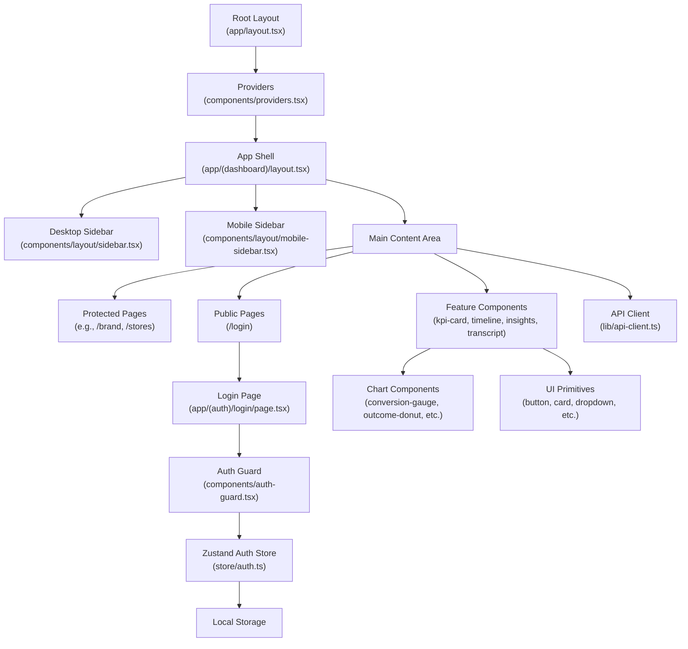

**Diagram sources**
- [apps/web/src/app/layout.tsx:1-37](file://apps/web/src/app/layout.tsx#L1-L37)
- [apps/web/src/components/providers.tsx:1-26](file://apps/web/src/components/providers.tsx#L1-L26)
- [apps/web/src/app/(dashboard)/layout.tsx:1-22](file://apps/web/src/app/(dashboard)/layout.tsx#L1-L22)
- [apps/web/src/components/layout/sidebar.tsx:1-143](file://apps/web/src/components/layout/sidebar.tsx#L1-L143)
- [apps/web/src/components/layout/mobile-sidebar.tsx:1-1](file://apps/web/src/components/layout/mobile-sidebar.tsx#L1-L1)
- [apps/web/src/app/(auth)/login/page.tsx:1-91](file://apps/web/src/app/(auth)/login/page.tsx#L1-L91)
- [apps/web/src/components/auth-guard.tsx:1-40](file://apps/web/src/components/auth-guard.tsx#L1-L40)
- [apps/web/src/store/auth.ts:1-49](file://apps/web/src/store/auth.ts#L1-L49)
- [apps/web/src/lib/api-client.ts:1-114](file://apps/web/src/lib/api-client.ts#L1-L114)

**Section sources**
- [apps/web/src/app/layout.tsx:1-37](file://apps/web/src/app/layout.tsx#L1-L37)
- [apps/web/src/components/providers.tsx:1-26](file://apps/web/src/components/providers.tsx#L1-L26)
- [apps/web/src/app/(dashboard)/layout.tsx:1-22](file://apps/web/src/app/(dashboard)/layout.tsx#L1-L22)
- [apps/web/src/middleware.ts:1-32](file://apps/web/src/middleware.ts#L1-L32)

## Core Components
- Providers: Wraps the app with React Query and Tooltip providers to enable caching, retries, and global tooltip behavior.
- AuthGuard: Enforces client-side route protection and redirects based on authentication state and pathname.
- Auth Store (Zustand): Manages user session state, persistence, and hydration from localStorage.
- API Client: Centralized HTTP client with automatic token injection, refresh flow, and structured error handling.
- Dashboard Layout: Composes the desktop sidebar, mobile sidebar, and main content area for protected routes.
- Feature Components: Reusable UI building blocks for KPIs, timelines, AI insights, transcripts, waveforms, and conversation drawers.
- Chart Components: Comprehensive visualization library including gauges, donuts, funnels, bar charts, heatmaps, radar charts, scatter plots, trend lines, and treemaps.
- UI Primitives: Complete set of shadcn/ui components including buttons, cards, inputs, selects, tables, tabs, avatars, badges, and more.

**Section sources**
- [apps/web/src/components/providers.tsx:1-26](file://apps/web/src/components/providers.tsx#L1-L26)
- [apps/web/src/components/auth-guard.tsx:1-40](file://apps/web/src/components/auth-guard.tsx#L1-L40)
- [apps/web/src/store/auth.ts:1-49](file://apps/web/src/store/auth.ts#L1-L49)
- [apps/web/src/lib/api-client.ts:1-114](file://apps/web/src/lib/api-client.ts#L1-L114)
- [apps/web/src/app/(dashboard)/layout.tsx:1-22](file://apps/web/src/app/(dashboard)/layout.tsx#L1-L22)

## Architecture Overview
The application follows a layered architecture with enhanced mobile support:
- Presentation Layer: Next.js App Router pages and shared UI components with responsive design patterns.
- State Management: Zustand store for authentication state with localStorage persistence.
- Data Access: Custom API client encapsulating HTTP requests, token refresh, and error normalization.
- UI Composition: Tailwind CSS and shadcn/ui primitives for consistent styling and responsive behavior across devices.
- Routing and Protection: Route groups for protected/public areas, middleware allowing public paths, and client-side AuthGuard.
- Mobile Experience: Dedicated mobile sidebar component with touch-friendly navigation and responsive breakpoints.

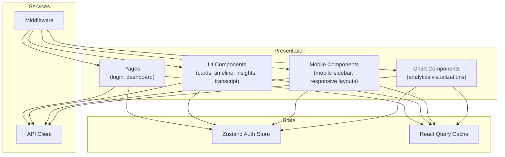

**Diagram sources**
- [apps/web/src/app/(auth)/login/page.tsx:1-91](file://apps/web/src/app/(auth)/login/page.tsx#L1-L91)
- [apps/web/src/app/(dashboard)/layout.tsx:1-22](file://apps/web/src/app/(dashboard)/layout.tsx#L1-L22)
- [apps/web/src/store/auth.ts:1-49](file://apps/web/src/store/auth.ts#L1-L49)
- [apps/web/src/components/providers.tsx:1-26](file://apps/web/src/components/providers.tsx#L1-L26)
- [apps/web/src/lib/api-client.ts:1-114](file://apps/web/src/lib/api-client.ts#L1-L114)
- [apps/web/src/middleware.ts:1-32](file://apps/web/src/middleware.ts#L1-L32)

## Detailed Component Analysis

### Authentication Flow and Protected Routes
The authentication system combines server-side middleware and client-side guards with enhanced mobile support:
- Middleware allows public paths and static assets, deferring auth checks to the client.
- AuthGuard hydrates the store on mount, enforces redirects for unauthenticated users, and prevents access to login when already authenticated.
- The login page submits credentials via the API client, persists tokens and user data, and navigates to the home dashboard.
- Mobile sidebar provides seamless navigation between authentication and dashboard states.

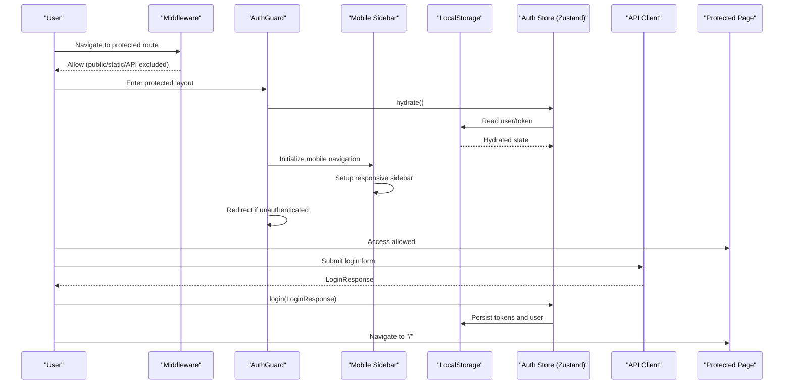

**Diagram sources**
- [apps/web/src/middleware.ts:1-32](file://apps/web/src/middleware.ts#L1-L32)
- [apps/web/src/components/auth-guard.tsx:1-40](file://apps/web/src/components/auth-guard.tsx#L1-L40)
- [apps/web/src/components/layout/mobile-sidebar.tsx:1-1](file://apps/web/src/components/layout/mobile-sidebar.tsx#L1-L1)
- [apps/web/src/store/auth.ts:1-49](file://apps/web/src/store/auth.ts#L1-L49)
- [apps/web/src/lib/api-client.ts:1-114](file://apps/web/src/lib/api-client.ts#L1-L114)
- [apps/web/src/app/(auth)/login/page.tsx:1-91](file://apps/web/src/app/(auth)/login/page.tsx#L1-L91)

**Section sources**
- [apps/web/src/middleware.ts:1-32](file://apps/web/src/middleware.ts#L1-L32)
- [apps/web/src/components/auth-guard.tsx:1-40](file://apps/web/src/components/auth-guard.tsx#L1-L40)
- [apps/web/src/store/auth.ts:1-49](file://apps/web/src/store/auth.ts#L1-L49)
- [apps/web/src/lib/api-client.ts:1-114](file://apps/web/src/lib/api-client.ts#L1-L114)
- [apps/web/src/app/(auth)/login/page.tsx:1-91](file://apps/web/src/app/(auth)/login/page.tsx#L1-L91)

### Dashboard Layout and Multi-Panel Navigation
The dashboard layout now features a sophisticated two-panel system with enhanced mobile responsiveness:
- Desktop sidebar provides traditional navigation with role-filtered items and active state highlighting.
- Mobile sidebar offers touch-friendly navigation with collapsible menu and responsive breakpoints.
- Main content area dynamically adapts to screen size and device type.
- Operations sidebar provides specialized navigation for operational workflows.

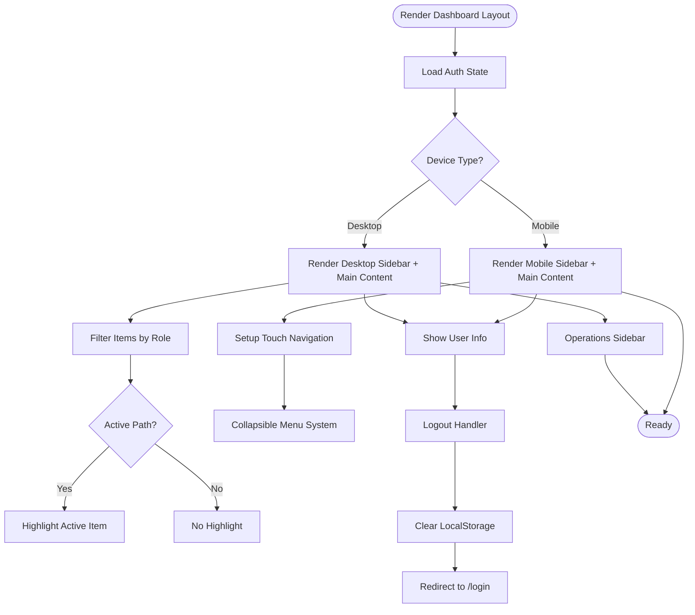

**Diagram sources**
- [apps/web/src/app/(dashboard)/layout.tsx:1-22](file://apps/web/src/app/(dashboard)/layout.tsx#L1-L22)
- [apps/web/src/components/layout/sidebar.tsx:1-143](file://apps/web/src/components/layout/sidebar.tsx#L1-L143)
- [apps/web/src/components/layout/mobile-sidebar.tsx:1-1](file://apps/web/src/components/layout/mobile-sidebar.tsx#L1-L1)
- [apps/web/src/components/layout/operations-sidebar.tsx:1-1](file://apps/web/src/components/layout/operations-sidebar.tsx#L1-L1)
- [apps/web/src/store/auth.ts:1-49](file://apps/web/src/store/auth.ts#L1-L49)

**Section sources**
- [apps/web/src/app/(dashboard)/layout.tsx:1-22](file://apps/web/src/app/(dashboard)/layout.tsx#L1-L22)
- [apps/web/src/components/layout/sidebar.tsx:1-143](file://apps/web/src/components/layout/sidebar.tsx#L1-L143)
- [apps/web/src/components/layout/mobile-sidebar.tsx:1-1](file://apps/web/src/components/layout/mobile-sidebar.tsx#L1-L1)
- [apps/web/src/components/layout/operations-sidebar.tsx:1-1](file://apps/web/src/components/layout/operations-sidebar.tsx#L1-L1)

### KPI Cards
KPI cards present metrics with optional trend indicators and icons. They accept props for title, value, description, icon, and trend data, rendering a consistent card layout using shadcn/ui primitives.

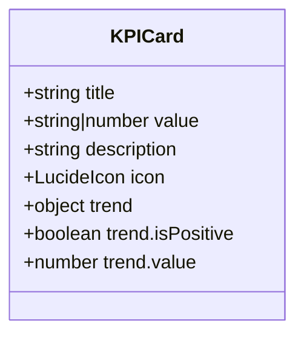

**Diagram sources**
- [apps/web/src/components/kpi-card.tsx:1-41](file://apps/web/src/components/kpi-card.tsx#L1-L41)

**Section sources**
- [apps/web/src/components/kpi-card.tsx:1-41](file://apps/web/src/components/kpi-card.tsx#L1-L41)

### Conversation Timeline Visualization
The timeline component visualizes detected conversations as colored bars along a duration axis, with tooltips for timing and outcomes, and click handlers to focus on specific conversations.

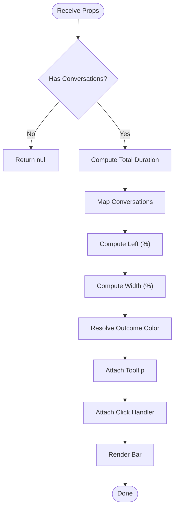

**Diagram sources**
- [apps/web/src/components/features/conversation-timeline.tsx:1-82](file://apps/web/src/components/features/conversation-timeline.tsx#L1-L82)

**Section sources**
- [apps/web/src/components/features/conversation-timeline.tsx:1-82](file://apps/web/src/components/features/conversation-timeline.tsx#L1-L82)

### AI Insights Panel
The AI insights panel displays structured analysis per conversation, including intent, outcome, budget, products, objections, competitors, closing attempt, summary, coaching notes, and score breakdowns. It supports click-to-focus and confidence badges.

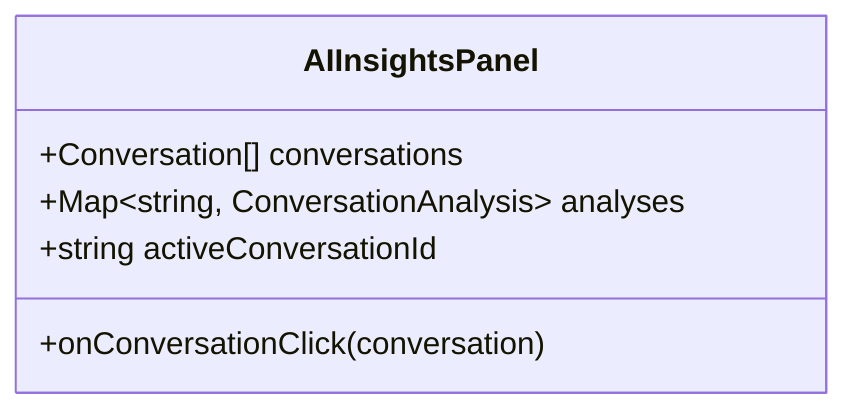

**Diagram sources**
- [apps/web/src/components/features/ai-insights-panel.tsx:1-203](file://apps/web/src/components/features/ai-insights-panel.tsx#L1-L203)

**Section sources**
- [apps/web/src/components/features/ai-insights-panel.tsx:1-203](file://apps/web/src/components/features/ai-insights-panel.tsx#L1-L203)

### Transcript Viewer
The transcript viewer renders speaker-labeled segments with timestamps, groups segments by active conversation, and supports highlighting and click events to navigate between segments and conversations.

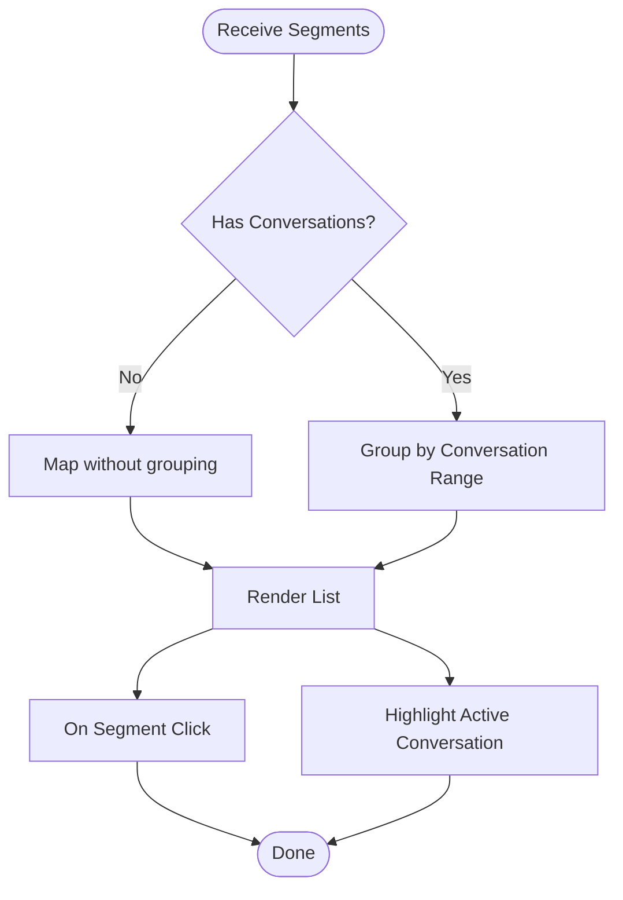

**Diagram sources**
- [apps/web/src/components/features/transcript-viewer.tsx:1-89](file://apps/web/src/components/features/transcript-viewer.tsx#L1-L89)

**Section sources**
- [apps/web/src/components/features/transcript-viewer.tsx:1-89](file://apps/web/src/components/features/transcript-viewer.tsx#L1-L89)

### Waveform Player
The waveform player provides audio visualization and playback controls for recorded conversations. It displays amplitude variations over time, supports play/pause controls, and enables scrubbing through audio segments.

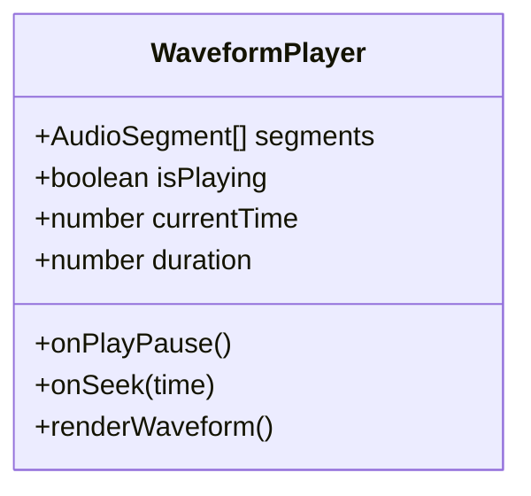

**Diagram sources**
- [apps/web/src/components/features/waveform-player.tsx:1-1](file://apps/web/src/components/features/waveform-player.tsx#L1-L1)

**Section sources**
- [apps/web/src/components/features/waveform-player.tsx:1-1](file://apps/web/src/components/features/waveform-player.tsx#L1-L1)

### Conversation Drawer
The conversation drawer provides an expandable panel for viewing detailed conversation information and related analytics. It supports slide-out animations and maintains context with the main timeline view.

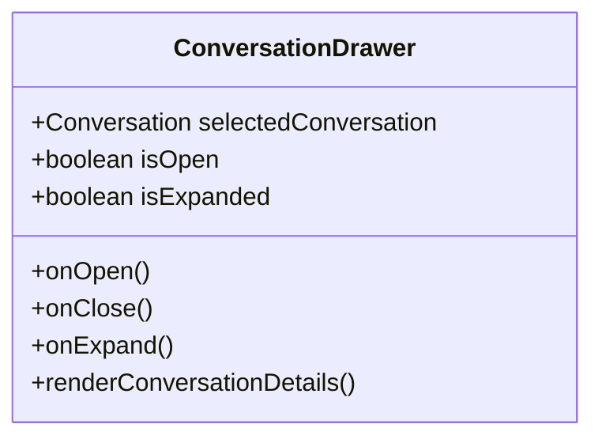

**Diagram sources**
- [apps/web/src/components/features/conversation-drawer.tsx:1-1](file://apps/web/src/components/features/conversation-drawer.tsx#L1-L1)

**Section sources**
- [apps/web/src/components/features/conversation-drawer.tsx:1-1](file://apps/web/src/components/features/conversation-drawer.tsx#L1-L1)

### Analysis Detail
The analysis detail component presents comprehensive conversation analysis with structured data presentation, supporting tabbed views for different analysis categories and interactive elements for deeper exploration.

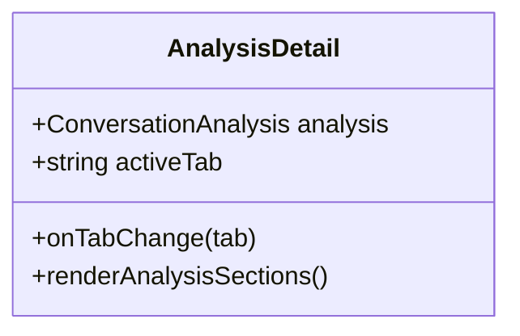

**Diagram sources**
- [apps/web/src/components/features/analysis-detail.tsx:1-1](file://apps/web/src/components/features/analysis-detail.tsx#L1-L1)

**Section sources**
- [apps/web/src/components/features/analysis-detail.tsx:1-1](file://apps/web/src/components/features/analysis-detail.tsx#L1-L1)

### API Integration Layer
The API client centralizes HTTP requests:
- Automatically injects Authorization header when a token exists.
- Handles 401 Unauthorized by attempting a token refresh using the refresh token.
- Normalizes errors into a structured ApiError with status and detail.
- Supports GET, POST, PUT, DELETE with JSON or FormData bodies.
- Treats 204 No Content as undefined return.

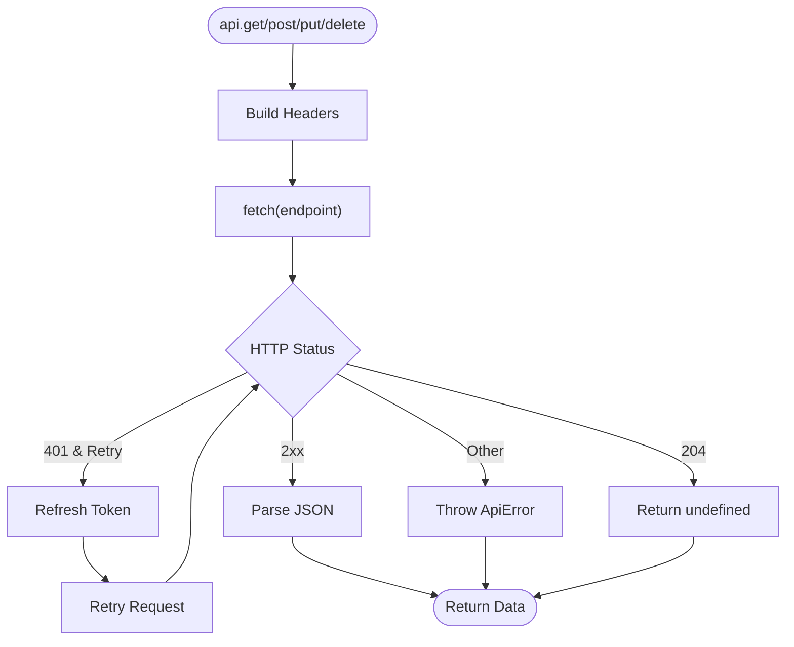

**Diagram sources**
- [apps/web/src/lib/api-client.ts:1-114](file://apps/web/src/lib/api-client.ts#L1-L114)

**Section sources**
- [apps/web/src/lib/api-client.ts:1-114](file://apps/web/src/lib/api-client.ts#L1-L114)

## Mobile Experience and Responsive Design
The application now features comprehensive mobile support with a dedicated mobile sidebar component and responsive design patterns:

### Mobile Sidebar Component
The mobile sidebar provides touch-friendly navigation with:
- Collapsible menu system for optimal screen space utilization
- Touch-friendly button sizing and spacing
- Responsive breakpoint detection for automatic switching between desktop and mobile layouts
- Smooth animations for menu transitions
- Persistent navigation state across device orientation changes

### Responsive Design Implementation
- Mobile-first design approach with progressive enhancement
- Flexible grid system using Tailwind CSS responsive utilities
- Adaptive typography scaling for different screen sizes
- Touch-optimized interactive elements with appropriate hit areas
- Performance optimizations for mobile devices including reduced animations and optimized image loading

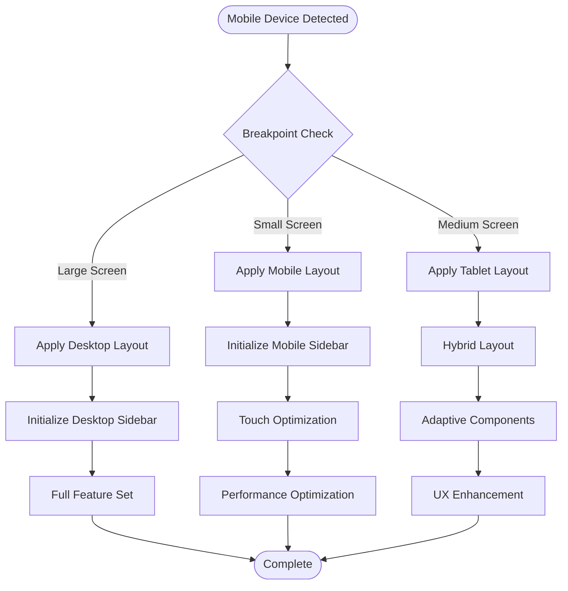

**Diagram sources**
- [apps/web/src/components/layout/mobile-sidebar.tsx:1-1](file://apps/web/src/components/layout/mobile-sidebar.tsx#L1-L1)
- [apps/web/src/app/(dashboard)/layout.tsx:1-22](file://apps/web/src/app/(dashboard)/layout.tsx#L1-L22)

**Section sources**
- [apps/web/src/components/layout/mobile-sidebar.tsx:1-1](file://apps/web/src/components/layout/mobile-sidebar.tsx#L1-L1)
- [apps/web/src/app/(dashboard)/layout.tsx:1-22](file://apps/web/src/app/(dashboard)/layout.tsx#L1-L22)

## Dashboard Visualizations and Analytics
The dashboard now includes a comprehensive suite of visualization components for data analysis and insights:

### Conversion Metrics
- Conversion gauge: Circular visualization showing conversion rates with color-coded thresholds
- Outcome donut: Pie chart displaying conversation outcome distribution
- Sales funnel: Step-by-step visualization of the sales process progression

### Performance Analytics
- Performance bar: Horizontal bar charts comparing team member performance metrics
- Skill heatmap: Matrix visualization showing skill proficiency across different categories
- Skill radar compare: Radar charts for multi-dimensional skill comparison

### Market Intelligence
- Store scatter: Scatter plot showing store performance metrics and correlations
- Volume trend: Line charts displaying temporal trends in conversation volumes
- Score trend: Trend analysis of performance scores over time
- Objection treemap: Hierarchical visualization of common objections and their frequencies

### Interactive Features
- Click-to-focus functionality linking visualizations to detailed analysis
- Hover effects and tooltips for additional context
- Drill-down capabilities for detailed data exploration
- Export functionality for sharing insights

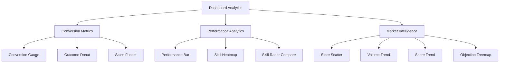

**Diagram sources**
- [apps/web/src/components/charts/conversion-gauge.tsx:1-1](file://apps/web/src/components/charts/conversion-gauge.tsx#L1-L1)
- [apps/web/src/components/charts/outcome-donut.tsx:1-1](file://apps/web/src/components/charts/outcome-donut.tsx#L1-L1)
- [apps/web/src/components/charts/sales-funnel.tsx:1-1](file://apps/web/src/components/charts/sales-funnel.tsx#L1-L1)
- [apps/web/src/components/charts/performance-bar.tsx:1-1](file://apps/web/src/components/charts/performance-bar.tsx#L1-L1)
- [apps/web/src/components/charts/skill-heatmap.tsx:1-1](file://apps/web/src/components/charts/skill-heatmap.tsx#L1-L1)
- [apps/web/src/components/charts/skill-radar-compare.tsx:1-1](file://apps/web/src/components/charts/skill-radar-compare.tsx#L1-L1)
- [apps/web/src/components/charts/store-scatter.tsx:1-1](file://apps/web/src/components/charts/store-scatter.tsx#L1-L1)
- [apps/web/src/components/charts/volume-trend.tsx:1-1](file://apps/web/src/components/charts/volume-trend.tsx#L1-L1)
- [apps/web/src/components/charts/score-trend.tsx:1-1](file://apps/web/src/components/charts/score-trend.tsx#L1-L1)
- [apps/web/src/components/charts/objection-treemap.tsx:1-1](file://apps/web/src/components/charts/objection-treemap.tsx#L1-L1)

**Section sources**
- [apps/web/src/components/charts/conversion-gauge.tsx:1-1](file://apps/web/src/components/charts/conversion-gauge.tsx#L1-L1)
- [apps/web/src/components/charts/outcome-donut.tsx:1-1](file://apps/web/src/components/charts/outcome-donut.tsx#L1-L1)
- [apps/web/src/components/charts/sales-funnel.tsx:1-1](file://apps/web/src/components/charts/sales-funnel.tsx#L1-L1)
- [apps/web/src/components/charts/performance-bar.tsx:1-1](file://apps/web/src/components/charts/performance-bar.tsx#L1-L1)
- [apps/web/src/components/charts/skill-heatmap.tsx:1-1](file://apps/web/src/components/charts/skill-heatmap.tsx#L1-L1)
- [apps/web/src/components/charts/skill-radar-compare.tsx:1-1](file://apps/web/src/components/charts/skill-radar-compare.tsx#L1-L1)
- [apps/web/src/components/charts/store-scatter.tsx:1-1](file://apps/web/src/components/charts/store-scatter.tsx#L1-L1)
- [apps/web/src/components/charts/volume-trend.tsx:1-1](file://apps/web/src/components/charts/volume-trend.tsx#L1-L1)
- [apps/web/src/components/charts/score-trend.tsx:1-1](file://apps/web/src/components/charts/score-trend.tsx#L1-L1)
- [apps/web/src/components/charts/objection-treemap.tsx:1-1](file://apps/web/src/components/charts/objection-treemap.tsx#L1-L1)

### UI Primitives and Components
The application utilizes a comprehensive set of shadcn/ui primitives for consistent component behavior:

#### Form Controls
- Button: Primary action elements with variants for different contexts
- Input: Text input fields with validation states
- Select: Dropdown selections with custom styling
- Textarea: Multi-line text input with auto-resize
- Label: Associated labels for form controls

#### Layout Components
- Card: Content containers with optional headers and footers
- Separator: Visual dividers for content organization
- Table: Data presentation with sorting and pagination
- Tabs: Tabbed content navigation

#### Interactive Elements
- Dropdown Menu: Contextual menus with keyboard navigation
- Sheet: Modal overlays for detailed content
- Avatar: User representation with fallback initials
- Badge: Status indicators and labels
- Tooltip: Contextual help text

#### Feedback Components
- Skeleton: Loading placeholders with animated effects
- Status Badge: Real-time status indicators

**Section sources**
- [apps/web/src/components/ui/button.tsx:1-1](file://apps/web/src/components/ui/button.tsx#L1-L1)
- [apps/web/src/components/ui/input.tsx:1-1](file://apps/web/src/components/ui/input.tsx#L1-L1)
- [apps/web/src/components/ui/select.tsx:1-1](file://apps/web/src/components/ui/select.tsx#L1-L1)
- [apps/web/src/components/ui/textarea.tsx:1-1](file://apps/web/src/components/ui/textarea.tsx#L1-L1)
- [apps/web/src/components/ui/label.tsx:1-1](file://apps/web/src/components/ui/label.tsx#L1-L1)
- [apps/web/src/components/ui/card.tsx:1-1](file://apps/web/src/components/ui/card.tsx#L1-L1)
- [apps/web/src/components/ui/dropdown-menu.tsx:1-1](file://apps/web/src/components/ui/dropdown-menu.tsx#L1-L1)
- [apps/web/src/components/ui/sheet.tsx:1-1](file://apps/web/src/components/ui/sheet.tsx#L1-L1)
- [apps/web/src/components/ui/avatar.tsx:1-1](file://apps/web/src/components/ui/avatar.tsx#L1-L1)
- [apps/web/src/components/ui/badge.tsx:1-1](file://apps/web/src/components/ui/badge.tsx#L1-L1)
- [apps/web/src/components/ui/separator.tsx:1-1](file://apps/web/src/components/ui/separator.tsx#L1-L1)
- [apps/web/src/components/ui/table.tsx:1-1](file://apps/web/src/components/ui/table.tsx#L1-L1)
- [apps/web/src/components/ui/tabs.tsx:1-1](file://apps/web/src/components/ui/tabs.tsx#L1-L1)
- [apps/web/src/components/ui/skeleton.tsx:1-1](file://apps/web/src/components/ui/skeleton.tsx#L1-L1)
- [apps/web/src/components/ui/tooltip.tsx:1-1](file://apps/web/src/components/ui/tooltip.tsx#L1-L1)

## Dependency Analysis
External dependencies relevant to UI and state include:
- next, react, react-dom for framework runtime
- @tanstack/react-query for caching and data fetching
- zustand for lightweight state management
- lucide-react for icons
- tailwind-merge, clsx, class-variance-authority for styling utilities
- recharts for comprehensive charting capabilities
- @samaa/shared for shared types and constants

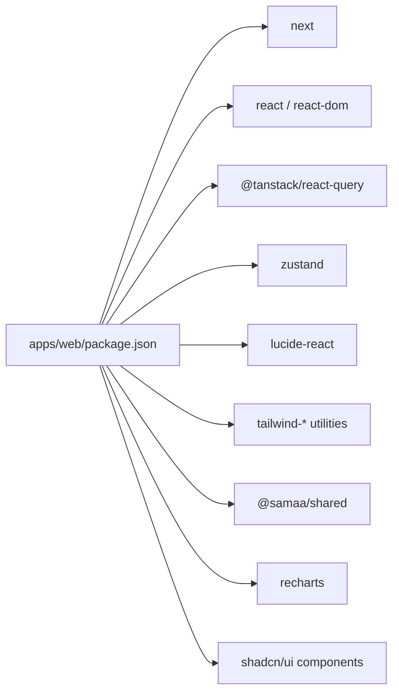

**Diagram sources**
- [apps/web/package.json:1-38](file://apps/web/package.json#L1-L38)

**Section sources**
- [apps/web/package.json:1-38](file://apps/web/package.json#L1-L38)

## Performance Considerations
- React Query defaults: Queries have a short stale time and limited retries to balance freshness and resilience.
- Memoization: Transcript viewer uses memoization to avoid recomputation when conversations change but segments remain the same.
- Conditional rendering: Components return early when data is unavailable to prevent unnecessary work.
- Token refresh: The API client avoids infinite retry loops by disabling retries after a refresh attempt.
- Mobile optimization: Dedicated mobile sidebar reduces bundle size and improves mobile performance.
- Chart optimization: Recharts components are optimized for large datasets with virtualization support.
- Component lazy loading: Non-critical components are loaded on demand to improve initial page load times.

## Troubleshooting Guide
Common issues and resolutions:
- Authentication loop or redirect to login:
  - Verify middleware allows public paths and static assets.
  - Ensure AuthGuard hydrates the store and redirects appropriately.
  - Confirm localStorage contains tokens and user data after login.
- 401 Unauthorized errors:
  - The API client attempts a token refresh automatically; if it fails, it clears auth state and redirects to login.
  - Check refresh token presence and backend refresh endpoint availability.
- UI not reflecting role-based navigation:
  - Confirm user role is persisted and the sidebar filters items based on roles.
- Empty or missing data in features:
  - Validate that conversations and analyses maps are populated before rendering.
  - Ensure transcript segments align with conversation time ranges.
- Mobile sidebar not functioning:
  - Verify responsive breakpoints are properly configured.
  - Check touch event handling and collision detection.
  - Ensure mobile-specific styles are applied correctly.
- Chart rendering issues:
  - Confirm data formats match expected chart specifications.
  - Check for proper data normalization and scaling.
  - Verify container dimensions for proper chart sizing.

**Section sources**
- [apps/web/src/middleware.ts:1-32](file://apps/web/src/middleware.ts#L1-L32)
- [apps/web/src/components/auth-guard.tsx:1-40](file://apps/web/src/components/auth-guard.tsx#L1-L40)
- [apps/web/src/store/auth.ts:1-49](file://apps/web/src/store/auth.ts#L1-L49)
- [apps/web/src/lib/api-client.ts:1-114](file://apps/web/src/lib/api-client.ts#L1-L114)
- [apps/web/src/components/layout/sidebar.tsx:1-143](file://apps/web/src/components/layout/sidebar.tsx#L1-L143)
- [apps/web/src/components/layout/mobile-sidebar.tsx:1-1](file://apps/web/src/components/layout/mobile-sidebar.tsx#L1-L1)

## Conclusion
The Xsamaa AI Pipeline web interface leverages Next.js 16 App Router, Zustand for authentication state, and a custom API client to deliver a responsive, role-aware dashboard with comprehensive mobile support. The modular UI components, consistent styling with Tailwind and shadcn/ui, extensive charting capabilities with Recharts, and robust data-fetching patterns enable scalable development and maintainable design. The enhanced mobile experience with dedicated mobile sidebar components ensures optimal user experience across all device types while maintaining design consistency and performance standards.

## Appendices

### Extending the UI with New Components
- Follow the existing component pattern: use shadcn/ui primitives, keep props minimal and typed, and leverage Tailwind utilities for styling.
- For new feature components, mirror the composition seen in timeline, insights, transcript viewer, waveform player, and conversation drawer: accept data props, compute derived visuals, and expose callbacks for interactions.
- For chart components, follow the established pattern of using Recharts with proper data transformation and responsive sizing.
- Maintain design consistency by using the established color tokens and spacing scales.
- Implement proper accessibility attributes and keyboard navigation support.
- Add comprehensive TypeScript interfaces for all component props and state.

### Styling and Responsive Design
- The project uses Tailwind CSS v4 and shadcn/ui components. Fonts are configured globally via the root layout.
- Responsive breakpoints and utilities are applied directly in component classes; ensure new components follow the same approach.
- Mobile-first design principles should guide all new component development.
- Touch-friendly interaction targets should be at least 44px for optimal mobile usability.
- Consider performance implications of complex animations and heavy DOM manipulation on mobile devices.

### Chart Component Development Guidelines
- All chart components should follow the established pattern of receiving normalized data and returning Recharts components.
- Implement proper data validation and error handling for chart data.
- Ensure charts are responsive and handle container resizing gracefully.
- Provide appropriate tooltips and legends for data interpretation.
- Consider performance optimization for large datasets with virtualization or sampling techniques.

### Mobile Component Development Guidelines
- Mobile components should be designed with touch interactions in mind, including appropriate hit areas and gesture support.
- Implement proper viewport configuration and meta tag settings for mobile devices.
- Test components across different screen sizes and orientations.
- Consider battery life implications of animations and intensive computations on mobile devices.
- Ensure mobile components degrade gracefully on older devices or browsers.