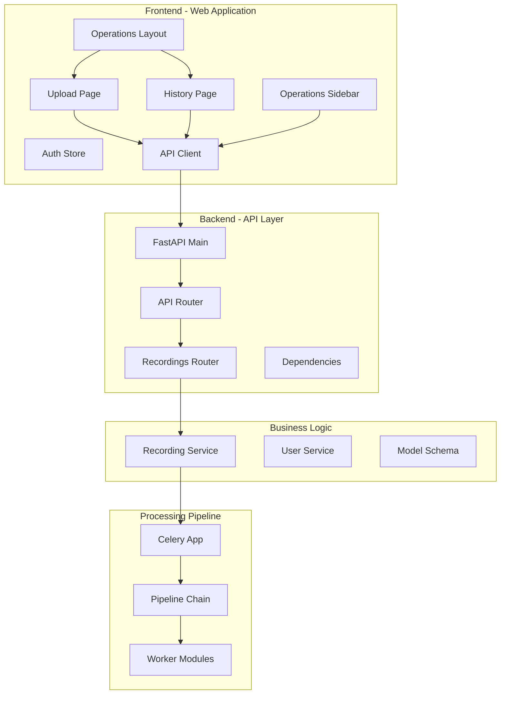
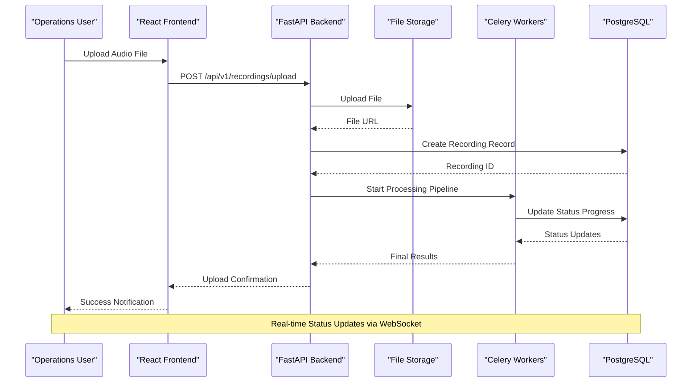
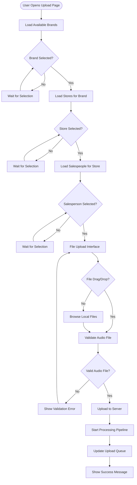
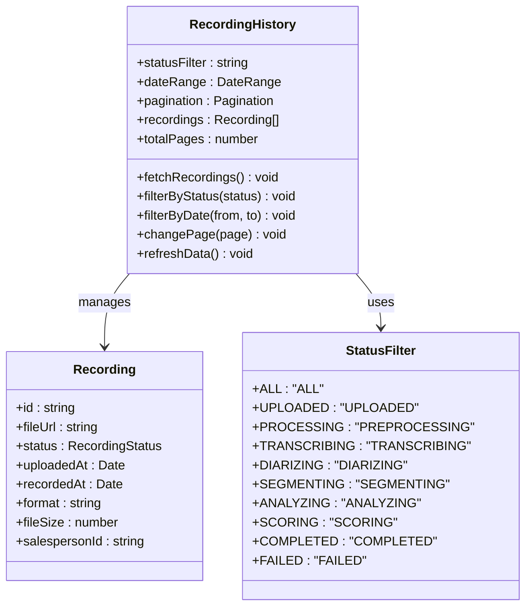
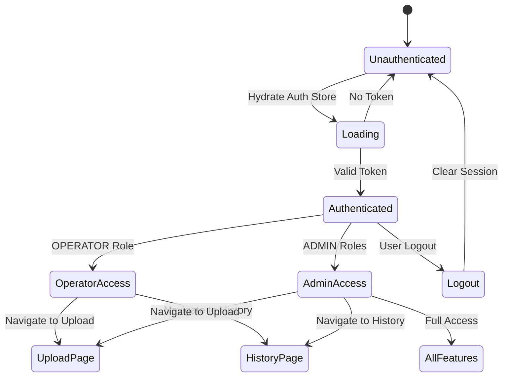
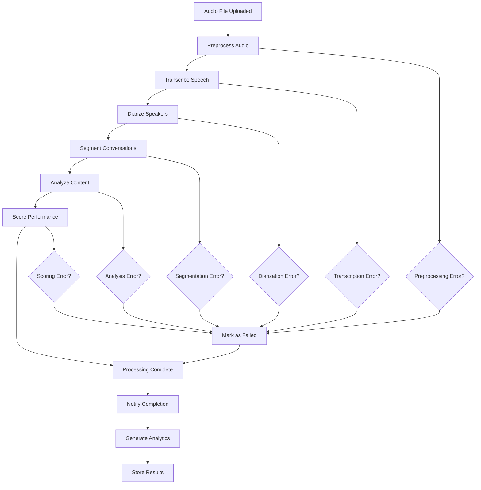
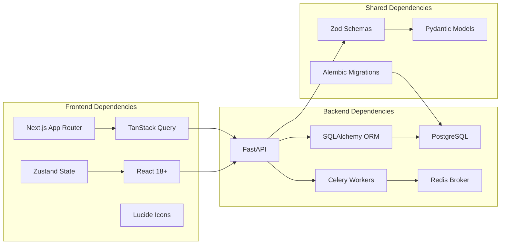

# Operations Module

<cite>
**Referenced Files in This Document**
- [apps/web/src/app/(operations)/layout.tsx](file://apps/web/src/app/(operations)/layout.tsx)
- [apps/web/src/app/(operations)/operations/page.tsx](file://apps/web/src/app/(operations)/operations/page.tsx)
- [apps/web/src/app/(operations)/operations/history/page.tsx](file://apps/web/src/app/(operations)/operations/history/page.tsx)
- [apps/web/src/components/layout/operations-sidebar.tsx](file://apps/web/src/components/layout/operations-sidebar.tsx)
- [apps/web/src/store/auth.ts](file://apps/web/src/store/auth.ts)
- [apps/web/src/lib/api-client.ts](file://apps/web/src/lib/api-client.ts)
- [apps/api/src/main.py](file://apps/api/src/main.py)
- [apps/api/src/api/v1/router.py](file://apps/api/src/api/v1/router.py)
- [apps/api/src/api/v1/recordings.py](file://apps/api/src/api/v1/recordings.py)
- [apps/api/src/services/recording.py](file://apps/api/src/services/recording.py)
- [apps/api/src/models/recording.py](file://apps/api/src/models/recording.py)
- [apps/api/src/models/user.py](file://apps/api/src/models/user.py)
- [apps/api/src/api/deps.py](file://apps/api/src/api/deps.py)
- [apps/api/src/workers/pipeline.py](file://apps/api/src/workers/pipeline.py)
- [apps/api/src/workers/celery_app.py](file://apps/api/src/workers/celery_app.py)
- [packages/shared/src/api-types.ts](file://packages/shared/src/api-types.ts)
</cite>

## Table of Contents
1. [Introduction](#introduction)
2. [Project Structure](#project-structure)
3. [Core Components](#core-components)
4. [Architecture Overview](#architecture-overview)
5. [Detailed Component Analysis](#detailed-component-analysis)
6. [Dependency Analysis](#dependency-analysis)
7. [Performance Considerations](#performance-considerations)
8. [Troubleshooting Guide](#troubleshooting-guide)
9. [Conclusion](#conclusion)

## Introduction
The Operations Module provides a comprehensive interface for sales operations teams to upload audio recordings, monitor processing status, and manage the AI-powered analysis pipeline. It serves operators and administrators who need to oversee daily recording uploads, track processing progress, and maintain quality assurance workflows.

The module integrates frontend React components with a FastAPI backend, implementing role-based access control, real-time status updates, and a robust audio processing pipeline orchestrated by Celery workers.

## Project Structure
The Operations Module follows a clear separation of concerns across frontend and backend layers:

**Diagram sources**
- [apps/web/src/app/(operations)/layout.tsx:1-40](file://apps/web/src/app/(operations)/layout.tsx#L1-L40)
- [apps/api/src/main.py:1-29](file://apps/api/src/main.py#L1-L29)
- [apps/api/src/api/v1/router.py:1-20](file://apps/api/src/api/v1/router.py#L1-L20)

**Section sources**
- [apps/web/src/app/(operations)/layout.tsx:1-40](file://apps/web/src/app/(operations)/layout.tsx#L1-L40)
- [apps/api/src/main.py:1-29](file://apps/api/src/main.py#L1-L29)

## Core Components
The Operations Module consists of several interconnected components that work together to provide a seamless user experience:

### Frontend Components
- **Operations Layout**: Provides role-based access control and navigation structure
- **Upload Page**: Handles audio file uploads with drag-and-drop support
- **History Page**: Displays comprehensive recording history with filtering capabilities
- **Operations Sidebar**: Navigation and user management interface
- **Auth Store**: Manages user authentication state and persistence
- **API Client**: Handles HTTP requests with automatic token refresh

### Backend Services
- **Recording Management**: Full CRUD operations for audio recordings
- **Processing Pipeline**: Orchestrated workflow for audio analysis
- **Role-Based Access Control**: Multi-tier permission system
- **Storage Integration**: File management and retrieval

**Section sources**
- [apps/web/src/app/(operations)/operations/page.tsx:1-494](file://apps/web/src/app/(operations)/operations/page.tsx#L1-L494)
- [apps/web/src/app/(operations)/operations/history/page.tsx:1-263](file://apps/web/src/app/(operations)/operations/history/page.tsx#L1-L263)
- [apps/api/src/services/recording.py:1-262](file://apps/api/src/services/recording.py#L1-L262)

## Architecture Overview
The Operations Module implements a modern microservices architecture with clear separation between presentation, business logic, and data layers:

**Diagram sources**
- [apps/api/src/api/v1/recordings.py:56-84](file://apps/api/src/api/v1/recordings.py#L56-L84)
- [apps/api/src/services/recording.py:83-126](file://apps/api/src/services/recording.py#L83-L126)
- [apps/api/src/workers/pipeline.py:12-35](file://apps/api/src/workers/pipeline.py#L12-L35)

The architecture follows these key principles:
- **Asynchronous Processing**: Long-running audio processing happens asynchronously via Celery workers
- **Real-time Updates**: Frontend receives status updates through React Query caching and polling
- **Role-Based Security**: Multi-tier permission system ensures appropriate access levels
- **Modular Design**: Clear separation between upload, processing, and analysis components

## Detailed Component Analysis

### Upload Interface Component
The upload interface provides a comprehensive solution for audio file ingestion with advanced validation and user feedback:

**Diagram sources**
- [apps/web/src/app/(operations)/operations/page.tsx:37-193](file://apps/web/src/app/(operations)/operations/page.tsx#L37-L193)

Key features include:
- **Multi-level Cascading Selectors**: Brand → Store → Salesperson hierarchy
- **Advanced File Validation**: MIME type and extension checking for audio formats
- **Drag-and-Drop Interface**: User-friendly file upload experience
- **Upload Queue Management**: Real-time tracking of upload progress
- **Error Handling**: Comprehensive validation and user feedback

**Section sources**
- [apps/web/src/app/(operations)/operations/page.tsx:27-193](file://apps/web/src/app/(operations)/operations/page.tsx#L27-L193)

### History Management Component
The history interface provides comprehensive oversight of all uploaded recordings with powerful filtering and pagination:

**Diagram sources**
- [apps/web/src/app/(operations)/operations/history/page.tsx:49-262](file://apps/web/src/app/(operations)/operations/history/page.tsx#L49-L262)

The history component implements:
- **Dynamic Filtering**: Status, date range, and pagination controls
- **Real-time Updates**: Automatic refresh for processing recordings
- **Comprehensive Display**: Detailed recording information with status indicators
- **Responsive Design**: Mobile-friendly table layout with pagination

**Section sources**
- [apps/web/src/app/(operations)/operations/history/page.tsx:49-262](file://apps/web/src/app/(operations)/operations/history/page.tsx#L49-L262)

### Authentication and Authorization
The module implements a robust role-based access control system:

**Diagram sources**
- [apps/web/src/app/(operations)/layout.tsx:9-39](file://apps/web/src/app/(operations)/layout.tsx#L9-L39)
- [apps/api/src/api/deps.py:41-66](file://apps/api/src/api/deps.py#L41-L66)

The authorization system supports:
- **Multi-role Support**: OPERATOR, SUPER_ADMIN, BRAND_ADMIN, STORE_MANAGER, SALESPERSON
- **Hierarchical Permissions**: Different access levels for different roles
- **Automatic Token Management**: JWT token handling with refresh capability
- **Route Protection**: Frontend and backend protection mechanisms

**Section sources**
- [apps/web/src/app/(operations)/layout.tsx:9-39](file://apps/web/src/app/(operations)/layout.tsx#L9-L39)
- [apps/api/src/api/deps.py:41-66](file://apps/api/src/api/deps.py#L41-L66)

### Processing Pipeline Architecture
The audio processing pipeline is orchestrated through Celery workers with clear stage boundaries:

**Diagram sources**
- [apps/api/src/workers/pipeline.py:12-35](file://apps/api/src/workers/pipeline.py#L12-L35)
- [apps/api/src/models/recording.py:12-22](file://apps/api/src/models/recording.py#L12-L22)

Each processing stage handles specific aspects of audio analysis:
- **Preprocessing**: Audio normalization, resampling, silence detection
- **Transcription**: Speech-to-text conversion using NVIDIA Parakeet
- **Diarization**: Speaker identification and separation
- **Segmentation**: Conversation boundary detection
- **Analysis**: AI-powered conversation analysis
- **Scoring**: Performance evaluation metrics

**Section sources**
- [apps/api/src/workers/pipeline.py:12-35](file://apps/api/src/workers/pipeline.py#L12-L35)
- [apps/api/src/models/recording.py:12-22](file://apps/api/src/models/recording.py#L12-L22)

## Dependency Analysis
The Operations Module exhibits excellent modularity with clear dependency relationships:

**Diagram sources**
- [apps/api/src/main.py:1-29](file://apps/api/src/main.py#L1-L29)
- [apps/api/src/workers/celery_app.py:1-31](file://apps/api/src/workers/celery_app.py#L1-L31)

Key dependency characteristics:
- **Frontend**: Modern React ecosystem with minimal external dependencies
- **Backend**: Lightweight FastAPI with essential production dependencies
- **Data Layer**: Clean SQLAlchemy ORM with explicit relationships
- **Processing**: Asynchronous task queue with reliable message broker

**Section sources**
- [apps/api/src/main.py:1-29](file://apps/api/src/main.py#L1-L29)
- [apps/api/src/workers/celery_app.py:1-31](file://apps/api/src/workers/celery_app.py#L1-L31)

## Performance Considerations
The Operations Module is designed for optimal performance across multiple dimensions:

### Frontend Performance
- **Code Splitting**: Route-based lazy loading reduces initial bundle size
- **Efficient State Management**: Minimal re-renders through selective state updates
- **Optimized Queries**: React Query caching with intelligent invalidation
- **Memory Management**: Proper cleanup of event listeners and timers

### Backend Performance
- **Connection Pooling**: Efficient database connection management
- **Async Processing**: Non-blocking I/O operations throughout the stack
- **Caching Strategy**: Strategic caching of frequently accessed data
- **Background Tasks**: Offloading heavy computations to Celery workers

### Scalability Features
- **Horizontal Scaling**: Stateless API endpoints support load balancing
- **Database Optimization**: Proper indexing and query optimization
- **Storage Separation**: Independent file storage reduces database load
- **Monitoring Ready**: Built-in health checks and performance metrics

## Troubleshooting Guide

### Common Upload Issues
**Problem**: Audio files fail validation
**Solution**: Verify file format matches supported MIME types (audio/wav, audio/mpeg, audio/mp3, audio/mp4, audio/x-m4a, audio/m4a)

**Problem**: Upload queue shows "error" status
**Solution**: Check network connectivity, file size limits, and server availability

**Problem**: Cascading selectors not populating
**Solution**: Ensure parent selections are properly saved before enabling child selectors

### Processing Pipeline Issues
**Problem**: Recordings stuck in "PREPROCESSING" status
**Solution**: Check Celery worker logs for preprocessing errors, verify NVIDIA service availability

**Problem**: Analysis results missing
**Solution**: Verify AI model service connectivity and check for processing timeouts

### Authentication Problems
**Problem**: Unauthorized access to operations pages
**Solution**: Verify user role includes OPERATOR or higher privileges, check token validity

**Problem**: Session expiration during uploads
**Solution**: Implement proper token refresh handling and user notification

**Section sources**
- [apps/web/src/app/(operations)/operations/page.tsx:130-193](file://apps/web/src/app/(operations)/operations/page.tsx#L130-L193)
- [apps/api/src/api/v1/recordings.py:56-84](file://apps/api/src/api/v1/recordings.py#L56-L84)

## Conclusion
The Operations Module represents a sophisticated solution for managing audio recording workflows in enterprise environments. Its architecture balances user experience with technical robustness, providing operators with intuitive tools while maintaining the reliability required for production systems.

Key strengths include:
- **Comprehensive Role-Based Access Control**: Multi-tier permissions ensure appropriate access levels
- **Robust Processing Pipeline**: Asynchronous architecture handles complex audio analysis workflows
- **Modern Frontend Implementation**: React-based interface with excellent user experience
- **Production-Ready Backend**: FastAPI implementation with proper error handling and monitoring
- **Scalable Infrastructure**: Designed for horizontal scaling and high availability

The module successfully addresses the core requirements of audio recording management while providing extensibility for future enhancements and integration with broader analytics platforms.