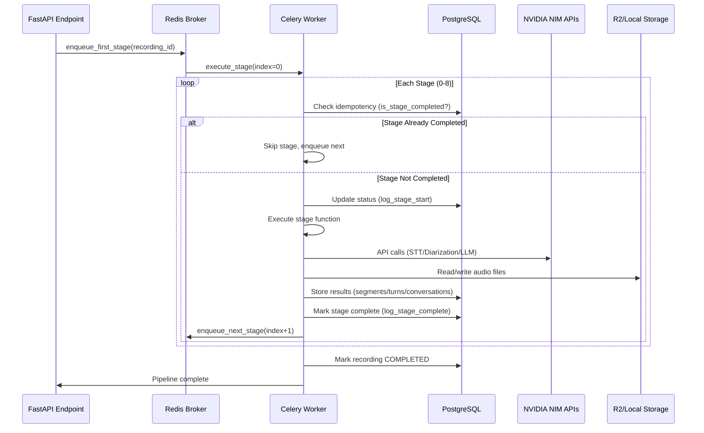
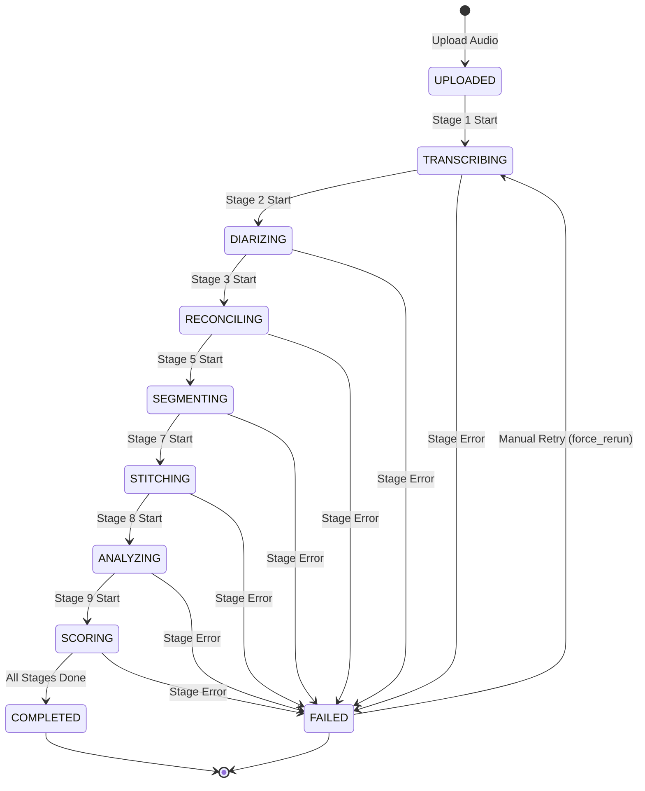
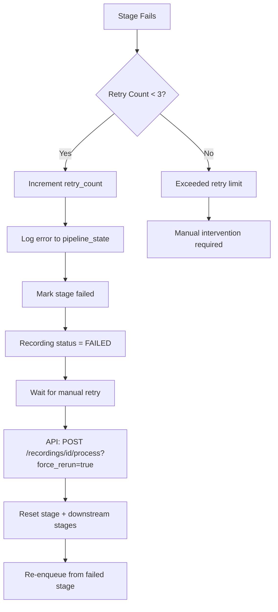
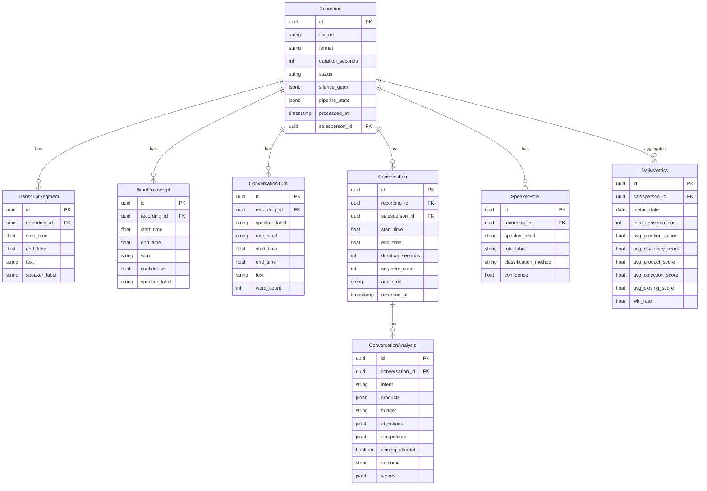

# CXSAMAA AI Pipeline — Complete Celery Architecture

## Overview

The CXSAMAA AI Pipeline is a **9-stage asynchronous processing pipeline** orchestrated by Celery workers. It transforms raw audio recordings into structured, analyzed customer interactions with speaker attribution, conversation segmentation, LLM-powered analysis, and performance scoring.

### Key Characteristics

- **Dual-Mode Architecture**: Celery + Redis for development, Cloud Tasks for production
- **Process Isolation**: Each stage runs as an independent Celery task
- **Idempotent Execution**: Stages skip if already completed (supports recovery/retry)
- **Real-Time Progress Tracking**: UI updates after every stage transition
- **Automatic Retry**: Up to 3 retries per stage before halting
- **Memory-Efficient**: ffmpeg-based audio processing keeps RAM at ~50MB regardless of recording length

---

## Pipeline Architecture

### High-Level Flow


### Stage Execution Sequence



---

## 9 Pipeline Stages

### Stage Definitions

```python
STAGES = [
    ("/stage/preprocess", preprocess_audio, "TRANSCRIBING"),
    ("/stage/stt", dispatch_transcription, "DIARIZING"),
    ("/stage/diarization", dispatch_diarization, "RECONCILING"),
    ("/stage/turns", build_conversation_turns, "RECONCILING"),
    ("/stage/roles", classify_speaker_roles, "SEGMENTING"),
    ("/stage/segmentation", segment_conversations, "SEGMENTING"),
    ("/stage/extract-audio", extract_conversation_audio, "STITCHING"),
    ("/stage/analyze", analyze_conversations, "ANALYZING"),
    ("/stage/scoring", score_salesperson, "SCORING"),
]
```

---

### Stage 1: Preprocessing (`preprocess_audio`)

**Purpose**: Convert raw audio to standardized 16kHz mono WAV format with silence-based chunking

**Input**: Raw audio file (MP3, WAV, M4A, etc.)

**Output**: 
- Standardized WAV chunks split at 30s+ silence gaps
- Silence gap metadata (start/end timestamps)
- Recording duration

**Key Operations**:
1. Download audio from R2/local storage
2. Convert to 16kHz mono WAV using ffmpeg (streaming, no RAM spike)
3. Detect silence gaps using `ffmpeg silencedetect` filter (-40dB threshold, 30s minimum)
4. Split audio at silence boundaries into chunks
5. Apply loudness normalization (EBU R128: -20 LUFS, -1.5 dBTP)
6. Store chunks in R2/local storage
7. Save silence gaps to `recording.silence_gaps` JSONB field

**Memory Efficiency**:
- All operations via ffmpeg subprocesses
- No pydub in hot path
- Peak RAM: ~50MB regardless of recording length (tested up to 9+ hours)

**Database Updates**:
- `recording.status = TRANSCRIBING`
- `recording.silence_gaps = [...]`
- `recording.duration_seconds = ...`
- `recording.format = "wav"`

**Status Label**: `TRANSCRIBING`

---

### Stage 2: Transcription (`dispatch_transcription`)

**Purpose**: Convert audio chunks to text using NVIDIA Parakeet 1.1B STT

**Input**: Preprocessed WAV chunks from Stage 1

**Output**:
- `TranscriptSegment` records (start, end, text)
- `WordTranscript` records (word-level with timestamps)

**Key Operations**:
1. Load audio chunks from storage
2. Optional VAD (Voice Activity Detection) filtering using Silero VAD
   - Strips silence before STT
   - Remaps timestamps back to original timeline
3. Send each chunk to NVIDIA Parakeet STT API (`parakeet-rnnt-1.1b`)
4. Aggregate segments and words across chunks
5. Store in database:
   - `transcript_segments` table
   - `word_transcripts` table (with word-level timestamps and confidence)

**Error Handling**:
- Retry on API failures (decorated with `@pipeline_retry`)
- VAD graceful fallback (skips if torch not available)
- Halts pipeline if no transcript produced

**Database Updates**:
- `recording.status = DIARIZING`
- Insert into `transcript_segments`
- Insert into `word_transcripts`

**Status Label**: `DIARIZING`

---

### Stage 3: Diarization (`dispatch_diarization`)

**Purpose**: Assign speaker labels (SPEAKER_00, SPEAKER_01, etc.) to transcript segments

**Input**: Transcript segments with timestamps (no speaker info)

**Output**: 
- Transcript segments with `speaker_label` assigned
- Word-level transcripts with `speaker_label` propagated

**Key Operations**:
1. Load transcript segments from database
2. Call NVIDIA Diarization API (`streusand-rnnt`) or pyannote.audio
3. Map diarization speaker labels to transcript segments by time alignment
4. Reconcile speakers across chunks (consistent labeling)
5. Propagate segment-level speaker labels to word-level transcripts
   - O(W + S) sweep: word midpoint containment check
6. Store updated speaker labels

**Speaker Reconciliation**:
- Ensures SPEAKER_00 in chunk 1 = SPEAKER_00 in chunk 2
- Uses majority voting and temporal continuity

**Database Updates**:
- `recording.status = RECONCILING`
- Update `transcript_segments.speaker_label`
- Update `word_transcripts.speaker_label`

**Status Label**: `RECONCILING`

---

### Stage 4: Turn Builder (`build_conversation_turns`)

**Purpose**: Merge word-level transcripts into conversation turns (speaker utterances)

**Input**: Word-level transcripts with speaker labels

**Output**: `ConversationTurn` records

**Key Operations**:
1. Load all `WordTranscript` records ordered by `start_time`
2. Group consecutive words by:
   - **Speaker continuity**: Same speaker = same turn
   - **Gap detection**: Gap > 1 second = new turn
3. Build turn objects:
   ```python
   {
       "speaker": "SPEAKER_00",
       "start_time": 12.5,
       "end_time": 18.3,
       "text": "Hello, welcome to our store...",
       "word_count": 8
   }
   ```
4. Store in `conversation_turns` table

**Turn Merging Logic**:
```
Word1[SPEAKER_00, 0.0-0.5] ─┐
Word2[SPEAKER_00, 0.6-1.2] ─┼─→ Turn1[SPEAKER_00, 0.0-1.2, "Hello there"]
Word3[SPEAKER_00, 1.3-1.8] ─┘
Word4[SPEAKER_01, 2.5-3.0] ───→ Turn2[SPEAKER_01, 2.5-3.0, "Hi!"]
                              (gap > 1s triggers new turn)
```

**Database Updates**:
- `recording.status = RECONCILING` (stays same)
- Insert into `conversation_turns`

**Status Label**: `RECONCILING`

---

### Stage 5: Role Classification (`classify_speaker_roles`)

**Purpose**: Identify which speaker is the Salesperson vs Customer

**Input**: Conversation turns with speaker labels

**Output**: `SpeakerRole` records mapping SPEAKER_XX → {SALESPERSON, CUSTOMER}

**Key Operations**:
1. Load conversation turns from database
2. **Primary**: LLM-based classification using NVIDIA Llama 3.3 70B
   - Sends turn samples to LLM with retail context
   - Returns JSON: `{"SPEAKER_00": "SALESPERSON", "SPEAKER_01": "CUSTOMER"}`
3. **Fallback**: Heuristic-based classification
   - Speaker with more turns = SALESPERSON
   - Speaker who speaks first = SALESPERSON (retail greeting pattern)
4. Store role classifications in `speaker_roles` table
5. Update `conversation_turns.role_label` with resolved roles

**Classification Methods**:
- `llm`: LLM-based (high confidence)
- `heuristic`: Rule-based fallback
- `majority_vote`: Statistical approach

**Database Updates**:
- `recording.status = SEGMENTING`
- Insert into `speaker_roles`
- Update `conversation_turns.role_label`

**Status Label**: `SEGMENTING`

---

### Stage 6: Segmentation (`segment_conversations`)

**Purpose**: Split continuous recording into discrete customer conversations

**Input**: 
- Labeled transcript segments (with speaker + role)
- Silence gaps from preprocessing

**Output**: `Conversation` records

**Key Operations**:
1. Load transcript segments with speaker/role labels
2. Load silence gaps from `recording.silence_gaps`
3. **Segmentation Strategy**:
   - **Primary**: LLM-first segmentation with retail context
   - Detect conversation boundaries using:
     - Silence gaps > 30 seconds
     - Greeting patterns ("Hello", "Welcome", "Can I help you?")
     - Farewell patterns ("Thank you", "Goodbye", "Have a nice day")
   - **Fallback**: Deterministic silence-based segmentation
4. Create conversation objects:
   ```python
   {
       "start_time": 0.0,
       "end_time": 145.5,
       "segment_count": 24
   }
   ```
5. Store in `conversations` table

**Boundary Detection**:
```
[---Conversation 1---]   [---Conversation 2---]
0s ─────── 145.5s │ 200.0s ─────── 380.0s
                  │
            (silence gap 54.5s)
```

**Database Updates**:
- `recording.status = SEGMENTING` (stays same)
- Insert into `conversations`

**Status Label**: `SEGMENTING`

---

### Stage 7: Audio Stitcher (`extract_conversation_audio`)

**Purpose**: Extract per-conversation audio clips from the original master file

**Input**: 
- Conversation records with start/end times
- Original master audio file (R2 or local)

**Output**: 
- Per-conversation WAV files in storage
- `conversation.audio_url` updated with file paths

**Key Operations**:
1. Load conversations from database
2. Get master file source:
   - **R2**: Generate pre-signed URL for HTTP streaming
   - **Local**: Use direct file path
3. For each conversation:
   - Use ffmpeg to seek+cut from master file:
     ```bash
     ffmpeg -i master.wav -ss 12.5 -to 145.5 -acodec pcm_s16wav conv_001.wav
     ```
   - Upload extracted clip to R2/local storage
   - Update `conversation.audio_url` with storage key
4. **Never downloads full master file** — streaming extraction only

**Memory Efficiency**:
- ffmpeg streaming I/O (no full file in RAM)
- Peak RAM: ~50MB per extraction

**Database Updates**:
- `recording.status = STITCHING`
- Update `conversations.audio_url`

**Status Label**: `STITCHING`

---

### Stage 8: Analysis (`analyze_conversations`)

**Purpose**: Analyze each conversation using LLM for retail insights

**Input**: Conversations with transcript segments

**Output**: `ConversationAnalysis` records with:
- Customer intent
- Products discussed
- Budget information
- Objections raised
- Competitor mentions
- Closing attempt (yes/no)
- Outcome (won/lost/pending)
- Loss reason (if lost)

**Key Operations**:
1. Load conversations from database
2. For each conversation:
   - Load transcript segments within conversation time range
   - Use overlap logic (±1s buffer) to handle LLM boundary imprecision
   - Send to NVIDIA Llama 3.3 70B with structured prompt:
     ```
     Analyze this retail sales conversation:
     [transcript with speaker roles]
     
     Return JSON with:
     - intent: string
     - products: array
     - budget: string|null
     - objections: array
     - competitors: array
     - closing_attempt: boolean
     - outcome: "won"|"lost"|"pending"
     - loss_reason: string|null
     ```
3. Filter low-confidence results (`MIN_CONFIDENCE_THRESHOLD`)
4. Store analysis in `conversation_analysis` table

**LLM Prompt Strategy**:
- Structured JSON output
- Retail-specific context
- Confidence scoring
- Robust parsing (handles malformed responses)

**Database Updates**:
- `recording.status = ANALYZING`
- Insert/update `conversation_analysis`

**Status Label**: `ANALYZING`

---

### Stage 9: Scoring (`score_salesperson`)

**Purpose**: Score salesperson performance across 5 dimensions

**Input**: Conversations with analysis results

**Output**: 
- `ConversationAnalysis.scores` with 5-dimensional scores
- `DailyMetrics` aggregation

**Key Operations**:
1. Load conversations with transcript segments
2. For each conversation:
   - Send to scoring LLM with structured prompt:
     ```
     Score this salesperson on 5 dimensions (1-100):
     [transcript with roles + analysis]
     
     1. Greeting & Rapport Building
     2. Needs Discovery
     3. Product Knowledge
     4. Objection Handling
     5. Closing Technique
     ```
3. Store scores in `conversation_analysis.scores` JSONB
4. Update `DailyMetrics` for the salesperson:
   - Total conversations
   - Average scores per dimension
   - Win rate
   - Products discussed count
5. Mark recording as `COMPLETED`

**Scoring Dimensions**:
| Dimension | Description | Weight |
|-----------|-------------|--------|
| Greeting & Rapport | Opening effectiveness, empathy | 20% |
| Needs Discovery | Questioning technique, active listening | 25% |
| Product Knowledge | Accuracy, relevance, recommendations | 20% |
| Objection Handling | Response quality, persistence | 20% |
| Closing Technique | Call-to-action, follow-up setup | 15% |

**Database Updates**:
- `recording.status = SCORING` → `COMPLETED`
- Update `conversation_analysis.scores`
- Upsert `daily_metrics`

**Status Label**: `SCORING`

---

## Pipeline State Machine

### Status Transitions



### Pipeline State Structure

```json
{
  "current_stage": "analyze",
  "completed_stages": ["preprocess", "stt", "diarization", "turns", "roles", "segmentation", "stitch"],
  "failed_stage": null,
  "error_message": null,
  "last_updated_by": "system",
  "retry_count": {
    "stt": 1,
    "diarization": 0
  },
  "stage_timestamps": {
    "preprocess": "2026-06-16T10:00:00Z",
    "stt": "2026-06-16T10:05:00Z",
    "diarization": "2026-06-16T10:10:00Z"
  }
}
```

---

## Idempotency & Recovery

### Idempotency Checks

Each stage performs two checks before execution:

1. **Completion Check**: Skip if stage already completed
   ```python
   if is_stage_completed_sync(recording_id, stage_name):
       logger.info("Skipping stage %s (already completed)", stage_name)
       enqueue_next_stage()
       return
   ```

2. **Duplicate Prevention**: Skip if recording already has this stage's status
   ```python
   if current_recording.status == status_label:
       logger.warning("Stage already in progress — skipping duplicate")
       return
   ```

### Recovery from Failure



### Manual Retry API

```bash
# Force rerun from specific stage
curl -X POST http://localhost:8000/api/v1/recordings/{id}/process \
  -H "Authorization: Bearer <token>" \
  -d '{"force_rerun": true, "from_stage": "stt"}'
```

This triggers:
1. `reset_stage_and_downstream(from_stage)` — clears completed_stages from retry point onward
2. `enqueue_first_stage(recording_id)` — restarts pipeline
3. Idempotency checks skip already-completed earlier stages

---

## Celery Configuration

### Development Mode (Celery)

```python
# apps/api/src/workers/celery_app.py
app = Celery('cxsamaa')
app.conf.update(
    broker_url='redis://localhost:6379/0',
    result_backend='redis://localhost:6379/1',
    task_serializer='json',
    result_serializer='json',
    accept_content=['json'],
    timezone='UTC',
    enable_utc=True,
    task_track_started=True,
    task_acks_late=True,
    worker_prefetch_multiplier=1,  # One task at a time
)

# macOS-specific: use solo pool to prevent gRPC crashes
@app.on_after_configure.connect
def on_after_configure(sender, **kwargs):
    if platform.system() == "Darwin":
        sender.conf.worker_pool = "solo"
        sender.conf.worker_concurrency = 1
    else:
        sender.conf.worker_pool = "prefork"
```

### Task Registration

```python
# apps/api/src/workers/pipeline_worker.py
@app.task(bind=True, max_retries=0, acks_late=True)
def execute_stage(
    self,
    recording_id: str,
    pipeline_version: str,
    stage_index: int,
    force_rerun: bool = False,
):
    """Celery task entrypoint — delegates to pipeline.run_stage()"""
    run_stage(recording_id, pipeline_version, stage_index, force_rerun)
```

### Stage Enqueuing

```python
# Development: Celery
def enqueue_next_stage_celery(recording_id, pipeline_version, stage_index):
    execute_stage.delay(recording_id, pipeline_version, stage_index)

# Production: Cloud Tasks
def enqueue_next_stage_cloud_tasks(recording_id, pipeline_version, stage_path):
    # HTTP POST to Cloud Tasks queue
    # dispatch_deadline: 550s
    # max_attempts: 3
    # backoff: 10s - 300s
```

---

## Progress Tracking

### Real-Time UI Updates

Every stage transition triggers:

```python
log_stage_start(recording_id, stage_name, total_stages, current_index)
# → Updates recording.status to stage label
# → Logs: "🔄 [id] Updating Status: stage_name → processing"

log_stage_complete(recording_id, stage_name, total_stages, current_index)
# → Updates recording.status to next stage label
# → Logs: "✅ [id] Completed stage 3/9: diarization"

log_stage_error(recording_id, stage_name, error_msg, total_stages, current_index)
# → Updates recording.status to FAILED
# → Logs: "❌ [id] Failed at stage 3/9: diarization — error details"
```

### Pipeline Progress Response

```json
{
  "recording_id": "abc-123",
  "status": "ANALYZING",
  "progress": {
    "current_stage": "analyze",
    "current_index": 7,
    "total_stages": 9,
    "completed_stages": 7,
    "percentage": 77.8
  },
  "stages": [
    {"name": "preprocess", "status": "completed", "timestamp": "2026-06-16T10:00:00Z"},
    {"name": "stt", "status": "completed", "timestamp": "2026-06-16T10:05:00Z"},
    {"name": "diarization", "status": "completed", "timestamp": "2026-06-16T10:10:00Z"},
    {"name": "turns", "status": "completed", "timestamp": "2026-06-16T10:12:00Z"},
    {"name": "roles", "status": "completed", "timestamp": "2026-06-16T10:14:00Z"},
    {"name": "segmentation", "status": "completed", "timestamp": "2026-06-16T10:16:00Z"},
    {"name": "stitch", "status": "completed", "timestamp": "2026-06-16T10:18:00Z"},
    {"name": "analyze", "status": "processing", "timestamp": "2026-06-16T10:20:00Z"},
    {"name": "scoring", "status": "pending", "timestamp": null}
  ]
}
```

---

## Error Handling & Resilience

### Retry Decorator

```python
# apps/api/src/workers/retry.py
def pipeline_retry(func):
    """Retry wrapper for pipeline stages with exponential backoff"""
    @wraps(func)
    def wrapper(*args, **kwargs):
        max_retries = 3
        for attempt in range(max_retries):
            try:
                return func(*args, **kwargs)
            except PipelineHalted:
                raise  # Don't retry halts
            except Exception as e:
                if attempt == max_retries - 1:
                    raise
                wait_time = 2 ** attempt  # 1s, 2s, 4s
                time.sleep(wait_time)
    return wrapper
```

### PipelineHalted Exception

```python
class PipelineHalted(Exception):
    """Recording failed validation — do not retry, do not continue"""

def fail_and_halt(recording_id: str, reason: str):
    """Mark FAILED and halt chain immediately"""
    _update_recording_status_sync(recording_id, "FAILED", reason)
    raise PipelineHalted(reason)
```

### Error Scenarios

| Scenario | Behavior | Recovery |
|----------|----------|----------|
| API timeout (NVIDIA) | Retry up to 3 times | Auto-retry with backoff |
| Invalid audio format | Halt immediately | Manual intervention |
| No speech detected | Halt with warning | Manual review |
| LLM malformed response | Robust parsing + fallback | Auto-retry |
| Database connection lost | Retry transaction | Auto-reconnect |
| Storage unavailable | Retry with backoff | Auto-retry |

---

## Data Flow

### Database Models



---

## Deployment

### Local Development

```bash
# Start infrastructure
docker compose up -d  # PostgreSQL + Redis

# Start Celery worker
cd apps/api
source .venv/bin/activate
celery -A src.workers.celery_app worker --loglevel=info --concurrency=4

# Start FastAPI API
uvicorn src.main:app --reload --host 0.0.0.0 --port 8000

# Start Next.js Frontend
npm run dev:web
```

### Production (Cloud Tasks)

```bash
# Deploy worker to Cloud Run
gcloud run deploy cxsamaa-worker \
  --source apps/api \
  --region us-central1 \
  --memory 2Gi \
  --timeout 600s \
  --max-instances 10

# Create Cloud Tasks queue
gcloud tasks queues create cxsamaa-pipeline \
  --location us-central1 \
  --max-dispatches-per-second 5 \
  --max-concurrent-dispatches 10
```

---

## Monitoring & Observability

### Celery Logs

```
[2026-06-16 10:00:00] INFO: 🔄 [abc-123] Updating Status: preprocess → processing
[2026-06-16 10:00:05] INFO: [abc-123] Running stage 1/9: /stage/preprocess
[2026-06-16 10:00:30] INFO: [abc-123] Detected 4 silence gaps
[2026-06-16 10:00:35] INFO: [abc-123] Split into 5 chunks
[2026-06-16 10:00:35] INFO: ✅ [abc-123] Completed stage 1/9: preprocess
[2026-06-16 10:00:35] INFO: [celery] Enqueued stage 1 for recording abc-123
[2026-06-16 10:00:36] INFO: 🔄 [abc-123] Updating Status: stt → processing
[2026-06-16 10:00:36] INFO: [abc-123] Running stage 2/9: /stage/stt
```

### Pipeline State Query

```sql
-- Check pipeline progress for all recordings
SELECT 
  id,
  status,
  pipeline_state->>'current_stage' as current_stage,
  jsonb_array_length(pipeline_state->'completed_stages') as completed_count,
  pipeline_state->>'failed_stage' as failed_stage,
  processed_at
FROM recordings
WHERE status NOT IN ('UPLOADED', 'COMPLETED', 'FAILED')
ORDER BY pipeline_state->>'current_stage';

-- Find stuck recordings (no progress in 10 minutes)
SELECT id, status, updated_at
FROM recordings
WHERE status IN ('TRANSCRIBING', 'DIARIZING', 'ANALYZING')
  AND updated_at < NOW() - INTERVAL '10 minutes';
```

---

## Performance Characteristics

| Metric | Value | Notes |
|--------|-------|-------|
| Memory per worker | ~50MB | ffmpeg streaming, no pydub |
| Max recording length | 9+ hours | Tested |
| Chunk size | 5-30 minutes | Silence-based split |
| STT latency | ~0.5x real-time | NVIDIA Parakeet |
| Diarization latency | ~0.3x real-time | NVIDIA Streusand |
| LLM analysis | ~2-5s per conversation | Llama 3.3 70B |
| Total pipeline time | 10-30 minutes | Depends on recording length |

---

## Future Enhancements

1. **Parallel Chunk Processing**: Process multiple audio chunks concurrently in STT/Diarization
2. **Streaming STT**: Real-time transcription as audio uploads
3. **Custom Diarization Model**: Fine-tuned pyannote.audio for retail environment
4. **Multi-language Support**: Hindi, Arabic STT + analysis
5. **Real-time Dashboard**: WebSocket updates for pipeline progress
6. **Queue Prioritization**: VIP recordings jump queue
7. **Batch Processing**: Process multiple recordings in single pipeline run
8. **Caching**: Skip stages if identical audio already processed

---

## Troubleshooting

### Common Issues

#### Pipeline Stuck at TRANSCRIBING

```bash
# Check Celery worker logs
tail -f .logs/celery.log

# Check if worker is running
celery -A src.workers.celery_app inspect active

# Restart worker
pkill -f celery
celery -A src.workers.celery_app worker --loglevel=info --concurrency=4 &
```

#### Stage Failed After 3 Retries

```bash
# Force retry from failed stage
curl -X POST http://localhost:8000/api/v1/recordings/{id}/process \
  -d '{"force_rerun": true, "from_stage": "stt"}'
```

#### Database Connection Errors

```bash
# Check PostgreSQL is running
docker compose ps

# Restart database
docker compose restart db

# Re-run migrations
cd apps/api
alembic upgrade head
```

#### Missing Audio Files

```bash
# Check local storage
ls -la uploads/

# Check R2 storage
aws s3 ls s3://your-bucket/ --endpoint-url https://your-account.r2.cloudflarestorage.com
```

---

## References

- [NVIDIA NIM Documentation](https://docs.nvidia.com/nim/)
- [Celery Documentation](https://docs.celeryq.dev/)
- [pyannote.audio Documentation](https://github.com/pyannote/pyannote-audio)
- [ffmpeg Documentation](https://ffmpeg.org/documentation.html)

---

## Appendix: File Locations

| Component | File Path |
|-----------|-----------|
| Pipeline Orchestrator | `apps/api/src/workers/pipeline.py` |
| Celery Task Wrapper | `apps/api/src/workers/pipeline_worker.py` |
| Pipeline State Management | `apps/api/src/services/pipeline_state.py` |
| Progress Tracking | `apps/api/src/services/pipeline_progress.py` |
| Stage 1: Preprocessing | `apps/api/src/workers/preprocessing.py` |
| Stage 2: Transcription | `apps/api/src/workers/transcription.py` |
| Stage 3: Diarization | `apps/api/src/workers/diarization.py` |
| Stage 4: Turn Builder | `apps/api/src/workers/turn_builder.py` |
| Stage 5: Role Classification | `apps/api/src/workers/role_classification.py` |
| Stage 6: Segmentation | `apps/api/src/workers/segmentation.py` |
| Stage 7: Audio Stitcher | `apps/api/src/workers/audio_stitcher.py` |
| Stage 8: Analysis | `apps/api/src/workers/analysis.py` |
| Stage 9: Scoring | `apps/api/src/workers/scoring.py` |
| Celery Configuration | `apps/api/src/workers/celery_app.py` |
| Pipeline Control | `apps/api/src/workers/pipeline_control.py` |
| Retry Logic | `apps/api/src/workers/retry.py` |
